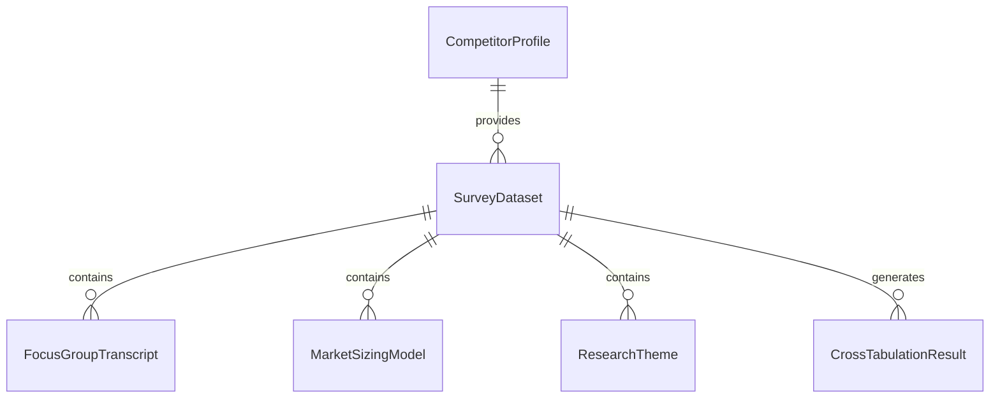
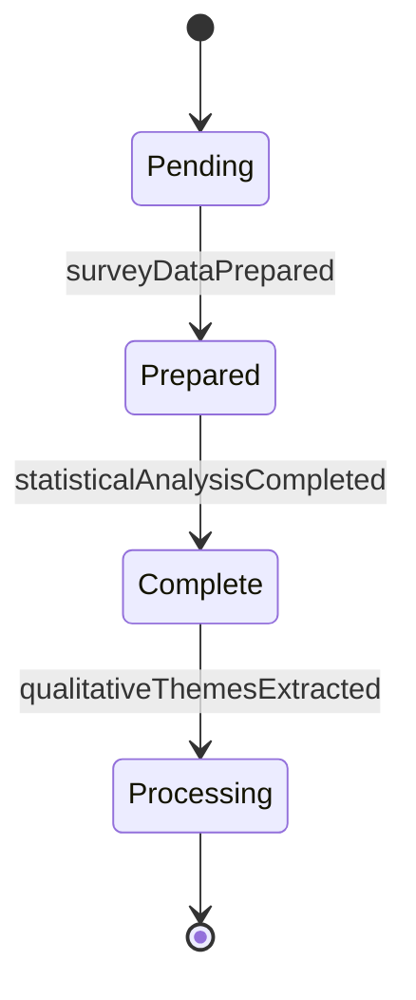
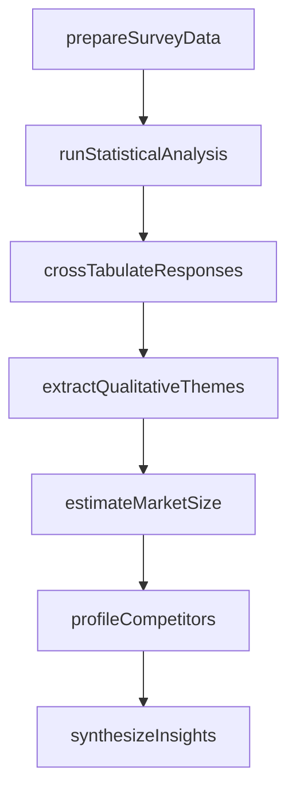
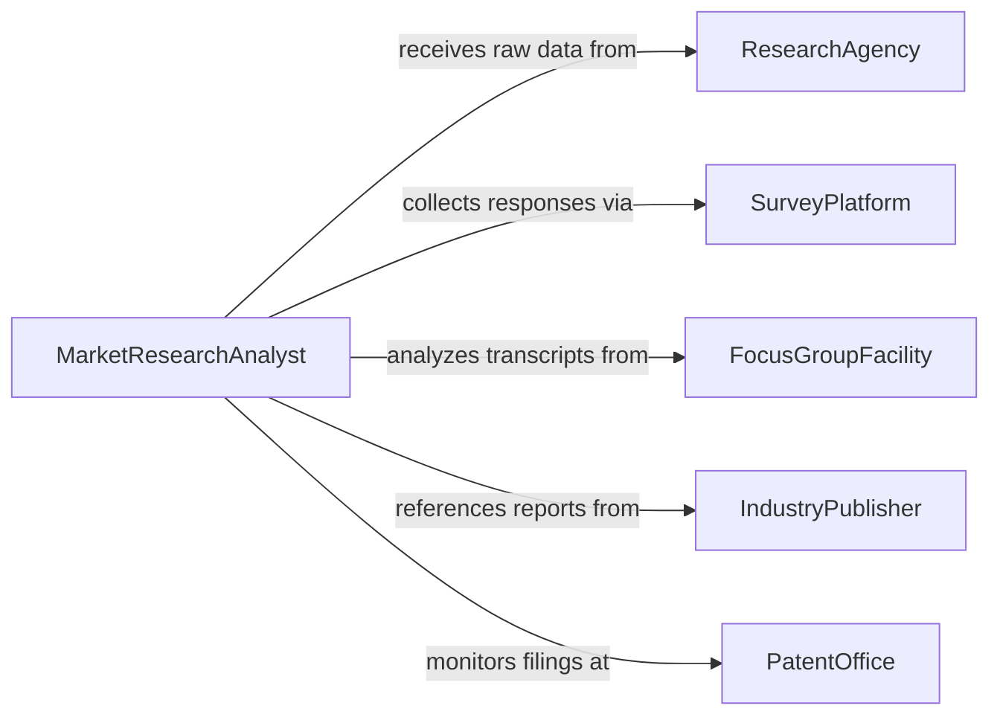

# Analyze Market Research Data

> Business-as-Code definition for analyzing market research data. Models the processing and interpretation of survey responses, focus group findings, competitive intelligence, and secondary research to extract actionable insights about market size, customer preferences, and competitive positioning.

## Overview

Analyzing market research data involves processing primary research outputs such as survey responses, interview transcripts, and focus group recordings alongside secondary data including published reports, patent filings, and regulatory filings to develop market sizing estimates, customer preference models, and competitive landscape assessments. This definition provides actions for data preparation, statistical analysis, theme extraction, and insight synthesis. It supports market researchers, product managers, brand strategists, and business development professionals.

## Actors

| Actor | Description |
|-------|-------------|
| ResearchAgency | Conducts primary research studies and delivers raw data sets |
| SurveyPlatform | Collects and distributes online survey responses at scale |
| FocusGroupFacility | Hosts moderated group discussions and provides recordings |
| IndustryPublisher | Releases syndicated research reports and market sizing data |
| PatentOffice | Publishes patent filings that signal technology and product direction |

## Roles

| Role | Description |
|------|-------------|
| MarketResearchAnalyst | Processes raw research data and extracts statistical insights |
| QualitativeResearcher | Interprets interview and focus group findings for thematic patterns |
| CompetitiveIntelligenceAnalyst | Synthesizes competitor data from multiple secondary sources |
| InsightsDirector | Translates research findings into strategic business recommendations |

## Entities

| Entity | Description |
|--------|-------------|
| SurveyDataset | A structured collection of quantitative survey responses |
| FocusGroupTranscript | A text record of a moderated group discussion |
| MarketSizingModel | A quantitative estimate of total addressable market by segment |
| CompetitorProfile | An aggregated assessment of a competitor's strategy and market position |
| ResearchTheme | A recurring pattern or insight extracted from qualitative data |
| CrossTabulationResult | A statistical breakdown of survey responses by demographic or segment |
| InsightSummary | A document synthesizing research findings into actionable recommendations |

## Actions

| Action | Description |
|--------|-------------|
| prepareSurveyData | Clean, code, and structure raw survey responses for analysis |
| runStatisticalAnalysis | Apply statistical methods to quantify patterns in research data |
| extractQualitativeThemes | Identify recurring patterns from interview and focus group transcripts |
| estimateMarketSize | Calculate total addressable market using top-down and bottom-up methods |
| profileCompetitors | Compile competitive intelligence into structured competitor assessments |
| crossTabulateResponses | Break down survey results by demographic, segment, or behavior |
| synthesizeInsights | Combine quantitative and qualitative findings into strategic recommendations |

## Events

| Event | Description |
|-------|-------------|
| surveyDataPrepared | Survey responses have been cleaned, coded, and structured |
| statisticalAnalysisCompleted | Quantitative patterns have been identified in research data |
| qualitativeThemesExtracted | Recurring patterns from qualitative data have been identified |
| marketSizeEstimated | Total addressable market calculations have been completed |
| competitorsProfiled | Competitive intelligence has been compiled into structured assessments |
| responsesCrossTabulated | Survey results have been broken down by segment or demographic |
| insightsSynthesized | Research findings have been combined into strategic recommendations |

## Searches

| Search | Description |
|--------|-------------|
| findResearchStudies | List research studies by topic, methodology, or date |
| getSurveyResults | Retrieve survey response data by study, question, or segment |
| getMarketSizeEstimates | Access market sizing data by segment, geography, or methodology |
| getCompetitorProfiles | View competitor assessments by company or market |
| getResearchThemes | List qualitative themes by study, category, or frequency |


## Entity Relationships



## State Diagram


## Workflow



## Actor Relationships



## Usage

### Calling Actions

```typescript
import { analyzeMarketResearchData } from '@headlessly/analyze-market-research-data'

const researcher = analyzeMarketResearchData()

// Prepare and analyze survey data
const study = await researcher.prepareSurveyData({
  studyId: 'customer-preference-Q4-2025',
  rawData: 'survey-responses-export.csv',
  codingScheme: 'preference-study-v3'
})

await researcher.runStatisticalAnalysis({ studyId: study.id, methods: ['regression', 'factor-analysis'] })
await researcher.crossTabulateResponses({
  studyId: study.id,
  dimensions: ['company-size', 'industry', 'region']
})

// Qualitative analysis and market sizing
await researcher.extractQualitativeThemes({ studyId: study.id })
await researcher.estimateMarketSize({
  studyId: study.id,
  methods: ['top-down', 'bottom-up'],
  segments: ['SMB', 'mid-market', 'enterprise']
})

// Synthesize insights
await researcher.synthesizeInsights({ studyId: study.id })
```

### Event-Driven Automation

```typescript
// Notify product team of significant themes
researcher.qualitativeThemesExtracted(async ({ studyId, themes }) => {
  const urgent = themes.filter(t => t.frequency > 0.4)
  if (urgent.length > 0) {
    await notify({
      to: 'product-team',
      message: `${urgent.length} high-frequency themes found: ${urgent.map(t => t.name).join(', ')}`
    })
  }
})

// Distribute final insights
researcher.insightsSynthesized(async ({ studyId, reportId }) => {
  await distribute({ reportId, recipients: ['executive-team', 'marketing', 'product-strategy'] })
})
```
