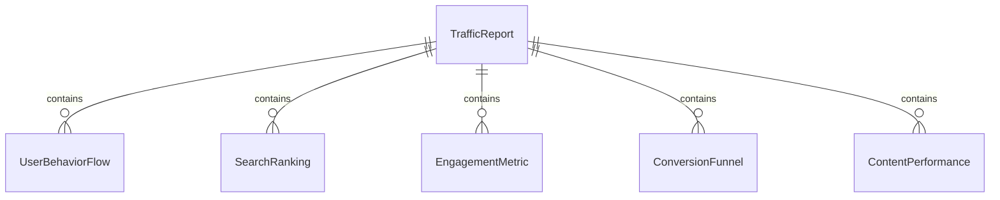
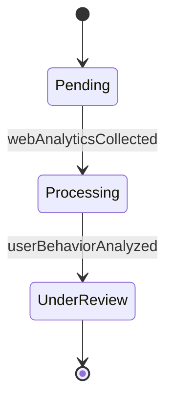
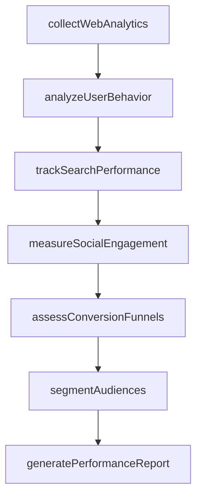
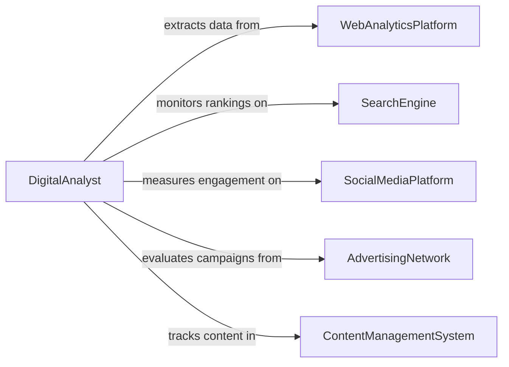

# Analyze Website or Related Online Data

> Business-as-Code definition for analyzing website and online data to track trends and usage. Models the collection and interpretation of web analytics, search engine data, social media metrics, and digital engagement patterns to understand online behavior and inform digital strategy.

## Overview

Analyzing website or related online data involves processing web traffic logs, user behavior streams, search engine rankings, social media engagement metrics, and e-commerce conversion data to identify usage patterns, content performance, and digital market trends. This definition provides actions for data collection, behavioral analysis, trend detection, and performance reporting. It supports digital analysts, SEO specialists, content strategists, and e-commerce managers.

## Actors

| Actor | Description |
|-------|-------------|
| WebAnalyticsPlatform | Provides traffic, session, and user behavior data |
| SearchEngine | Supplies ranking, impression, and click-through data |
| SocialMediaPlatform | Provides engagement, reach, and audience demographic data |
| AdvertisingNetwork | Shares campaign performance and audience targeting metrics |
| ContentManagementSystem | Tracks content publication and page-level performance data |

## Roles

| Role | Description |
|------|-------------|
| DigitalAnalyst | Collects and interprets online data to identify patterns and trends |
| SEOSpecialist | Analyzes search engine data to optimize organic visibility |
| ContentStrategist | Uses engagement data to guide content creation and distribution |
| ConversionOptimizer | Analyzes user funnels to improve conversion rates |

## Entities

| Entity | Description |
|--------|-------------|
| TrafficReport | An aggregation of website visitor data by source, page, and period |
| UserBehaviorFlow | A mapped sequence of user interactions across site pages |
| SearchRanking | A position for a keyword or page in search engine results |
| EngagementMetric | A measure of user interaction such as time on page or bounce rate |
| ConversionFunnel | A staged path from visitor arrival to desired action completion |
| ContentPerformance | A scoring of individual content items by engagement and outcome metrics |
| AudienceSegment | A grouped subset of users sharing common behavioral or demographic traits |

## Actions

| Action | Description |
|--------|-------------|
| collectWebAnalytics | Gather traffic, session, and behavior data from analytics platforms |
| analyzeUserBehavior | Map user interaction patterns and navigation flows |
| trackSearchPerformance | Monitor keyword rankings, impressions, and click-through rates |
| measureSocialEngagement | Evaluate reach, shares, and interaction rates on social platforms |
| assessConversionFunnels | Analyze user progression through conversion paths |
| segmentAudiences | Group users by behavior, demographics, or acquisition source |
| generatePerformanceReport | Produce a summary of online metrics with trend analysis |

## Events

| Event | Description |
|-------|-------------|
| webAnalyticsCollected | Traffic and behavior data have been gathered from platforms |
| userBehaviorAnalyzed | Interaction patterns and navigation flows have been mapped |
| searchPerformanceTracked | Keyword rankings and click-through data have been monitored |
| socialEngagementMeasured | Social media reach and interaction metrics have been evaluated |
| conversionFunnelsAssessed | User progression through conversion paths has been analyzed |
| audiencesSegmented | Users have been grouped by behavioral or demographic traits |
| performanceReportGenerated | An online metrics summary has been produced |

## Searches

| Search | Description |
|--------|-------------|
| findTrafficReports | List traffic reports by site, date range, or source |
| getSearchRankings | Retrieve keyword ranking positions by page or domain |
| getEngagementMetrics | Access engagement data by content item or page |
| getConversionRates | View conversion metrics by funnel stage or period |
| getAudienceSegments | List audience groups by segment criteria or size |


## Entity Relationships



## State Diagram


## Workflow



## Actor Relationships



## Usage

### Calling Actions

```typescript
import { analyzeWebsiteRelatedOnlineData } from '@headlessly/analyze-website-related-online-data'

const analyst = analyzeWebsiteRelatedOnlineData()

// Collect web analytics
const analysis = await analyst.collectWebAnalytics({
  sites: ['www.example.com', 'blog.example.com'],
  platforms: ['google-analytics', 'search-console', 'social-insights'],
  period: { start: '2025-10-01', end: '2025-12-31' }
})

// Analyze behavior and performance
await analyst.analyzeUserBehavior({ analysisId: analysis.id })
await analyst.trackSearchPerformance({ analysisId: analysis.id })
await analyst.measureSocialEngagement({ analysisId: analysis.id })
await analyst.assessConversionFunnels({
  analysisId: analysis.id,
  funnels: ['signup-flow', 'purchase-flow', 'demo-request']
})

// Segment and report
await analyst.segmentAudiences({ analysisId: analysis.id })
await analyst.generatePerformanceReport({ analysisId: analysis.id })
```

### Event-Driven Automation

```typescript
// Alert on conversion funnel drops
analyst.conversionFunnelsAssessed(async ({ analysisId, funnel, dropoffRate }) => {
  if (dropoffRate > 0.6) {
    await notify({
      to: 'product-team',
      message: `High dropoff rate (${(dropoffRate * 100).toFixed(0)}%) detected in ${funnel} funnel`
    })
  }
})

// Auto-distribute performance reports
analyst.performanceReportGenerated(async ({ analysisId, reportId }) => {
  await distribute({ reportId, recipients: ['marketing-team', 'content-team', 'executive-dashboard'] })
})
```
