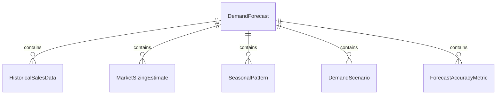
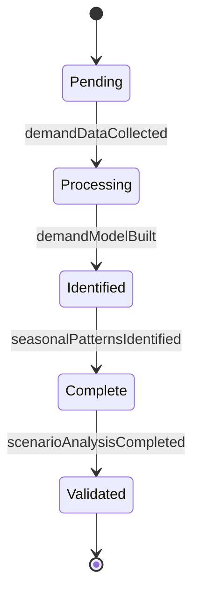
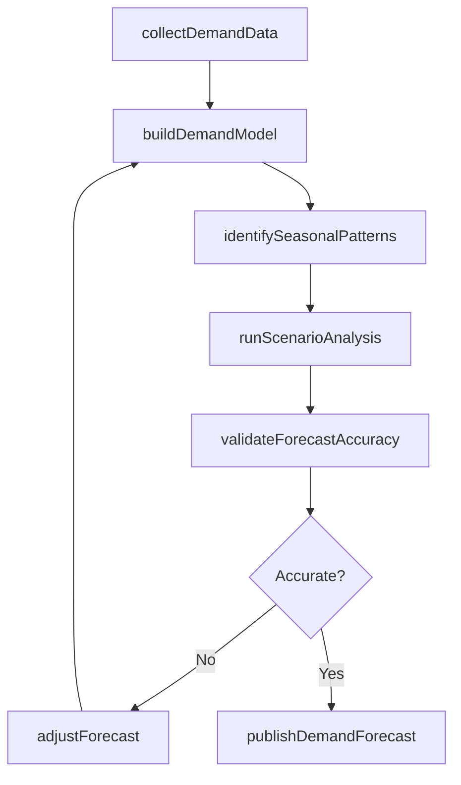
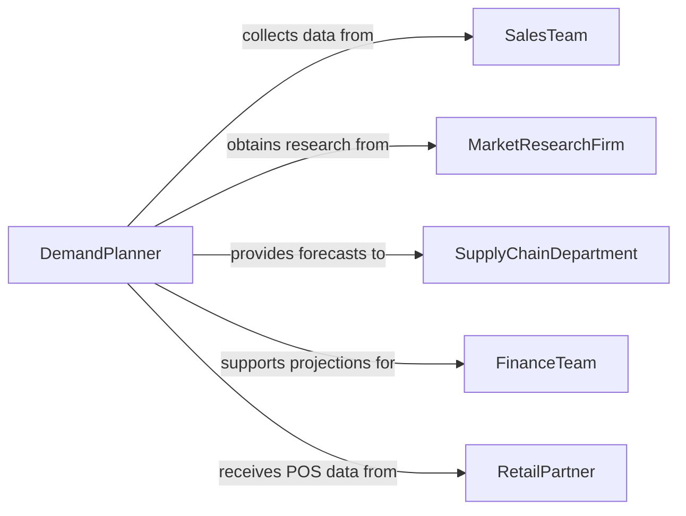

# Estimate Demand for Products or Services

> Business-as-Code definition for estimating demand for products and services. Models the use of historical sales data, market research, demographic analysis, and forecasting methodologies to project future demand volumes, seasonal patterns, and market potential.

## Overview

Estimating demand for products or services involves analyzing historical sales figures, market research data, economic indicators, demographic trends, and competitive landscape information to project future demand volumes and patterns. This definition provides actions for data collection, demand modeling, scenario analysis, and forecast publication. It supports demand planners, market analysts, supply chain managers, and product managers.

## Actors

| Actor | Description |
|-------|-------------|
| SalesTeam | Provides historical sales data and market intelligence |
| MarketResearchFirm | Supplies consumer surveys and market sizing data |
| SupplyChainDepartment | Uses demand estimates for procurement and production planning |
| FinanceTeam | Incorporates demand forecasts into revenue projections |
| RetailPartner | Shares point-of-sale data and inventory movement information |

## Roles

| Role | Description |
|------|-------------|
| DemandPlanner | Develops demand forecasts using quantitative and qualitative methods |
| MarketAnalyst | Assesses market conditions and competitive factors affecting demand |
| ForecastingStatistician | Applies statistical models to project future demand |
| ProductManager | Provides product lifecycle context for demand estimation |

## Entities

| Entity | Description |
|--------|-------------|
| DemandForecast | A projected estimate of future product or service demand |
| HistoricalSalesData | Past sales volumes used as the basis for demand modeling |
| MarketSizingEstimate | An assessment of total addressable market potential |
| SeasonalPattern | A recurring demand fluctuation tied to calendar periods |
| DemandScenario | An alternative forecast based on different market assumptions |
| ForecastAccuracyMetric | A measure of how closely past forecasts matched actual demand |

## Actions

| Action | Description |
|--------|-------------|
| collectDemandData | Gather historical sales, market research, and economic indicator data |
| buildDemandModel | Construct a statistical model for projecting future demand |
| identifySeasonalPatterns | Detect recurring demand fluctuations across time periods |
| runScenarioAnalysis | Generate demand projections under different market assumptions |
| validateForecastAccuracy | Compare past forecasts against actual demand to assess model performance |
| publishDemandForecast | Release the approved demand estimate to stakeholders |
| adjustForecast | Modify demand projections based on new data or market developments |

## Events

| Event | Description |
|-------|-------------|
| demandDataCollected | Historical and market data for demand estimation have been gathered |
| demandModelBuilt | A statistical forecasting model has been constructed |
| seasonalPatternsIdentified | Recurring demand fluctuations have been detected |
| scenarioAnalysisCompleted | Demand projections under multiple assumptions have been generated |
| forecastAccuracyValidated | Past forecast performance has been measured |
| demandForecastPublished | The approved demand estimate has been released |
| forecastAdjusted | Demand projections have been modified based on new information |

## Searches

| Search | Description |
|--------|-------------|
| findForecasts | List demand forecasts by product, region, or period |
| getSeasonalPatterns | View demand seasonality by product category or market |
| getScenarios | Retrieve scenario analyses by product or assumption set |
| getForecastAccuracy | Compare forecast accuracy metrics across products or periods |
| getMarketSizing | Access market potential estimates by segment or geography |


## Entity Relationships



## State Diagram


## Workflow



## Actor Relationships



## Usage

### Calling Actions

```typescript
import { estimateDemandProductsServices } from '@headlessly/estimate-demand-products-services'

const planner = estimateDemandProductsServices()

// Collect data and build model
const forecast = await planner.collectDemandData({
  products: ['widget-pro-x1', 'widget-lite-s2', 'widget-enterprise-e3'],
  dataSources: ['erp-sales-history', 'market-research-Q4', 'economic-indicators'],
  period: { start: '2023-01-01', end: '2025-12-31' }
})

await planner.buildDemandModel({
  forecastId: forecast.id,
  method: 'exponential-smoothing',
  horizon: { months: 12 }
})

await planner.identifySeasonalPatterns({ forecastId: forecast.id })
await planner.runScenarioAnalysis({
  forecastId: forecast.id,
  scenarios: ['base-case', 'optimistic', 'recession']
})

// Publish forecast
await planner.publishDemandForecast({ forecastId: forecast.id })
```

### Event-Driven Automation

```typescript
// Notify supply chain of new forecast
planner.demandForecastPublished(async ({ forecastId, products, horizon }) => {
  await notify({
    to: 'supply-chain-planning',
    message: `New demand forecast published for ${products.length} products. ${horizon.months}-month horizon.`
  })
})

// Alert on significant forecast changes
planner.forecastAdjusted(async ({ forecastId, product, changePercent }) => {
  if (Math.abs(changePercent) > 20) {
    await notify({
      to: 'demand-planning-team',
      message: `Demand forecast for ${product} adjusted by ${changePercent}%`
    })
  }
})
```
