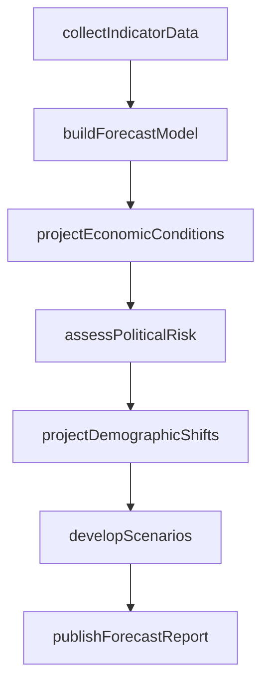
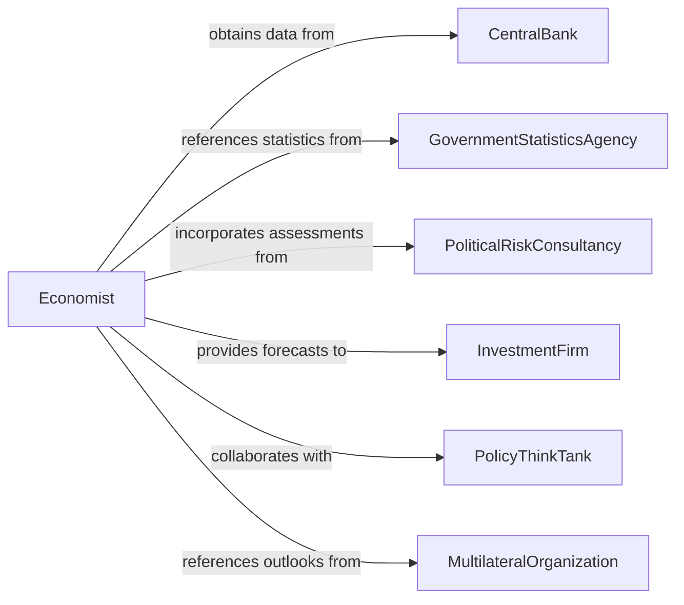

# Forecast Economic, Political, or Social Trends

> Business-as-Code definition for forecasting economic, political, and social trends. Models the analysis of macroeconomic indicators, political risk factors, demographic shifts, and social movements to project future conditions that impact business strategy, investment decisions, and policy development.

## Overview

Forecasting economic, political, or social trends involves analyzing GDP growth, inflation rates, employment data, political stability indicators, legislative agendas, demographic projections, and social sentiment data to project future conditions and their business implications. This definition provides actions for indicator collection, model construction, scenario development, and forecast dissemination. It supports economists, political risk analysts, social researchers, investment strategists, and corporate planning teams.

## Actors

| Actor | Description |
|-------|-------------|
| CentralBank | Publishes monetary policy data and economic forecasts |
| GovernmentStatisticsAgency | Releases official economic and demographic data |
| PoliticalRiskConsultancy | Provides assessments of political stability and policy direction |
| InvestmentFirm | Uses trend forecasts for portfolio allocation decisions |
| PolicyThinkTank | Produces research on economic and social policy implications |
| MultilateralOrganization | Publishes global economic outlooks and development indicators |

## Roles

| Role | Description |
|------|-------------|
| Economist | Builds economic models and projects macroeconomic indicators |
| PoliticalRiskAnalyst | Assesses political developments and their economic implications |
| DemographicForecaster | Projects population trends, migration patterns, and workforce changes |
| ChiefEconomist | Synthesizes forecasts into organizational strategy recommendations |

## Entities

| Entity | Description |
|--------|-------------|
| EconomicIndicator | A quantitative measure of economic activity such as GDP or inflation |
| PoliticalRiskScore | A rated assessment of political stability for a country or region |
| DemographicProjection | A forecast of population changes by age, location, or characteristic |
| ForecastModel | A mathematical framework for projecting future trend values |
| ScenarioProjection | An alternative future outcome based on different assumptions |
| TrendForecastReport | A document presenting projected trends and their implications |

## Actions

| Action | Description |
|--------|-------------|
| collectIndicatorData | Gather economic, political, and social data from official sources |
| buildForecastModel | Construct mathematical models for projecting future trends |
| projectEconomicConditions | Forecast GDP, inflation, employment, and other economic metrics |
| assessPoliticalRisk | Evaluate political stability and policy change probabilities |
| projectDemographicShifts | Forecast population, migration, and workforce composition changes |
| developScenarios | Create alternative projections based on different assumptions |
| publishForecastReport | Release the trend forecast with analysis and implications |

## Events

| Event | Description |
|-------|-------------|
| indicatorDataCollected | Economic, political, and social data have been gathered |
| forecastModelBuilt | Mathematical projection models have been constructed |
| economicConditionsProjected | GDP, inflation, and employment forecasts have been generated |
| politicalRiskAssessed | Political stability and policy risks have been evaluated |
| demographicShiftsProjected | Population and workforce changes have been forecast |
| scenariosDeveloped | Alternative future projections have been created |
| forecastReportPublished | The trend forecast has been released to stakeholders |

## Searches

| Search | Description |
|--------|-------------|
| findForecasts | List trend forecasts by type, region, or period |
| getEconomicProjections | Retrieve projected economic indicators by country or metric |
| getPoliticalRiskScores | View political stability assessments by country or region |
| getDemographicProjections | Access population and workforce forecasts by geography |
| getScenarioComparisons | Compare alternative projections across assumption sets |

## Workflow



## Actor Relationships



## Usage

### Calling Actions

```typescript
import { forecastEconomicPoliticalSocialTrends } from '@headlessly/forecast-economic-political-social-trends'

const forecaster = forecastEconomicPoliticalSocialTrends()

// Collect indicator data
const forecast = await forecaster.collectIndicatorData({
  regions: ['north-america', 'european-union', 'asia-pacific'],
  indicators: ['GDP-growth', 'CPI-inflation', 'unemployment-rate', 'trade-balance'],
  sources: ['IMF-WEO', 'world-bank-GDI', 'OECD-outlook']
})

// Build models and project conditions
await forecaster.buildForecastModel({
  forecastId: forecast.id,
  method: 'vector-autoregression',
  horizon: { quarters: 8 }
})

await forecaster.projectEconomicConditions({ forecastId: forecast.id })
await forecaster.assessPoliticalRisk({ forecastId: forecast.id })
await forecaster.projectDemographicShifts({ forecastId: forecast.id })

// Develop scenarios and publish
await forecaster.developScenarios({
  forecastId: forecast.id,
  scenarios: ['baseline', 'stagflation', 'rapid-recovery']
})
await forecaster.publishForecastReport({ forecastId: forecast.id })
```

### Event-Driven Automation

```typescript
// Alert investment team on significant risk changes
forecaster.politicalRiskAssessed(async ({ forecastId, region, riskLevel, previousLevel }) => {
  if (riskLevel > previousLevel + 2) {
    await notify({
      to: 'investment-committee',
      message: `Political risk elevated in ${region}: ${previousLevel} to ${riskLevel}`
    })
  }
})

// Distribute published forecast
forecaster.forecastReportPublished(async ({ forecastId, reportId }) => {
  await distribute({ reportId, recipients: ['executive-team', 'strategy-department', 'investor-relations'] })
})
```
