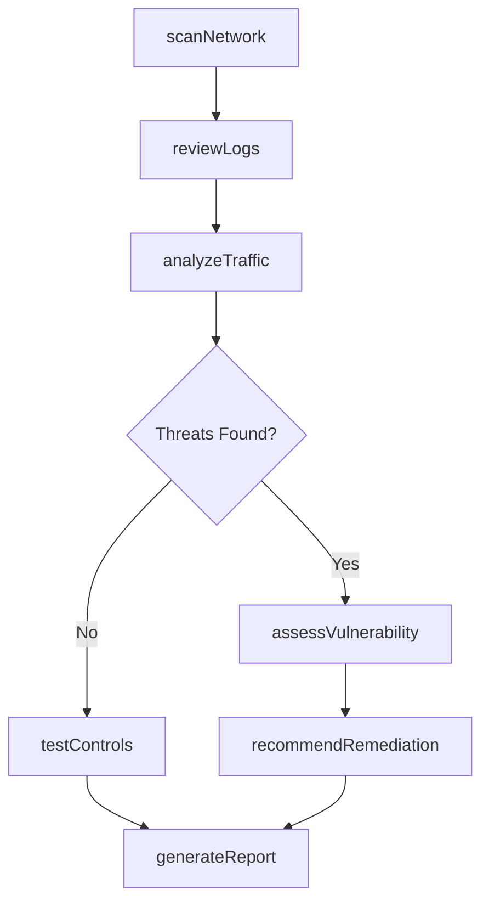
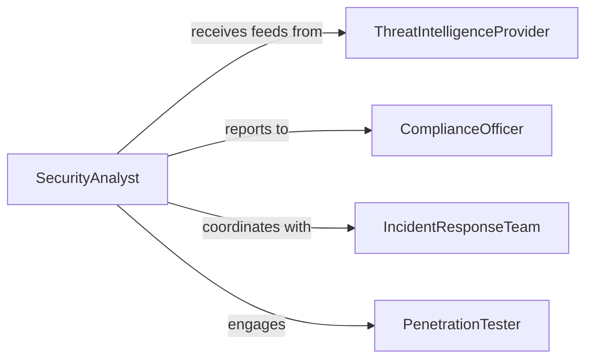

# Analyze Security Systems Network Data

> Business-as-Code definition for analyzing security of systems, networks, and data. Models the complete security analysis lifecycle from scanning through remediation.

## Overview

Security analysis involves systematic evaluation of information systems, networks, and data to identify vulnerabilities, threats, and compliance gaps. Security analysts perform continuous monitoring, threat assessment, and incident analysis to protect organizational assets from cyber threats and ensure regulatory compliance.

## Actors

| Actor | Description |
|-------|-------------|
| ThreatIntelligenceProvider | Supplies threat feeds and vulnerability databases |
| RegulatoryBody | Defines security compliance standards and requirements |
| IncidentResponseTeam | Responds to security incidents and breaches |
| PenetrationTester | Conducts authorized security testing |
| SecurityVendor | Provides security tools and managed services |

## Roles

| Role | Description |
|------|-------------|
| SecurityAnalyst | Monitors and analyzes security systems and data |
| NetworkEngineer | Maintains network infrastructure and security controls |
| ComplianceOfficer | Ensures adherence to security regulations |
| SecurityArchitect | Designs security frameworks and controls |

## Entities

| Entity | Description |
|--------|-------------|
| SecurityScan | Automated or manual security assessment |
| Vulnerability | Identified security weakness in systems or data |
| ThreatIndicator | Evidence of potential or active security threat |
| SecurityEvent | Logged activity from security systems |
| ComplianceReport | Assessment of regulatory adherence |
| Remediation | Corrective action to address security findings |

## Actions

| Action | Description |
|--------|-------------|
| scanNetwork | Execute network vulnerability scan |
| analyzeTraffic | Examine network traffic for anomalies |
| assessVulnerability | Evaluate severity and impact of findings |
| reviewLogs | Analyze security event logs for threats |
| testControls | Validate effectiveness of security controls |
| generateReport | Create security analysis documentation |
| recommendRemediation | Propose fixes for identified issues |

## Events

| Event | Description |
|-------|-------------|
| networkScanned | Network vulnerability scan completed |
| trafficAnalyzed | Network traffic analysis finished |
| vulnerabilityAssessed | Vulnerability severity determined |
| logsReviewed | Security event logs analyzed |
| controlsTested | Security controls validation completed |
| reportGenerated | Security analysis report created |
| remediationRecommended | Remediation actions proposed |

## Searches

| Search | Description |
|--------|-------------|
| findVulnerabilities | Query vulnerabilities by severity, system, or status |
| getThreatIndicators | Retrieve active threat indicators |
| getSecurityEvents | Search security event logs by criteria |
| getComplianceGaps | Find non-compliant systems or controls |

## Workflow



## Actor Relationships



## Usage

### Calling Actions

```typescript
import { analyzeSecuritySystemsNetworkData } from '@headlessly/analyze-security-systems-network-data'

const security = analyzeSecuritySystemsNetworkData()

// Execute comprehensive network scan
const scan = await security.scanNetwork({
  targets: ['10.0.0.0/24', 'production-vpc'],
  scanType: 'full',
  includePorts: true
})

// Analyze recent security events
await security.reviewLogs({
  timeRange: { start: '2026-02-01', end: '2026-02-05' },
  severity: ['high', 'critical']
})
```

### Event-Driven Automation

```typescript
// Auto-assess critical vulnerabilities
security.networkScanned(async ({ scanId, findings }) => {
  const critical = findings.filter(f => f.severity === 'critical')
  for (const vuln of critical) {
    await security.assessVulnerability({ vulnerabilityId: vuln.id })
  }
})

// Alert on threat detection
security.trafficAnalyzed(async ({ threats }) => {
  if (threats.length > 0) {
    await notify({
      channel: 'security-alerts',
      message: `${threats.length} threats detected in network traffic`
    })
  }
})
```
