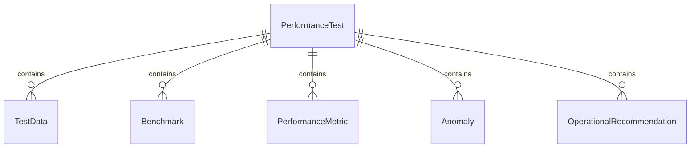
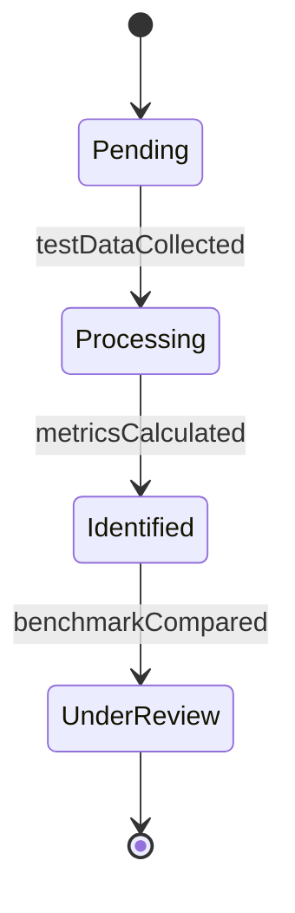
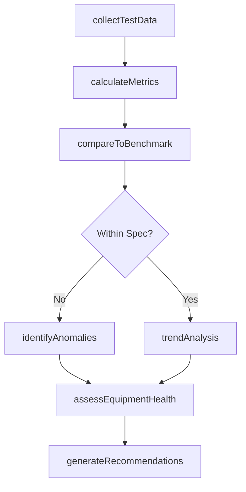
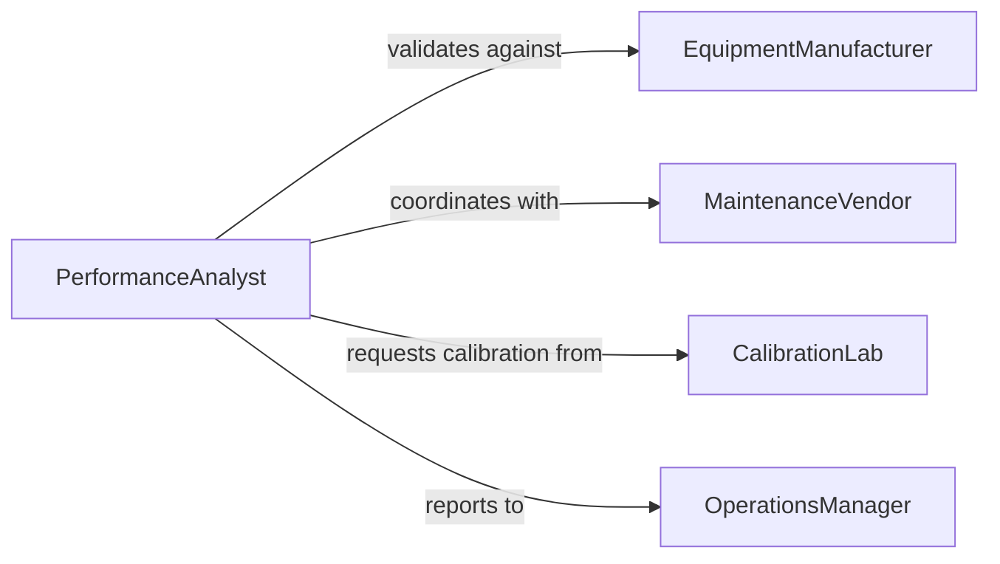

# Analyze Test Performance Data Assess

> Business-as-Code definition for analyzing test and performance data to assess equipment operation. Models the complete equipment performance assessment lifecycle from data collection through operational recommendations.

## Overview

Equipment performance analysis involves systematic evaluation of test data, operational metrics, and diagnostic information to assess equipment health, efficiency, and reliability. Performance analysts interpret sensor data, benchmark results, and historical trends to optimize equipment operation and predict maintenance needs.

## Actors

| Actor | Description |
|-------|-------------|
| EquipmentManufacturer | Provides performance specifications and standards |
| MaintenanceVendor | Performs equipment servicing and repairs |
| CalibrationLab | Validates measurement accuracy and calibration |
| QualityAuditor | Reviews compliance with performance standards |
| OriginalEquipmentManufacturer | Supplies replacement parts and technical support |

## Roles

| Role | Description |
|------|-------------|
| PerformanceAnalyst | Evaluates equipment test and operational data |
| TestEngineer | Conducts performance testing and diagnostics |
| MaintenanceTechnician | Performs equipment maintenance based on analysis |
| OperationsManager | Makes decisions based on performance insights |

## Entities

| Entity | Description |
|--------|-------------|
| PerformanceTest | Structured evaluation of equipment capabilities |
| TestData | Raw measurements and sensor readings |
| Benchmark | Performance standard or reference point |
| PerformanceMetric | Calculated measure of equipment efficiency |
| Anomaly | Deviation from expected performance patterns |
| OperationalRecommendation | Suggested action based on analysis |

## Actions

| Action | Description |
|--------|-------------|
| collectTestData | Gather performance measurements from equipment |
| calculateMetrics | Compute efficiency and performance indicators |
| compareToBenchmark | Evaluate results against standards |
| identifyAnomalies | Detect unusual performance patterns |
| trendAnalysis | Analyze performance changes over time |
| assessEquipmentHealth | Determine overall operational status |
| generateRecommendations | Produce actionable improvement suggestions |

## Events

| Event | Description |
|-------|-------------|
| testDataCollected | Performance measurements gathered |
| metricsCalculated | Performance indicators computed |
| benchmarkCompared | Results evaluated against standards |
| anomaliesIdentified | Unusual patterns detected |
| trendAnalyzed | Performance trends evaluated |
| equipmentHealthAssessed | Operational status determined |
| recommendationsGenerated | Improvement actions proposed |

## Searches

| Search | Description |
|--------|-------------|
| findPerformanceTests | Query tests by equipment, date, or type |
| getMetricsByEquipment | Retrieve performance data for specific equipment |
| getAnomalies | Find performance deviations and outliers |
| getBenchmarkComparisons | Access historical benchmark results |


## Entity Relationships



## State Diagram


## Workflow



## Actor Relationships



## Usage

### Calling Actions

```typescript
import { analyzeTestPerformanceDataAssess } from '@headlessly/analyze-test-performance-data-assess'

const performance = analyzeTestPerformanceDataAssess()

// Collect and analyze equipment test data
const testData = await performance.collectTestData({
  equipmentId: 'PUMP-001',
  testType: 'efficiency',
  duration: 3600
})

// Calculate performance metrics
const metrics = await performance.calculateMetrics({
  dataId: testData.id,
  metrics: ['efficiency', 'throughput', 'energy-consumption']
})

// Compare to manufacturer specifications
await performance.compareToBenchmark({
  metricsId: metrics.id,
  benchmarkSource: 'manufacturer-spec'
})
```

### Event-Driven Automation

```typescript
// Auto-detect anomalies after metric calculation
performance.metricsCalculated(async ({ metricsId, equipmentId }) => {
  await performance.identifyAnomalies({
    metricsId,
    thresholds: { deviation: 0.15 }
  })
})

// Alert on equipment health issues
performance.equipmentHealthAssessed(async ({ equipmentId, health, status }) => {
  if (status === 'degraded' || status === 'critical') {
    await notify({
      channel: 'maintenance-team',
      message: `Equipment ${equipmentId} requires attention: ${health.summary}`
    })
  }
})
```
