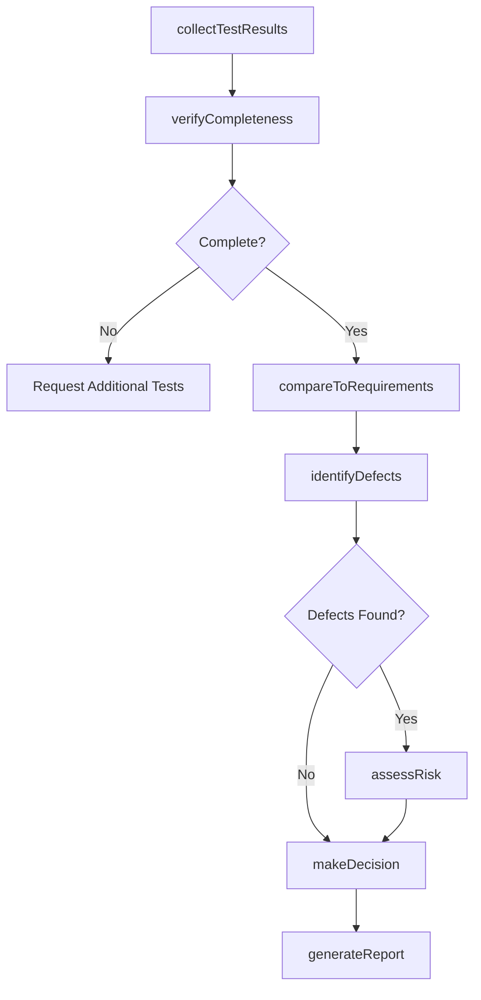
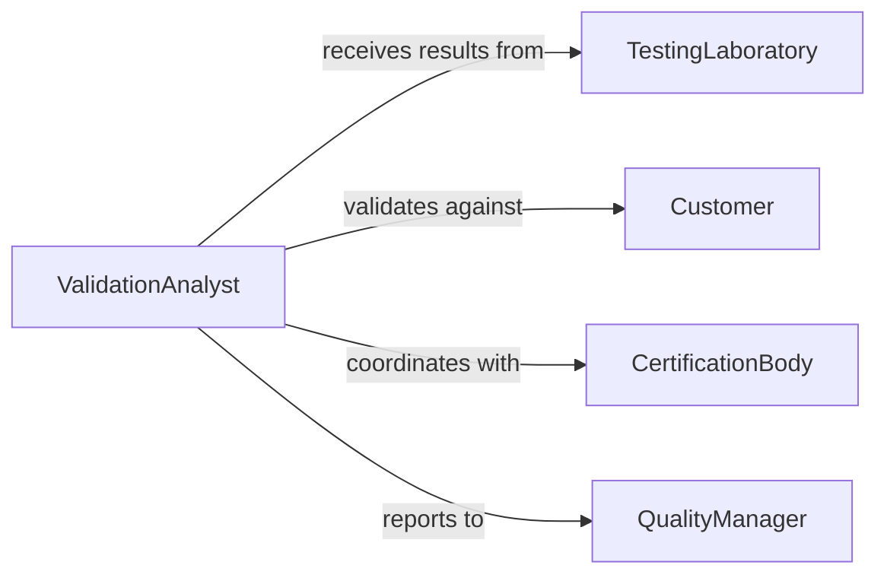

# Analyze Test Validation Data

> Business-as-Code definition for analyzing test and validation data. Models the complete validation analysis lifecycle from test execution through acceptance decisions.

## Overview

Test validation analysis involves systematic evaluation of test results to verify that products, systems, or processes meet specified requirements and quality standards. Validation analysts examine test data, compare against acceptance criteria, and determine whether deliverables are fit for purpose and ready for release or deployment.

## Actors

| Actor | Description |
|-------|-------------|
| TestingLaboratory | Conducts independent validation testing |
| CertificationBody | Provides standards certification and compliance verification |
| Customer | Defines acceptance criteria and requirements |
| RegulatoryAgency | Enforces compliance with mandatory standards |
| QualityAuditor | Reviews validation processes and documentation |

## Roles

| Role | Description |
|------|-------------|
| ValidationAnalyst | Analyzes test data and determines acceptance |
| TestEngineer | Executes validation tests and collects data |
| QualityManager | Oversees validation process and approvals |
| ProductOwner | Defines requirements and acceptance criteria |

## Entities

| Entity | Description |
|--------|-------------|
| ValidationTest | Structured test to verify requirements compliance |
| TestResult | Outcome data from validation testing |
| AcceptanceCriteria | Required standards for passing validation |
| ValidationReport | Documentation of analysis and decision |
| Defect | Identified failure to meet requirements |
| ValidationDecision | Approval or rejection determination |

## Actions

| Action | Description |
|--------|-------------|
| collectTestResults | Gather data from validation tests |
| verifyCompleteness | Ensure all required tests executed |
| compareToRequirements | Evaluate results against acceptance criteria |
| identifyDefects | Detect failures and non-conformances |
| assessRisk | Determine impact of identified issues |
| makeDecision | Approve or reject based on analysis |
| generateReport | Create validation documentation |

## Events

| Event | Description |
|-------|-------------|
| testResultsCollected | Validation test data gathered |
| completenessVerified | Test coverage confirmed |
| requirementsCompared | Results evaluated against criteria |
| defectsIdentified | Non-conformances detected |
| riskAssessed | Impact of issues evaluated |
| decisionMade | Validation approval or rejection determined |
| reportGenerated | Validation documentation created |

## Searches

| Search | Description |
|--------|-------------|
| findValidationTests | Query tests by product, type, or status |
| getTestResults | Retrieve results by test or requirement |
| getDefects | Find non-conformances by severity or category |
| getValidationDecisions | Access historical approval decisions |

## Workflow



## Actor Relationships



## Usage

### Calling Actions

```typescript
import { analyzeTestValidationData } from '@headlessly/analyze-test-validation-data'

const validation = analyzeTestValidationData()

// Collect validation test results
const results = await validation.collectTestResults({
  productId: 'PRD-2026-001',
  testSuite: 'functional-validation',
  buildNumber: '1.2.0-rc1'
})

// Compare results to requirements
await validation.compareToRequirements({
  resultsId: results.id,
  requirementsSet: 'release-1.2-criteria'
})

// Make validation decision
const decision = await validation.makeDecision({
  resultsId: results.id,
  reviewer: 'validation-analyst-001'
})
```

### Event-Driven Automation

```typescript
// Auto-identify defects after comparison
validation.requirementsCompared(async ({ resultsId, failures }) => {
  if (failures.length > 0) {
    await validation.identifyDefects({
      resultsId,
      failures
    })
  }
})

// Notify stakeholders on decision
validation.decisionMade(async ({ productId, decision, defects }) => {
  await notify({
    to: 'product-team',
    message: `Validation ${decision.status} for ${productId}. ${defects.length} defects identified.`,
    priority: decision.status === 'rejected' ? 'high' : 'normal'
  })
})
```
