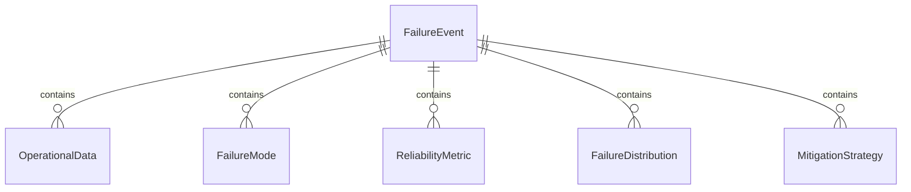
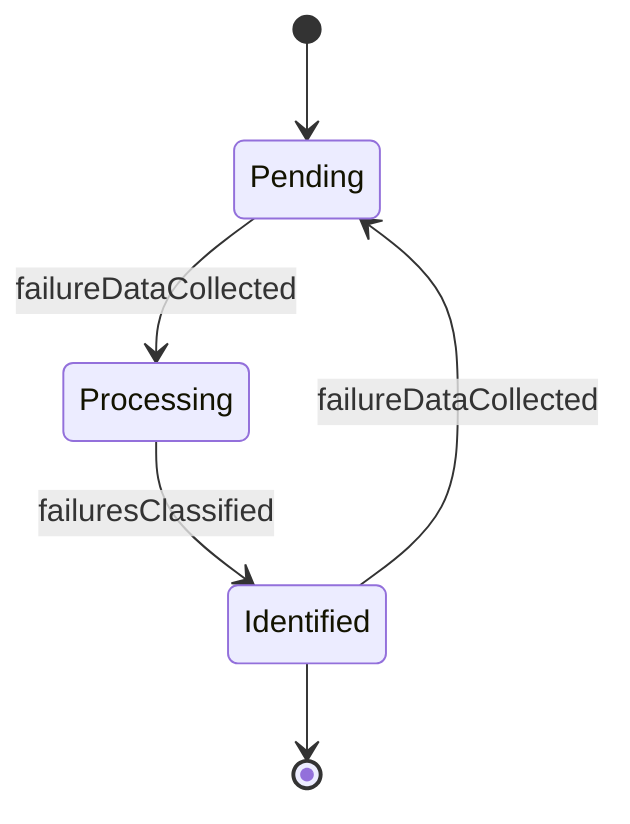
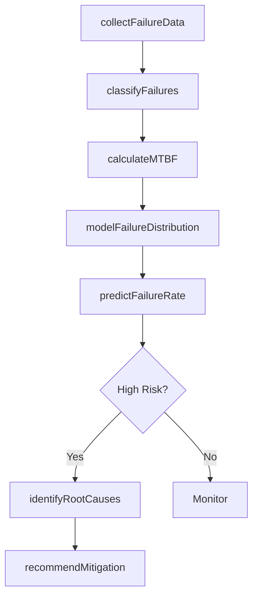
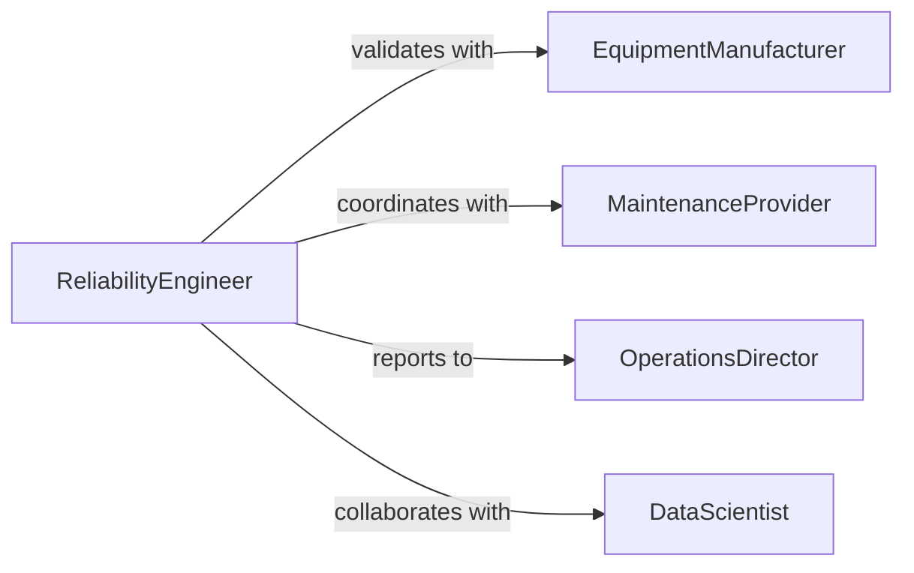

# Conduct Quantitative Failure Analyses Operational

> Business-as-Code definition for conducting quantitative failure analyses of operational data. Models the complete reliability analysis lifecycle from data collection through failure prediction and mitigation.

## Overview

Quantitative failure analysis involves statistical evaluation of operational data to identify failure patterns, calculate reliability metrics, and predict future failures. Reliability engineers use mathematical models, failure rates, and historical data to assess system dependability, determine root causes, and recommend improvements to reduce downtime and improve asset performance.

## Actors

| Actor | Description |
|-------|-------------|
| EquipmentManufacturer | Provides failure mode data and reliability specifications |
| MaintenanceProvider | Implements corrective and preventive maintenance |
| InsuranceCarrier | Assesses risk based on failure analysis |
| IndustryStandardsBody | Defines reliability calculation methodologies |
| SupplyChainPartner | Impacts reliability through component quality |

## Roles

| Role | Description |
|------|-------------|
| ReliabilityEngineer | Conducts quantitative failure analysis |
| MaintenanceManager | Plans maintenance based on failure predictions |
| OperationsDirector | Makes asset management decisions |
| DataScientist | Develops predictive failure models |

## Entities

| Entity | Description |
|--------|-------------|
| FailureEvent | Documented instance of system or component failure |
| OperationalData | Time-series data from system operation |
| FailureMode | Specific way in which a component can fail |
| ReliabilityMetric | Calculated measure of system dependability |
| FailureDistribution | Statistical model of failure patterns |
| MitigationStrategy | Recommended action to reduce failure risk |

## Actions

| Action | Description |
|--------|-------------|
| collectFailureData | Gather historical failure and operational data |
| classifyFailures | Categorize failures by mode and severity |
| calculateMTBF | Compute mean time between failures |
| modelFailureDistribution | Fit statistical distribution to failure data |
| predictFailureRate | Forecast future failure probability |
| identifyRootCauses | Determine underlying failure mechanisms |
| recommendMitigation | Propose strategies to reduce failures |

## Events

| Event | Description |
|-------|-------------|
| failureDataCollected | Historical failure data gathered |
| failuresClassified | Failure modes categorized |
| mtbfCalculated | Mean time between failures computed |
| failureDistributionModeled | Statistical model fitted to data |
| failureRatePredicted | Future failure probability forecasted |
| rootCausesIdentified | Underlying failure mechanisms determined |
| mitigationRecommended | Failure reduction strategies proposed |

## Searches

| Search | Description |
|--------|-------------|
| findFailureEvents | Query failures by asset, mode, or timeframe |
| getReliabilityMetrics | Retrieve MTBF, MTTR, availability by system |
| getFailurePredictions | Access forecasted failure probabilities |
| getRootCauseAnalyses | Find completed root cause investigations |


## Entity Relationships



## State Diagram


## Workflow



## Actor Relationships



## Usage

### Calling Actions

```typescript
import { conductQuantitativeFailureAnalysesOperational } from '@headlessly/conduct-quantitative-failure-analyses-operational'

const reliability = conductQuantitativeFailureAnalysesOperational()

// Collect failure data for analysis
const data = await reliability.collectFailureData({
  assetIds: ['TURBINE-001', 'TURBINE-002'],
  timeRange: { start: '2024-01-01', end: '2026-02-01' },
  includeOperationalData: true
})

// Calculate reliability metrics
const mtbf = await reliability.calculateMTBF({
  dataId: data.id,
  groupBy: 'asset'
})

// Predict future failures
const prediction = await reliability.predictFailureRate({
  assetId: 'TURBINE-001',
  forecastPeriod: 180
})
```

### Event-Driven Automation

```typescript
// Auto-classify failures when collected
reliability.failureDataCollected(async ({ dataId }) => {
  await reliability.classifyFailures({
    dataId,
    taxonomy: 'ISO-14224'
  })
})

// Alert on high-risk predictions
reliability.failureRatePredicted(async ({ assetId, prediction }) => {
  if (prediction.probability > 0.25) {
    await reliability.identifyRootCauses({ assetId })
    await notify({
      channel: 'maintenance-planning',
      message: `Asset ${assetId} has ${prediction.probability * 100}% failure probability in next ${prediction.days} days`
    })
  }
})
```
