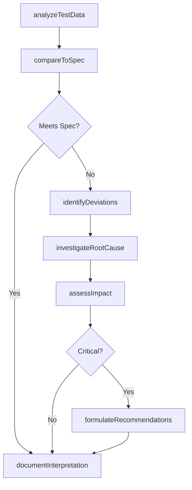
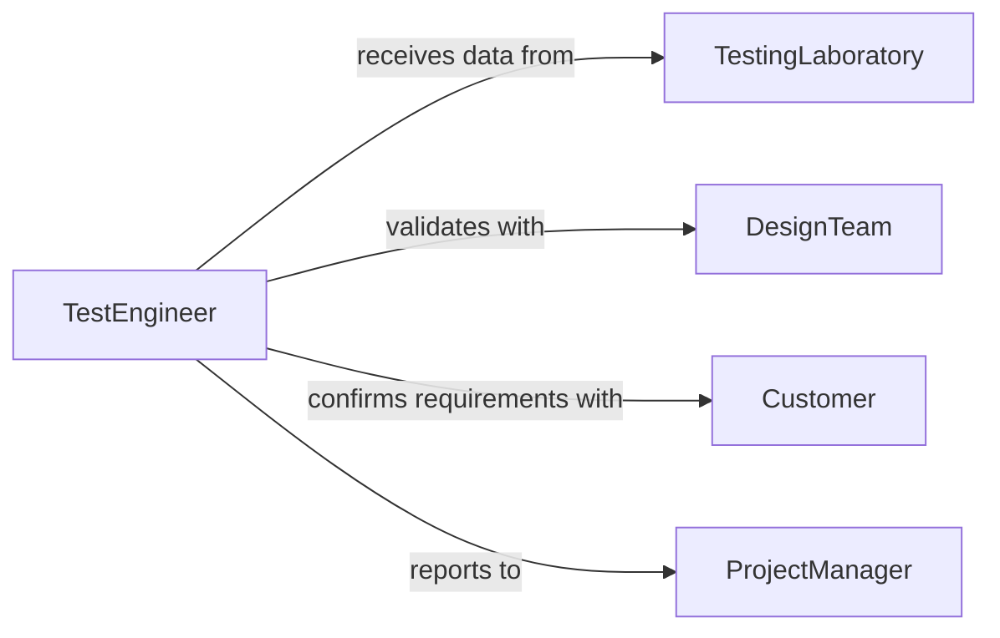

# Interpret Design Operational Test Results

> Business-as-Code definition for interpreting design and operational test results. Models the complete test interpretation lifecycle from data analysis through design recommendations.

## Overview

Test result interpretation involves analyzing design validation and operational test data to assess whether systems, products, or processes meet specifications and performance requirements. Test engineers evaluate test outcomes, identify design issues, determine root causes of failures, and provide recommendations for design improvements or operational adjustments.

## Actors

| Actor | Description |
|-------|-------------|
| DesignTeam | Creates product or system specifications |
| TestingLaboratory | Conducts formal testing and provides raw data |
| Customer | Defines operational requirements and use cases |
| RegulatoryBody | Establishes mandatory testing standards |
| ComponentSupplier | Provides subsystem components and specifications |

## Roles

| Role | Description |
|------|-------------|
| TestEngineer | Interprets test results and evaluates performance |
| DesignEngineer | Uses test insights to refine designs |
| QualityEngineer | Validates conformance to requirements |
| ProjectManager | Makes decisions based on test interpretations |

## Entities

| Entity | Description |
|--------|-------------|
| TestRun | Execution of design or operational test |
| TestResult | Raw data and measurements from testing |
| Specification | Required performance or design criteria |
| Interpretation | Analysis and conclusions from test data |
| DesignDefect | Identified flaw in design or implementation |
| Recommendation | Suggested design or operational change |

## Actions

| Action | Description |
|--------|-------------|
| analyzeTestData | Examine raw test measurements and observations |
| compareToSpec | Evaluate results against design specifications |
| identifyDeviations | Detect failures or performance gaps |
| investigateRootCause | Determine underlying reasons for failures |
| assessImpact | Evaluate severity and scope of issues |
| formulateRecommendations | Develop design or operational improvement proposals |
| documentInterpretation | Create formal test interpretation report |

## Events

| Event | Description |
|-------|-------------|
| testDataAnalyzed | Test measurements examined and processed |
| specCompared | Results evaluated against requirements |
| deviationsIdentified | Failures or gaps detected |
| rootCauseInvestigated | Underlying failure reasons determined |
| impactAssessed | Severity and scope evaluated |
| recommendationsFormulated | Improvement proposals developed |
| interpretationDocumented | Test interpretation report completed |

## Searches

| Search | Description |
|--------|-------------|
| findTestRuns | Query tests by system, date, or type |
| getDeviations | Retrieve failures and performance gaps |
| getInterpretations | Access historical test analysis reports |
| getRecommendations | Find design improvement suggestions |

## Workflow



## Actor Relationships



## Usage

### Calling Actions

```typescript
import { interpretDesignOperationalTestResults } from '@headlessly/interpret-design-operational-test-results'

const testing = interpretDesignOperationalTestResults()

// Analyze test data from recent run
const analysis = await testing.analyzeTestData({
  testRunId: 'TEST-2026-042',
  dataPoints: ['temperature', 'pressure', 'efficiency'],
  statisticalMethods: ['mean', 'std-dev', 'range']
})

// Compare results to specifications
await testing.compareToSpec({
  analysisId: analysis.id,
  specificationId: 'SPEC-PRD-001-v2.1'
})

// Formulate recommendations for design team
const recommendations = await testing.formulateRecommendations({
  testRunId: 'TEST-2026-042',
  severity: 'high',
  scope: 'design-change'
})
```

### Event-Driven Automation

```typescript
// Auto-investigate when deviations found
testing.deviationsIdentified(async ({ testRunId, deviations }) => {
  const critical = deviations.filter(d => d.severity === 'critical')
  if (critical.length > 0) {
    await testing.investigateRootCause({
      testRunId,
      deviations: critical
    })
  }
})

// Notify design team of recommendations
testing.recommendationsFormulated(async ({ testRunId, recommendations }) => {
  await notify({
    to: 'design-team',
    message: `${recommendations.length} design recommendations from test ${testRunId}`,
    attachments: [{ type: 'recommendations', data: recommendations }]
  })
})
```
