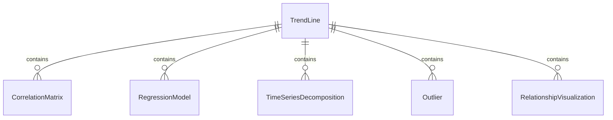
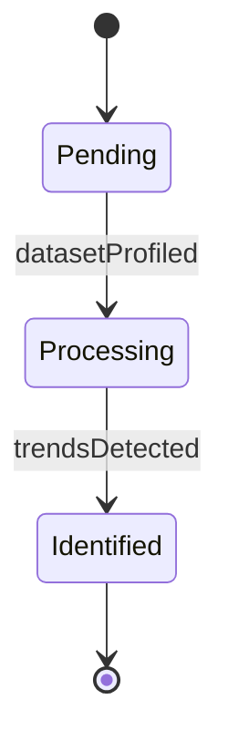
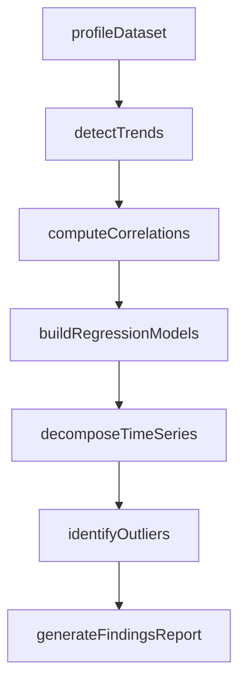
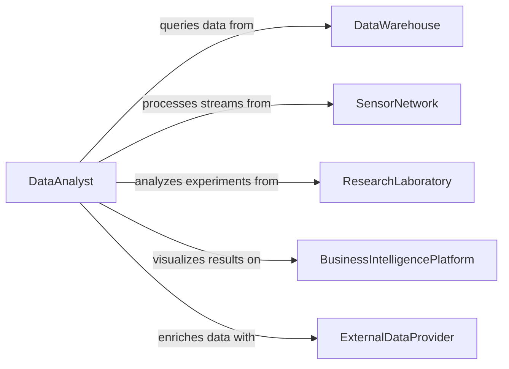

# Analyze Data to Identify Trends or Relationships

> Business-as-Code definition for analyzing data to identify trends or relationships among variables. Models the application of exploratory data analysis, correlation studies, regression modeling, and time-series decomposition to discover patterns, dependencies, and directional changes in structured and unstructured datasets.

## Overview

Analyzing data to identify trends or relationships among variables involves applying exploratory data analysis, correlation and covariance studies, regression modeling, time-series decomposition, and multivariate analysis to discover meaningful patterns and dependencies in datasets. This definition provides actions for data profiling, trend detection, relationship quantification, and findings visualization. It supports data analysts, research scientists, business intelligence specialists, and quantitative analysts.

## Actors

| Actor | Description |
|-------|-------------|
| DataWarehouse | Stores structured datasets used for trend and relationship analysis |
| SensorNetwork | Generates continuous time-series data from monitoring equipment |
| ResearchLaboratory | Produces experimental datasets requiring statistical analysis |
| BusinessIntelligencePlatform | Provides dashboards and visualization tools for analytical outputs |
| ExternalDataProvider | Supplies third-party datasets for cross-referencing and enrichment |

## Roles

| Role | Description |
|------|-------------|
| DataAnalyst | Explores datasets to identify patterns, trends, and anomalies |
| QuantitativeAnalyst | Applies advanced statistical methods to quantify relationships |
| BusinessIntelligenceAnalyst | Translates data patterns into business performance insights |
| ResearchScientist | Analyzes experimental data to test hypotheses and discover relationships |

## Entities

| Entity | Description |
|--------|-------------|
| TrendLine | A fitted curve showing the directional movement of a variable over time |
| CorrelationMatrix | A table of pairwise correlation coefficients among multiple variables |
| RegressionModel | A statistical model quantifying the relationship between dependent and independent variables |
| TimeSeriesDecomposition | A breakdown of time-series data into trend, seasonal, and residual components |
| Outlier | A data point significantly deviating from expected patterns |
| RelationshipVisualization | A chart or graph depicting discovered patterns and dependencies |
| FindingsReport | A document presenting discovered trends, relationships, and their significance |

## Actions

| Action | Description |
|--------|-------------|
| profileDataset | Examine data distributions, completeness, and quality characteristics |
| detectTrends | Identify directional movements and patterns in time-series or sequential data |
| computeCorrelations | Calculate statistical associations between pairs of variables |
| buildRegressionModels | Construct models quantifying relationships between variables |
| decomposeTimeSeries | Separate time-series data into trend, seasonal, and residual components |
| identifyOutliers | Detect data points that deviate significantly from expected patterns |
| generateFindingsReport | Produce a summary of discovered trends, relationships, and implications |

## Events

| Event | Description |
|-------|-------------|
| datasetProfiled | Data distributions and quality characteristics have been examined |
| trendsDetected | Directional movements in the data have been identified |
| correlationsComputed | Statistical associations between variables have been calculated |
| regressionModelsBuilt | Quantitative relationship models have been constructed |
| timeSeriesDecomposed | Time-series data has been separated into components |
| outliersIdentified | Anomalous data points have been detected |
| findingsReportGenerated | A summary of trends and relationships has been produced |

## Searches

| Search | Description |
|--------|-------------|
| findAnalyses | List data analyses by dataset, method, or date |
| getTrends | Retrieve detected trends by variable, direction, or significance |
| getCorrelations | Access correlation results by variable pair or strength |
| getRegressionResults | View regression model coefficients and fit metrics |
| getOutliers | List detected outliers by dataset, variable, or deviation magnitude |


## Entity Relationships



## State Diagram


## Workflow



## Actor Relationships



## Usage

### Calling Actions

```typescript
import { analyzeDataIdentifyTrendsRelationships } from '@headlessly/analyze-data-identify-trends-relationships'

const analyst = analyzeDataIdentifyTrendsRelationships()

// Profile and explore dataset
const analysis = await analyst.profileDataset({
  dataset: 'customer-engagement-metrics',
  variables: ['session-duration', 'page-views', 'conversion-rate', 'support-tickets', 'NPS-score'],
  period: { start: '2024-01-01', end: '2025-12-31' }
})

// Detect trends and relationships
await analyst.detectTrends({ analysisId: analysis.id })
await analyst.computeCorrelations({ analysisId: analysis.id })
await analyst.buildRegressionModels({
  analysisId: analysis.id,
  dependent: 'conversion-rate',
  independents: ['session-duration', 'page-views', 'NPS-score']
})

// Decompose and detect anomalies
await analyst.decomposeTimeSeries({ analysisId: analysis.id })
await analyst.identifyOutliers({ analysisId: analysis.id })

// Report
await analyst.generateFindingsReport({ analysisId: analysis.id })
```

### Event-Driven Automation

```typescript
// Alert on significant correlations
analyst.correlationsComputed(async ({ analysisId, correlations }) => {
  const strong = correlations.filter(c => Math.abs(c.coefficient) > 0.8)
  if (strong.length > 0) {
    await notify({
      to: 'analytics-team',
      message: `${strong.length} strong correlations discovered in analysis ${analysisId}`
    })
  }
})

// Flag outliers for investigation
analyst.outliersIdentified(async ({ analysisId, outliers }) => {
  if (outliers.length > 0) {
    await notify({
      to: 'data-quality-team',
      message: `${outliers.length} outliers detected requiring investigation`
    })
  }
})
```
