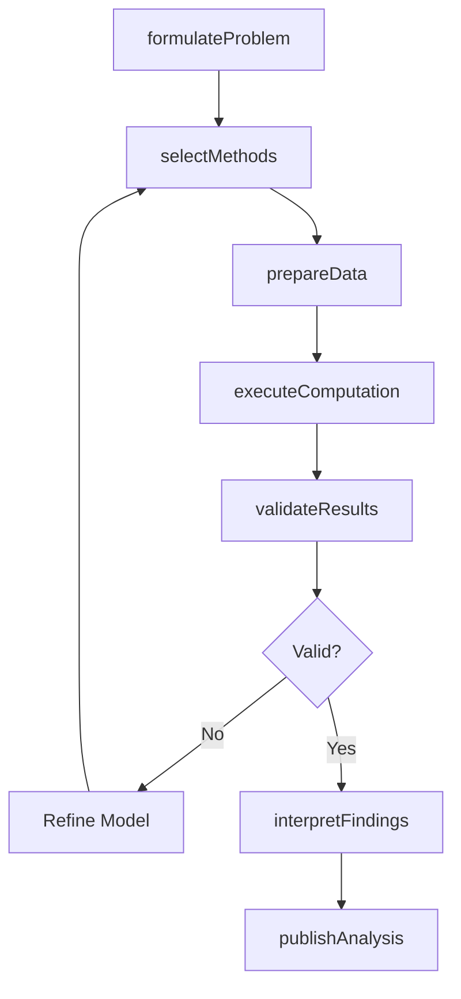
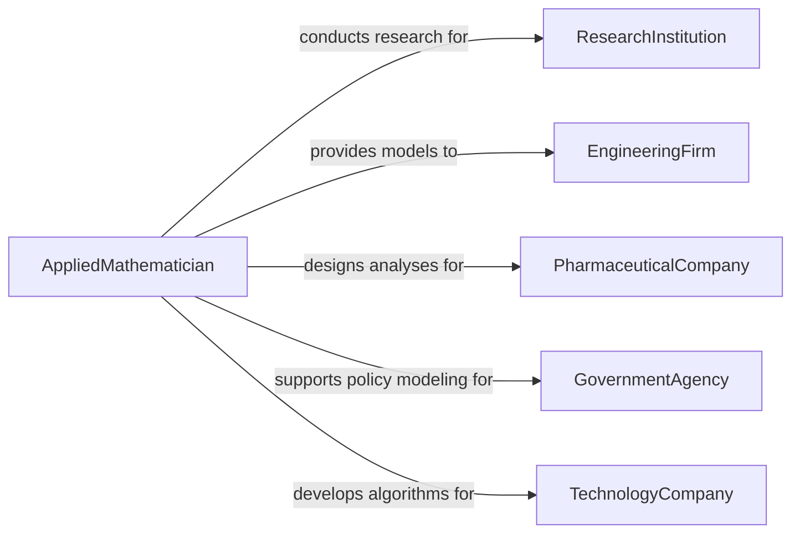

# Apply Mathematical Principles or Statistical Approaches

> Business-as-Code definition for applying mathematical principles and statistical approaches to solve problems in scientific or applied fields. Models the formulation, computation, validation, and interpretation of mathematical models and statistical analyses used in engineering, physical sciences, operations research, and data science.

## Overview

Applying mathematical principles or statistical approaches involves formulating mathematical models, selecting appropriate statistical methods, executing computational analyses, validating results, and interpreting findings to solve problems in engineering, physical sciences, economics, and operations research. This definition provides actions for problem formulation, method selection, computation, validation, and results reporting. It supports mathematicians, statisticians, data scientists, operations researchers, and scientific computing specialists.

## Actors

| Actor | Description |
|-------|-------------|
| ResearchInstitution | Commissions mathematical analyses for scientific investigations |
| EngineeringFirm | Requires mathematical modeling for design and optimization problems |
| PharmaceuticalCompany | Uses statistical methods for clinical trial analysis and drug efficacy testing |
| GovernmentAgency | Funds applied mathematics research and uses models for policy analysis |
| TechnologyCompany | Applies machine learning and statistical methods to product development |

## Roles

| Role | Description |
|------|-------------|
| AppliedMathematician | Formulates mathematical models for real-world problems |
| Statistician | Designs studies and applies statistical methods to analyze data |
| DataScientist | Combines statistical approaches with computational tools for analysis |
| OperationsResearcher | Applies optimization and simulation methods to operational problems |

## Entities

| Entity | Description |
|--------|-------------|
| MathematicalModel | A formal representation of a system or process using equations and constraints |
| StatisticalTest | A procedure for making inferences about populations from sample data |
| DataSet | A structured collection of observations used for analysis |
| ComputationResult | The output of a mathematical or statistical computation |
| ValidationMetric | A measure of how well a model fits observed data or predicts outcomes |
| AnalysisReport | A document presenting mathematical or statistical findings and interpretations |
| OptimizationSolution | A set of variable values that minimizes or maximizes an objective function |

## Actions

| Action | Description |
|--------|-------------|
| formulateProblem | Define the mathematical structure of the problem including variables and constraints |
| selectMethods | Choose appropriate mathematical or statistical approaches for the problem type |
| prepareData | Clean, transform, and structure data for mathematical analysis |
| executeComputation | Run the mathematical model or statistical analysis |
| validateResults | Assess model fit, statistical significance, and result robustness |
| interpretFindings | Translate mathematical outputs into domain-specific conclusions |
| publishAnalysis | Produce a report of methods, results, and interpretations |

## Events

| Event | Description |
|-------|-------------|
| problemFormulated | The mathematical structure of the problem has been defined |
| methodsSelected | Appropriate mathematical or statistical approaches have been chosen |
| dataPrepared | Data has been cleaned, transformed, and structured for analysis |
| computationExecuted | The mathematical model or statistical analysis has been run |
| resultsValidated | Model fit and statistical significance have been assessed |
| findingsInterpreted | Mathematical outputs have been translated into conclusions |
| analysisPublished | A report of methods and results has been produced |

## Searches

| Search | Description |
|--------|-------------|
| findAnalyses | List mathematical or statistical analyses by domain, method, or date |
| getComputationResults | Retrieve model outputs by analysis, variable, or scenario |
| getValidationMetrics | Access model fit and significance measures by analysis |
| getOptimizationSolutions | View optimal solutions by problem or objective function |
| getMethodComparisons | Compare results across different analytical approaches |

## Workflow



## Actor Relationships



## Usage

### Calling Actions

```typescript
import { applyMathematicalPrinciplesStatisticalApproaches } from '@headlessly/apply-mathematical-principles-statistical-approaches'

const analyst = applyMathematicalPrinciplesStatisticalApproaches()

// Formulate and solve an optimization problem
const analysis = await analyst.formulateProblem({
  domain: 'supply-chain-optimization',
  type: 'mixed-integer-linear-program',
  objective: 'minimize-total-cost',
  constraints: ['capacity', 'demand-satisfaction', 'lead-time']
})

await analyst.selectMethods({
  analysisId: analysis.id,
  methods: ['branch-and-bound', 'sensitivity-analysis']
})

await analyst.prepareData({
  analysisId: analysis.id,
  sources: ['demand-forecasts', 'supplier-costs', 'transportation-rates']
})

await analyst.executeComputation({ analysisId: analysis.id })
await analyst.validateResults({ analysisId: analysis.id })
await analyst.interpretFindings({ analysisId: analysis.id })
await analyst.publishAnalysis({ analysisId: analysis.id })
```

### Event-Driven Automation

```typescript
// Alert on validation failures
analyst.resultsValidated(async ({ analysisId, isValid, validationMetrics }) => {
  if (!isValid) {
    await notify({
      to: 'modeling-team',
      message: `Validation failed for analysis ${analysisId}: ${validationMetrics.failureReason}`
    })
  }
})

// Distribute published analyses
analyst.analysisPublished(async ({ analysisId, reportId, domain }) => {
  await distribute({ reportId, recipients: ['research-team', 'engineering', 'decision-makers'] })
})
```
