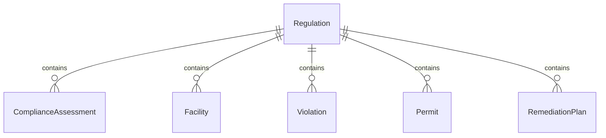
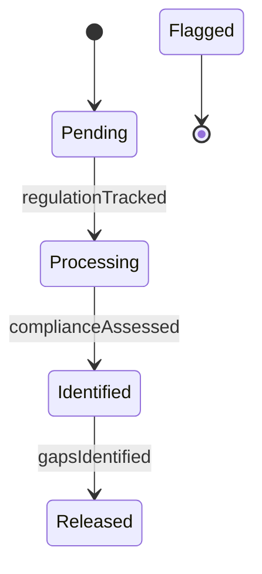
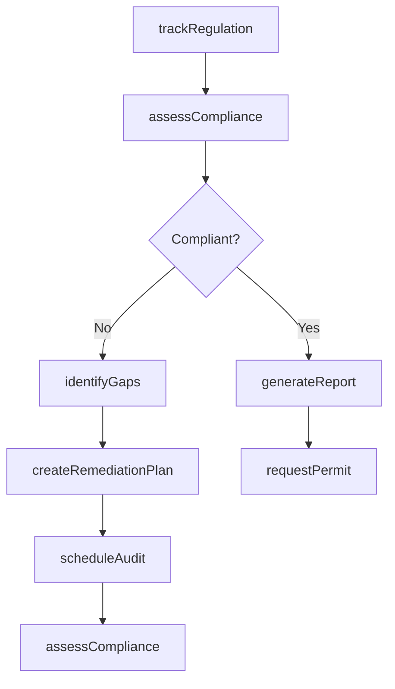
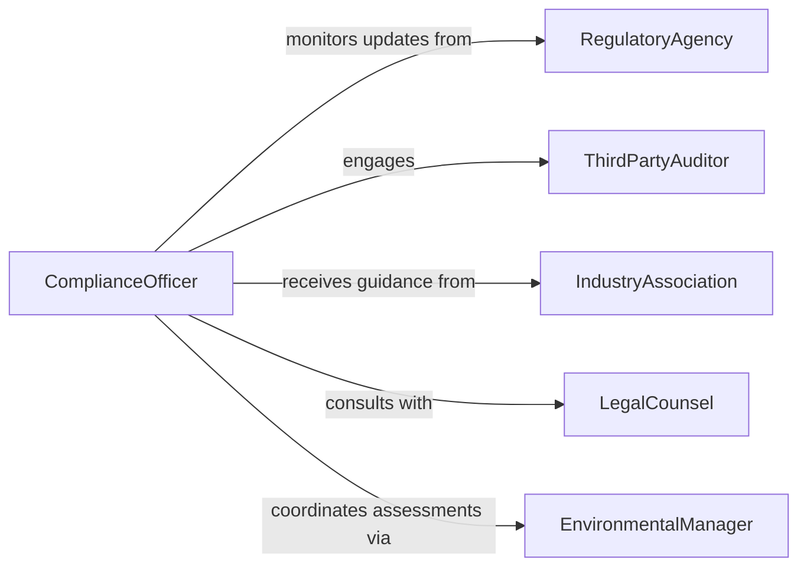

# Analyze Environmental Regulations Ensure Organizationa

> Business-as-Code definition for environmental regulatory compliance analysis. Provides systematic evaluation of environmental regulations and organizational adherence across facilities and operations.

## Overview

Environmental regulatory compliance analysis involves reviewing federal, state, and local environmental laws to ensure organizational practices meet required standards. This definition exposes actions for regulation tracking, compliance assessment, and reporting, with events to trigger remediation workflows and automated regulatory updates.

## Actors

| Actor | Description |
|-------|-------------|
| RegulatoryAgency | Government bodies enforcing environmental standards |
| ThirdPartyAuditor | Independent consultants verifying compliance |
| IndustryAssociation | Trade groups providing regulatory guidance |
| LegalCounsel | Attorneys specializing in environmental law |
| EnvironmentalConsultant | Experts providing compliance assessment services |
| CommunityStakeholder | Local groups monitoring organizational environmental impact |

## Roles

| Role | Description |
|------|-------------|
| ComplianceOfficer | Oversees regulatory adherence and reporting |
| EnvironmentalManager | Manages environmental programs and initiatives |
| FacilityManager | Implements compliance measures at operational sites |
| RegulatoryAnalyst | Tracks and interprets environmental regulations |

## Entities

| Entity | Description |
|--------|-------------|
| Regulation | An environmental law or rule requiring compliance |
| ComplianceAssessment | Evaluation of organizational adherence to regulations |
| Facility | Physical location subject to environmental regulations |
| Violation | Instance of non-compliance with regulatory requirements |
| Permit | Authorization to conduct activities affecting the environment |
| RemediationPlan | Action plan to address compliance gaps |

## Actions

| Action | Description |
|--------|-------------|
| trackRegulation | Monitor new and updated environmental regulations |
| assessCompliance | Evaluate organizational adherence to specific regulations |
| identifyGaps | Detect areas where practices fall short of requirements |
| generateReport | Produce compliance documentation for regulators |
| requestPermit | Apply for environmental permits or renewals |
| createRemediationPlan | Develop corrective actions for violations |
| scheduleAudit | Arrange third-party compliance verification |

## Events

| Event | Description |
|-------|-------------|
| regulationTracked | New or updated regulation has been identified |
| complianceAssessed | Assessment of adherence has been completed |
| gapsIdentified | Non-compliance areas have been detected |
| reportGenerated | Compliance documentation has been produced |
| permitRequested | Application for environmental permit submitted |
| remediationPlanned | Corrective action plan has been created |
| auditScheduled | Third-party verification has been arranged |

## Searches

| Search | Description |
|--------|-------------|
| findRegulations | List regulations by jurisdiction, type, or effective date |
| getAssessments | Retrieve compliance evaluations by facility or period |
| getViolations | Find instances of non-compliance requiring remediation |
| getPermits | List permits by facility, type, or expiration date |


## Entity Relationships



## State Diagram


## Workflow



## Actor Relationships



## Usage

### Calling Actions

```typescript
import { analyzeEnvironmentalRegulationsEnsureOrganizational } from '@headlessly/analyze-environmental-regulations-ensure-organizational'

const compliance = analyzeEnvironmentalRegulationsEnsureOrganizational()

// Track a new air quality regulation
const regulation = await compliance.trackRegulation({
  jurisdiction: 'US-EPA',
  title: 'Clean Air Act Amendment 2026',
  effectiveDate: '2026-07-01',
  applicableFacilities: ['plant-001', 'plant-003']
})

// Assess compliance at a facility
const assessment = await compliance.assessCompliance({
  facilityId: 'plant-001',
  regulationId: regulation.id,
  assessmentDate: '2026-06-15'
})

// Generate compliance report for submission
const report = await compliance.generateReport({
  facilityId: 'plant-001',
  reportingPeriod: 'Q2-2026',
  regulationIds: [regulation.id]
})
```

### Event-Driven Automation

```typescript
// Automatically create remediation plan when gaps identified
compliance.gapsIdentified(async ({ assessmentId, violations }) => {
  if (violations.length > 0) {
    await compliance.createRemediationPlan({
      assessmentId,
      violations,
      targetCompletionDate: addDays(new Date(), 90)
    })
  }
})

// Schedule audit after remediation plan completion
compliance.remediationPlanned(async ({ planId, facilityId }) => {
  await compliance.scheduleAudit({
    facilityId,
    auditType: 'post-remediation',
    requestedDate: addDays(new Date(), 30)
  })
})
```
