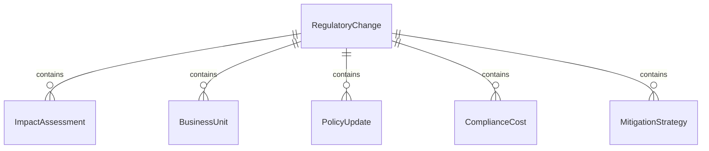
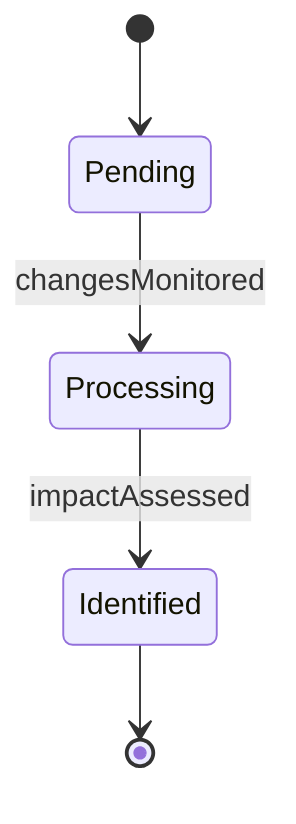
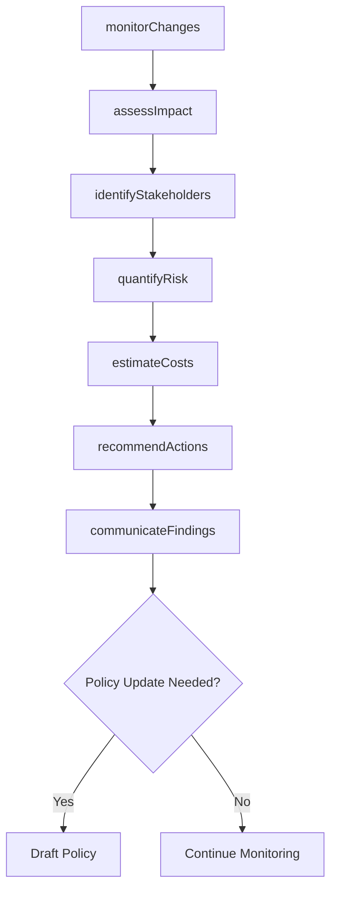
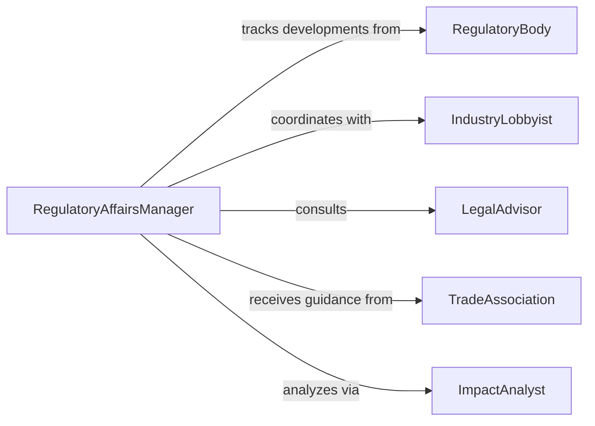

# Analyze Impact Legal Regulatory Changes

> Business-as-Code definition for legal and regulatory impact analysis. Evaluates how legislative and regulatory changes affect business operations, policies, and strategic planning.

## Overview

Legal and regulatory impact analysis involves assessing how new laws, amendments, and enforcement changes affect organizational activities. This definition provides actions for change tracking, impact assessment, and stakeholder communication, with events to trigger policy updates and compliance initiatives across affected business units.

## Actors

| Actor | Description |
|-------|-------------|
| Legislator | Lawmakers introducing or passing new legislation |
| RegulatoryBody | Government agencies issuing rules and enforcement guidance |
| IndustryLobbyist | Representatives advocating for industry positions |
| LegalAdvisor | Attorneys interpreting regulatory changes |
| TradeAssociation | Industry groups providing member guidance |
| CompetitorOrganization | Peer companies subject to the same regulations |

## Roles

| Role | Description |
|------|-------------|
| RegulatoryAffairsManager | Monitors legislative and regulatory developments |
| ImpactAnalyst | Evaluates operational and financial implications |
| PolicyAdvisor | Recommends organizational policy adjustments |
| ComplianceDirector | Ensures adherence to new requirements |

## Entities

| Entity | Description |
|--------|-------------|
| RegulatoryChange | A new law, rule, or enforcement guideline |
| ImpactAssessment | Analysis of how a change affects the organization |
| BusinessUnit | Department or division affected by regulatory change |
| PolicyUpdate | Internal policy revision required by regulatory change |
| ComplianceCost | Financial impact of adhering to new requirements |
| MitigationStrategy | Plan to address negative impacts of regulatory changes |

## Actions

| Action | Description |
|--------|-------------|
| monitorChanges | Track new legislative and regulatory developments |
| assessImpact | Evaluate effects on operations, costs, and strategy |
| quantifyRisk | Measure compliance risk and potential penalties |
| identifyStakeholders | Determine which business units are affected |
| recommendActions | Propose policy updates and compliance measures |
| estimateCosts | Calculate financial impact of compliance |
| communicateFindings | Distribute impact analysis to leadership |

## Events

| Event | Description |
|-------|-------------|
| changesMonitored | Regulatory developments have been identified |
| impactAssessed | Analysis of effects has been completed |
| riskQuantified | Compliance risk measurement is available |
| stakeholdersIdentified | Affected business units have been determined |
| actionsRecommended | Policy and compliance proposals have been made |
| costsEstimated | Financial impact calculation is complete |
| findingsCommunicated | Analysis has been distributed to stakeholders |

## Searches

| Search | Description |
|--------|-------------|
| findChanges | List regulatory changes by date, jurisdiction, or topic |
| getAssessments | Retrieve impact analyses by business unit or severity |
| getRisks | Find high-priority compliance risks requiring attention |
| getCosts | List financial impacts by change or business unit |


## Entity Relationships



## State Diagram


## Workflow



## Actor Relationships



## Usage

### Calling Actions

```typescript
import { analyzeImpactLegalRegulatoryChanges } from '@headlessly/analyze-impact-legal-regulatory-changes'

const impact = analyzeImpactLegalRegulatoryChanges()

// Monitor a new data privacy regulation
const change = await impact.monitorChanges({
  jurisdiction: 'California',
  title: 'Consumer Privacy Rights Act 2026',
  effectiveDate: '2027-01-01',
  category: 'data-protection'
})

// Assess impact on affected business units
const assessment = await impact.assessImpact({
  changeId: change.id,
  scope: ['marketing', 'sales', 'customer-service']
})

// Estimate compliance costs
const costs = await impact.estimateCosts({
  changeId: change.id,
  categories: ['technology', 'training', 'legal', 'operational']
})
```

### Event-Driven Automation

```typescript
// Automatically quantify risk when impact assessed
impact.impactAssessed(async ({ changeId, severity }) => {
  if (severity === 'high') {
    await impact.quantifyRisk({
      changeId,
      factors: ['financial', 'operational', 'reputational']
    })
  }
})

// Alert leadership on high-cost regulatory changes
impact.costsEstimated(async ({ changeId, totalCost }) => {
  if (totalCost > 1000000) {
    await impact.communicateFindings({
      changeId,
      recipients: ['ceo', 'cfo', 'general-counsel'],
      urgency: 'immediate'
    })
  }
})
```
