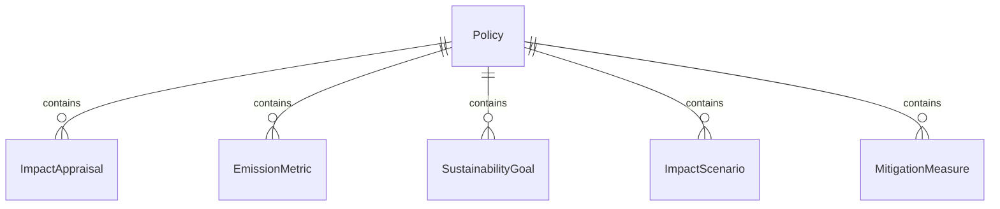
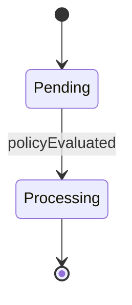
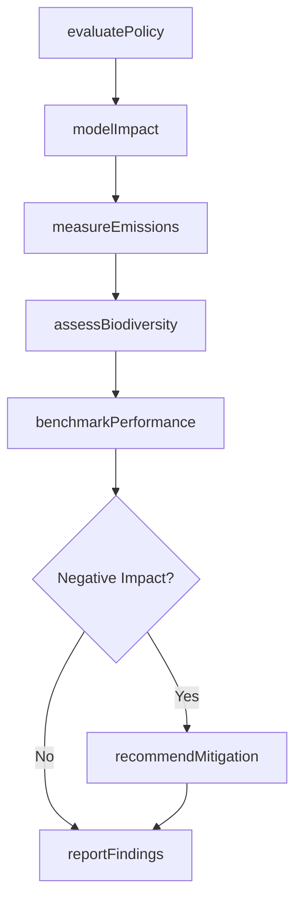
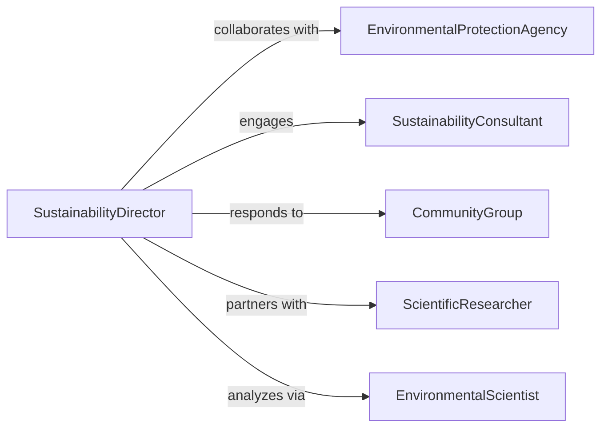

# Appraise Environmental Impact Regulations Policies

> Business-as-Code definition for environmental impact appraisal of regulations and policies. Evaluates how regulatory frameworks affect ecosystems, sustainability goals, and environmental performance metrics.

## Overview

Environmental impact appraisal involves analyzing how regulations and organizational policies affect natural resources, emissions, and sustainability outcomes. This definition provides actions for impact modeling, scenario analysis, and stakeholder reporting, with events to trigger sustainability initiatives and environmental performance tracking across operations.

## Actors

| Actor | Description |
|-------|-------------|
| EnvironmentalProtectionAgency | Government body setting environmental standards |
| SustainabilityConsultant | Expert advisors on environmental best practices |
| CommunityGroup | Local organizations monitoring environmental effects |
| ScientificResearcher | Academics studying ecological impacts |
| IndustryPeer | Competitor organizations with similar environmental footprints |
| InvestorStakeholder | Financial stakeholders evaluating ESG performance |

## Roles

| Role | Description |
|------|-------------|
| SustainabilityDirector | Oversees environmental strategy and reporting |
| EnvironmentalScientist | Conducts technical impact assessments |
| PolicyAnalyst | Evaluates regulatory implications for environmental goals |
| ESGReporter | Prepares environmental performance disclosures |

## Entities

| Entity | Description |
|--------|-------------|
| Policy | Organizational or regulatory rule affecting environmental practices |
| ImpactAppraisal | Assessment of environmental effects from a policy |
| EmissionMetric | Measurement of greenhouse gas or pollutant outputs |
| SustainabilityGoal | Target for environmental performance improvement |
| ImpactScenario | Projected environmental outcomes under different policies |
| MitigationMeasure | Action to reduce negative environmental impacts |

## Actions

| Action | Description |
|--------|-------------|
| evaluatePolicy | Assess environmental implications of a regulation or policy |
| modelImpact | Project environmental outcomes under different scenarios |
| measureEmissions | Quantify current greenhouse gas and pollutant levels |
| assessBiodiversity | Evaluate effects on local ecosystems and species |
| benchmarkPerformance | Compare environmental metrics to industry standards |
| recommendMitigation | Propose actions to reduce negative impacts |
| reportFindings | Communicate environmental appraisal results |

## Events

| Event | Description |
|-------|-------------|
| policyEvaluated | Environmental implications have been assessed |
| impactModeled | Scenario projections have been completed |
| emissionsMeasured | Current pollution levels have been quantified |
| biodiversityAssessed | Ecosystem effects have been evaluated |
| performanceBenchmarked | Industry comparison has been completed |
| mitigationRecommended | Corrective actions have been proposed |
| findingsReported | Environmental appraisal has been communicated |

## Searches

| Search | Description |
|--------|-------------|
| findPolicies | List policies by type, jurisdiction, or environmental category |
| getAppraisals | Retrieve impact assessments by policy or date |
| getEmissions | Find emission metrics by facility, pollutant, or period |
| getMitigation | List recommended actions by impact severity |


## Entity Relationships



## State Diagram


## Workflow



## Actor Relationships



## Usage

### Calling Actions

```typescript
import { appraiseEnvironmentalImpactRegulationsPolicies } from '@headlessly/appraise-environmental-impact-regulations-policies'

const appraisal = appraiseEnvironmentalImpactRegulationsPolicies()

// Evaluate a carbon emissions regulation
const policy = await appraisal.evaluatePolicy({
  policyName: 'Net Zero 2030 Mandate',
  jurisdiction: 'European Union',
  environmentalCategories: ['climate', 'air-quality']
})

// Model impact scenarios
const scenarios = await appraisal.modelImpact({
  policyId: policy.id,
  scenarios: [
    { name: 'Current Trajectory', emissionReduction: 20 },
    { name: 'Accelerated Compliance', emissionReduction: 45 },
    { name: 'Full Mitigation', emissionReduction: 60 }
  ]
})

// Measure current emissions baseline
const emissions = await appraisal.measureEmissions({
  facilityIds: ['plant-001', 'plant-002', 'plant-003'],
  pollutants: ['CO2', 'NOx', 'particulate-matter'],
  period: '2025-Q4'
})
```

### Event-Driven Automation

```typescript
// Recommend mitigation when emissions exceed thresholds
appraisal.emissionsMeasured(async ({ facilityId, pollutants }) => {
  const exceeded = pollutants.filter(p => p.value > p.threshold)
  if (exceeded.length > 0) {
    await appraisal.recommendMitigation({
      facilityId,
      pollutants: exceeded,
      urgency: 'high'
    })
  }
})

// Benchmark performance after impact modeling
appraisal.impactModeled(async ({ policyId, scenarios }) => {
  await appraisal.benchmarkPerformance({
    policyId,
    comparisonGroup: 'industry-peers',
    metrics: ['carbon-intensity', 'energy-efficiency']
  })
})
```
