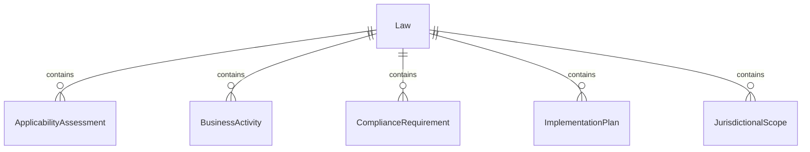
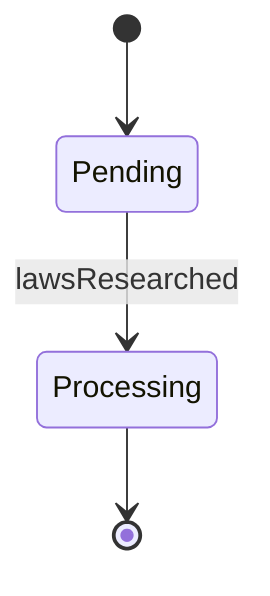
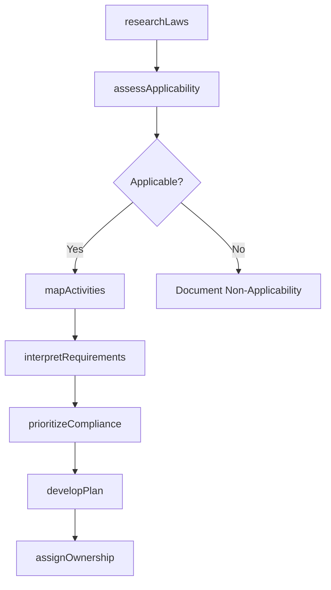
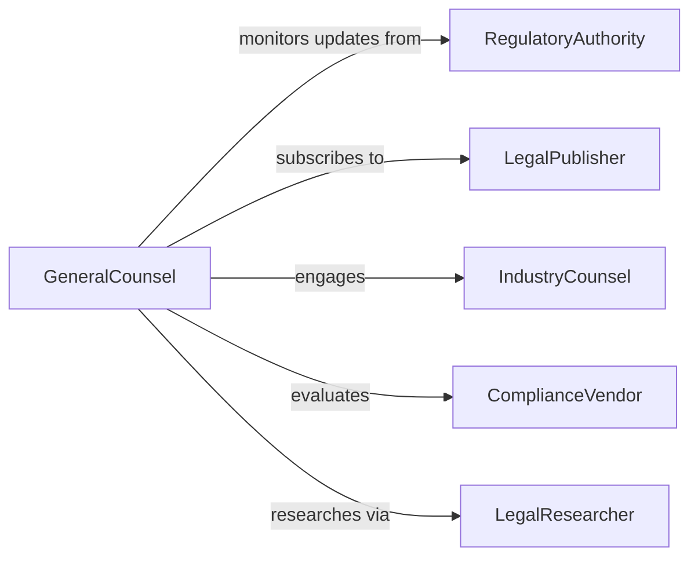

# Evaluate Applicable Laws Regulations Determine

> Business-as-Code definition for evaluating applicable laws and regulations. Determines which legal requirements affect organizational operations and assesses their implementation requirements.

## Overview

Evaluating applicable laws and regulations involves identifying relevant legal frameworks, determining their applicability to business activities, and assessing implementation needs. This definition provides actions for legal research, applicability assessment, and compliance planning, with events to trigger policy development and training initiatives across affected departments.

## Actors

| Actor | Description |
|-------|-------------|
| LegislativeBody | Government entities enacting laws |
| RegulatoryAuthority | Agencies enforcing rules and issuing guidance |
| LegalPublisher | Providers of legal research databases and updates |
| IndustryCounsel | Law firms specializing in sector-specific regulations |
| ComplianceVendor | Technology providers offering regulatory compliance tools |
| ProfessionalAssociation | Trade groups offering regulatory interpretation |

## Roles

| Role | Description |
|------|-------------|
| GeneralCounsel | Chief legal officer overseeing regulatory compliance |
| ComplianceManager | Ensures adherence to legal requirements |
| LegalResearcher | Identifies and interprets applicable laws |
| BusinessUnitLead | Department head implementing compliance measures |

## Entities

| Entity | Description |
|--------|-------------|
| Law | A statute or regulation with potential applicability |
| ApplicabilityAssessment | Determination of whether a law affects the organization |
| BusinessActivity | Operational process subject to legal requirements |
| ComplianceRequirement | Specific obligation derived from applicable laws |
| ImplementationPlan | Strategy for meeting legal obligations |
| JurisdictionalScope | Geographic or industry boundaries where laws apply |

## Actions

| Action | Description |
|--------|-------------|
| researchLaws | Identify laws potentially affecting the organization |
| assessApplicability | Determine whether specific laws apply to activities |
| mapActivities | Link business processes to legal requirements |
| interpretRequirements | Clarify obligations derived from applicable laws |
| prioritizeCompliance | Rank requirements by risk and implementation urgency |
| developPlan | Create strategies for meeting legal obligations |
| assignOwnership | Designate responsible parties for compliance tasks |

## Events

| Event | Description |
|-------|-------------|
| lawsResearched | Potentially applicable laws have been identified |
| applicabilityAssessed | Determination of legal relevance has been completed |
| activitiesMapped | Business processes have been linked to requirements |
| requirementsInterpreted | Legal obligations have been clarified |
| compliancePrioritized | Requirements have been ranked by urgency |
| planDeveloped | Implementation strategy has been created |
| ownershipAssigned | Compliance responsibilities have been designated |

## Searches

| Search | Description |
|--------|-------------|
| findLaws | List laws by jurisdiction, topic, or effective date |
| getAssessments | Retrieve applicability determinations by law or activity |
| getRequirements | Find compliance obligations by business unit or priority |
| getPlans | List implementation strategies by deadline or status |


## Entity Relationships



## State Diagram


## Workflow



## Actor Relationships



## Usage

### Calling Actions

```typescript
import { evaluateApplicableLawsRegulationsDetermine } from '@headlessly/evaluate-applicable-laws-regulations-determine'

const evaluation = evaluateApplicableLawsRegulationsDetermine()

// Research laws for a new market entry
const laws = await evaluation.researchLaws({
  jurisdiction: 'Canada',
  industries: ['financial-services', 'technology'],
  topics: ['data-protection', 'consumer-protection', 'employment']
})

// Assess applicability of a specific regulation
const assessment = await evaluation.assessApplicability({
  lawId: 'PIPEDA-2023',
  businessActivities: ['customer-data-processing', 'marketing-communications']
})

// Develop implementation plan for applicable requirements
const plan = await evaluation.developPlan({
  lawId: 'PIPEDA-2023',
  requirements: assessment.requirements,
  targetDate: '2026-12-31',
  budget: 250000
})
```

### Event-Driven Automation

```typescript
// Map activities when law deemed applicable
evaluation.applicabilityAssessed(async ({ lawId, applicable }) => {
  if (applicable) {
    await evaluation.mapActivities({
      lawId,
      scope: 'all-business-units'
    })
  }
})

// Assign ownership after plan development
evaluation.planDeveloped(async ({ planId, requirements }) => {
  for (const req of requirements) {
    await evaluation.assignOwnership({
      planId,
      requirementId: req.id,
      owner: req.suggestedOwner,
      deadline: req.implementationDeadline
    })
  }
})
```
