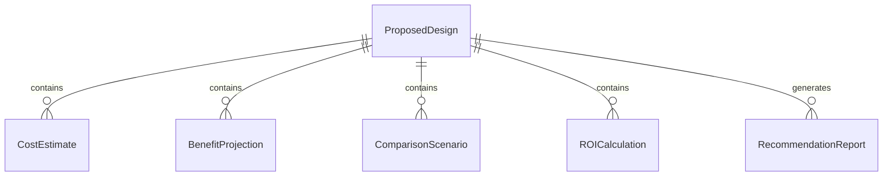
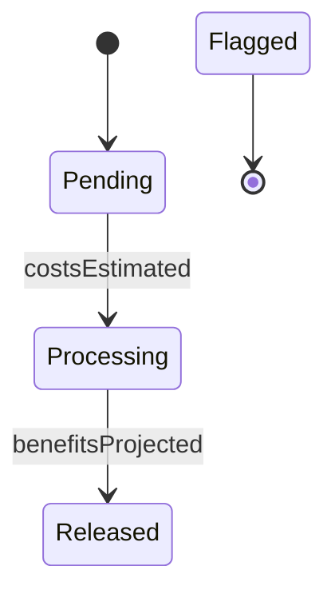
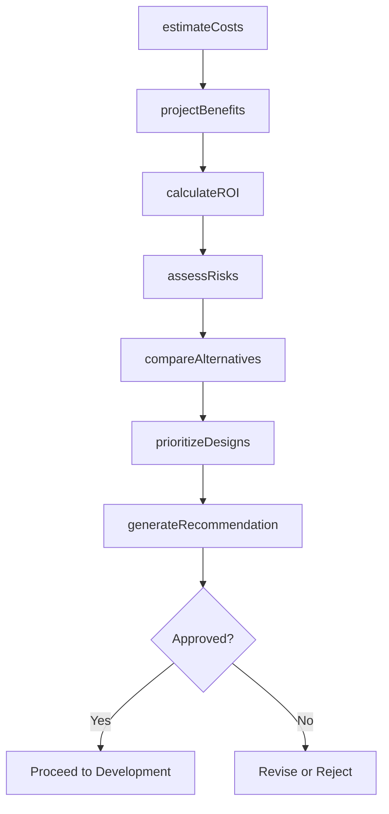
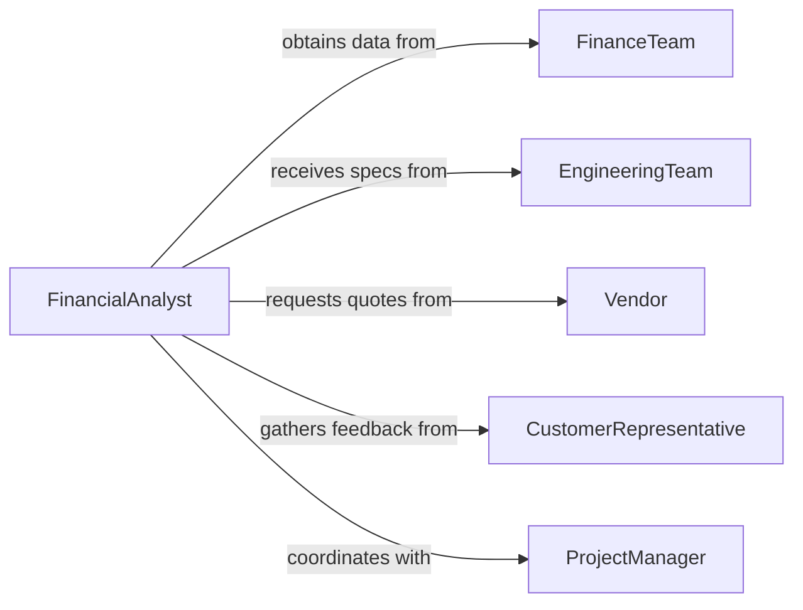

# Analyze Costs Benefits Proposed Designs

> Business-as-Code definition for cost-benefit analysis of proposed designs and projects. Evaluates financial viability, return on investment, and strategic value of design alternatives.

## Overview

Cost-benefit analysis of proposed designs involves quantifying expenses, projecting returns, and comparing alternatives to determine optimal solutions. This definition provides actions for cost estimation, benefit quantification, and scenario comparison, with events to trigger approval workflows and investment decision processes.

## Actors

| Actor | Description |
|-------|-------------|
| FinanceTeam | Provides cost data and financial modeling support |
| EngineeringTeam | Supplies technical specifications and design details |
| Vendor | Offers pricing for materials, components, and services |
| CustomerRepresentative | Provides market feedback on design value |
| IndustryAnalyst | Delivers market benchmarks and competitive intelligence |
| ExecutiveSponsor | Decision-maker approving investment in designs |

## Roles

| Role | Description |
|------|-------------|
| FinancialAnalyst | Quantifies costs and benefits for design options |
| ProjectManager | Coordinates analysis activities and stakeholder input |
| DesignEngineer | Provides technical specifications for costing |
| ProcurementSpecialist | Obtains vendor quotes and pricing information |

## Entities

| Entity | Description |
|--------|-------------|
| ProposedDesign | A design alternative under evaluation |
| CostEstimate | Projected expenses for implementing a design |
| BenefitProjection | Expected financial or strategic returns from a design |
| ComparisonScenario | Side-by-side evaluation of design alternatives |
| ROICalculation | Return on investment analysis for a design |
| RecommendationReport | Analysis findings and investment recommendation |

## Actions

| Action | Description |
|--------|-------------|
| estimateCosts | Calculate development, production, and lifecycle expenses |
| projectBenefits | Forecast revenue, savings, and strategic value |
| compareAlternatives | Evaluate multiple designs against key criteria |
| calculateROI | Compute return on investment and payback period |
| assessRisks | Identify financial and technical risks in designs |
| generateRecommendation | Produce analysis report with investment guidance |
| prioritizeDesigns | Rank alternatives by financial and strategic merit |

## Events

| Event | Description |
|-------|-------------|
| costsEstimated | Expense projections have been completed |
| benefitsProjected | Return forecasts have been calculated |
| alternativesCompared | Design options have been evaluated |
| roiCalculated | Investment return has been quantified |
| risksAssessed | Financial and technical risks have been identified |
| recommendationGenerated | Analysis report has been produced |
| designsPrioritized | Alternatives have been ranked for decision-making |

## Searches

| Search | Description |
|--------|-------------|
| findDesigns | List proposed designs by project, status, or date |
| getCosts | Retrieve cost estimates by design or expense category |
| getBenefits | Find benefit projections by design or benefit type |
| getROI | List ROI calculations by design or investment amount |


## Entity Relationships



## State Diagram


## Workflow



## Actor Relationships



## Usage

### Calling Actions

```typescript
import { analyzeCostsBenefitsProposedDesigns } from '@headlessly/analyze-costs-benefits-proposed-designs'

const analysis = analyzeCostsBenefitsProposedDesigns()

// Estimate costs for a new product design
const costs = await analysis.estimateCosts({
  designId: 'product-v2-concept',
  categories: ['materials', 'tooling', 'labor', 'testing', 'certification'],
  productionVolume: 50000
})

// Project benefits over 5-year lifecycle
const benefits = await analysis.projectBenefits({
  designId: 'product-v2-concept',
  projectionPeriod: '5-years',
  factors: ['revenue', 'market-share-gain', 'cost-savings']
})

// Calculate ROI and payback period
const roi = await analysis.calculateROI({
  designId: 'product-v2-concept',
  investmentAmount: costs.total,
  projectedBenefits: benefits.total
})
```

### Event-Driven Automation

```typescript
// Compare alternatives when ROI calculated
analysis.roiCalculated(async ({ designId, roi }) => {
  const alternatives = await analysis.findDesigns({
    project: 'product-v2',
    status: 'analysis-complete'
  })

  await analysis.compareAlternatives({
    designs: alternatives.map(d => d.id),
    criteria: ['roi', 'cost', 'risk', 'time-to-market']
  })
})

// Generate recommendation after prioritization
analysis.designsPrioritized(async ({ rankings }) => {
  await analysis.generateRecommendation({
    rankings,
    recipient: 'executive-sponsor',
    includeRiskAssessment: true
  })
})
```
