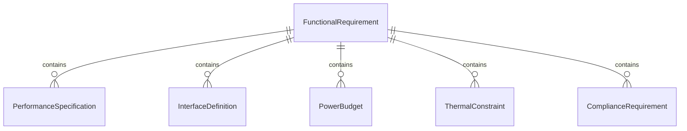
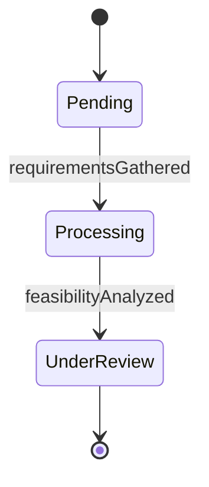
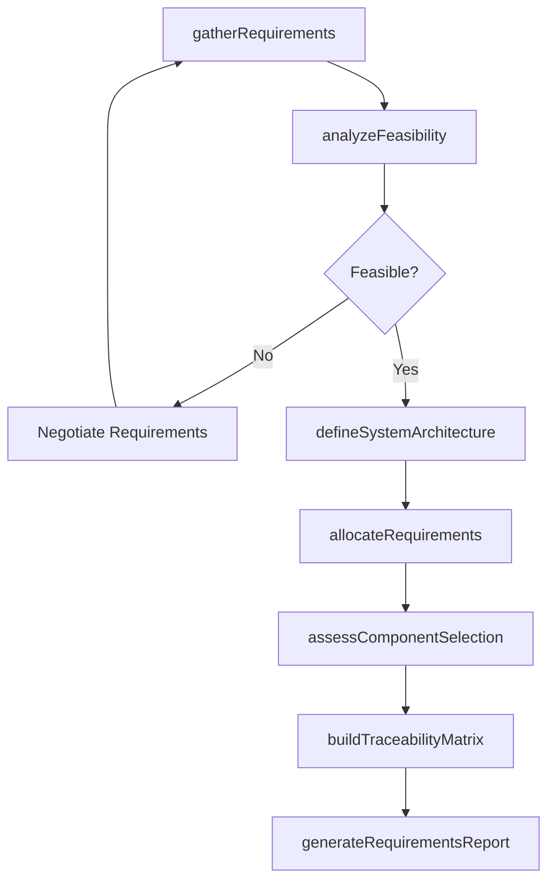
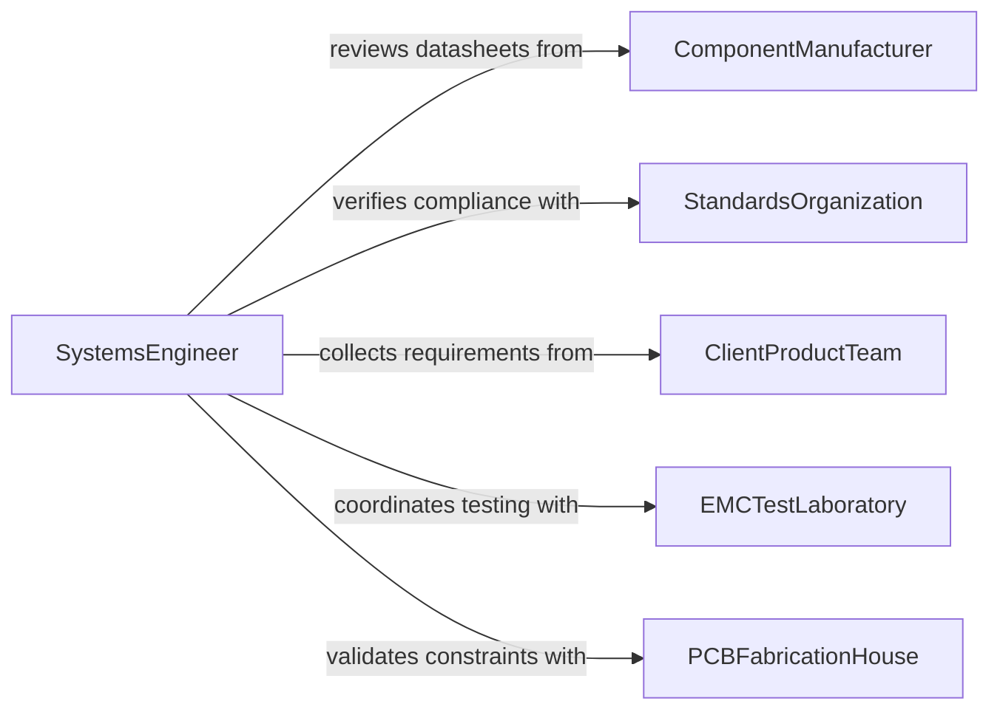

# Analyze Design Requirements for Computer or Electronics Systems

> Business-as-Code definition for analyzing design requirements for computer and electronics systems. Models the evaluation of functional specifications, performance criteria, interface definitions, power requirements, and compliance standards to define and validate system architectures for hardware, firmware, and embedded electronics designs.

## Overview

Analyzing design requirements for computer or electronics systems involves reviewing functional specifications, performance targets, interface protocols, power and thermal constraints, electromagnetic compatibility requirements, and regulatory compliance standards to define system architectures and validate design feasibility. This definition provides actions for requirements gathering, feasibility analysis, architecture definition, and requirements traceability. It supports systems engineers, hardware designers, firmware architects, and electronics test engineers.

## Actors

| Actor | Description |
|-------|-------------|
| ComponentManufacturer | Provides datasheets and specifications for electronic components |
| StandardsOrganization | Publishes technical standards for electronics design and compliance |
| ClientProductTeam | Specifies functional and performance requirements for the system |
| EMCTestLaboratory | Conducts electromagnetic compatibility testing and certification |
| PCBFabricationHouse | Provides manufacturing constraints for printed circuit board design |

## Roles

| Role | Description |
|------|-------------|
| SystemsEngineer | Decomposes high-level requirements into subsystem specifications |
| HardwareDesignEngineer | Translates requirements into circuit designs and component selections |
| FirmwareArchitect | Defines embedded software requirements based on hardware capabilities |
| TestEngineer | Validates that designs meet requirements through verification testing |

## Entities

| Entity | Description |
|--------|-------------|
| FunctionalRequirement | A specification of what the system must do |
| PerformanceSpecification | A quantitative target for system speed, throughput, or accuracy |
| InterfaceDefinition | A protocol and pinout specification for system interconnections |
| PowerBudget | An allocation of electrical power across system components |
| ThermalConstraint | A temperature operating range and heat dissipation limit |
| ComplianceRequirement | A regulatory or standards-based criterion the design must satisfy |
| RequirementsTraceabilityMatrix | A mapping of requirements to design elements and verification methods |

## Actions

| Action | Description |
|--------|-------------|
| gatherRequirements | Collect functional, performance, and compliance requirements from stakeholders |
| analyzeFeasibility | Evaluate whether requirements can be met with available technology and budget |
| defineSystemArchitecture | Specify the high-level design structure including subsystems and interfaces |
| allocateRequirements | Distribute system-level requirements to hardware, firmware, and test subsystems |
| assessComponentSelection | Evaluate candidate components against requirements and availability |
| buildTraceabilityMatrix | Map each requirement to its implementing design element and verification method |
| generateRequirementsReport | Produce a comprehensive requirements analysis and architecture summary |

## Events

| Event | Description |
|-------|-------------|
| requirementsGathered | Functional and performance specifications have been collected |
| feasibilityAnalyzed | Technology and budget feasibility has been evaluated |
| systemArchitectureDefined | The high-level design structure has been specified |
| requirementsAllocated | System requirements have been distributed to subsystems |
| componentSelectionAssessed | Candidate components have been evaluated against requirements |
| traceabilityMatrixBuilt | Requirements have been mapped to design elements and tests |
| requirementsReportGenerated | A comprehensive requirements analysis has been produced |

## Searches

| Search | Description |
|--------|-------------|
| findRequirements | List requirements by type, subsystem, or priority |
| getArchitectureDefinitions | Retrieve system architecture documents by project or version |
| getComponentAssessments | Access component evaluation results by part or requirement |
| getTraceabilityData | View requirement-to-design mappings by subsystem or verification status |
| getComplianceStatus | Check regulatory compliance status by standard or design element |


## Entity Relationships



## State Diagram


## Workflow



## Actor Relationships



## Usage

### Calling Actions

```typescript
import { analyzeDesignRequirementsComputerElectronics } from '@headlessly/analyze-design-requirements-computer-electronics'

const engineer = analyzeDesignRequirementsComputerElectronics()

// Gather and analyze requirements
const analysis = await engineer.gatherRequirements({
  projectId: 'industrial-IoT-gateway-v2',
  stakeholders: ['product-management', 'firmware-team', 'manufacturing'],
  categories: ['functional', 'performance', 'interface', 'compliance', 'environmental']
})

await engineer.analyzeFeasibility({
  analysisId: analysis.id,
  constraints: { budget: 45, targetBOM: 120, timeToMarket: '6-months' }
})

// Define architecture and allocate
await engineer.defineSystemArchitecture({ analysisId: analysis.id })
await engineer.allocateRequirements({ analysisId: analysis.id })
await engineer.assessComponentSelection({
  analysisId: analysis.id,
  candidates: { processor: ['STM32H7', 'NXP-iMXRT1060'], connectivity: ['ESP32-C6', 'nRF5340'] }
})

// Trace and report
await engineer.buildTraceabilityMatrix({ analysisId: analysis.id })
await engineer.generateRequirementsReport({ analysisId: analysis.id })
```

### Event-Driven Automation

```typescript
// Alert on feasibility concerns
engineer.feasibilityAnalyzed(async ({ analysisId, isFeasible, blockers }) => {
  if (!isFeasible) {
    await notify({
      to: 'engineering-leadership',
      message: `Feasibility concerns for ${analysisId}: ${blockers.join(', ')}`
    })
  }
})

// Distribute requirements reports
engineer.requirementsReportGenerated(async ({ analysisId, reportId }) => {
  await distribute({ reportId, recipients: ['hardware-team', 'firmware-team', 'test-engineering'] })
})
```
