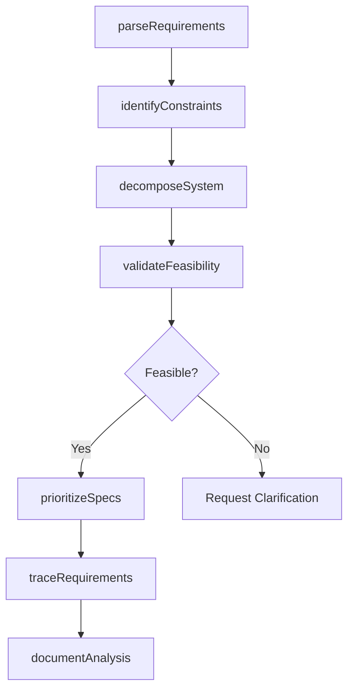
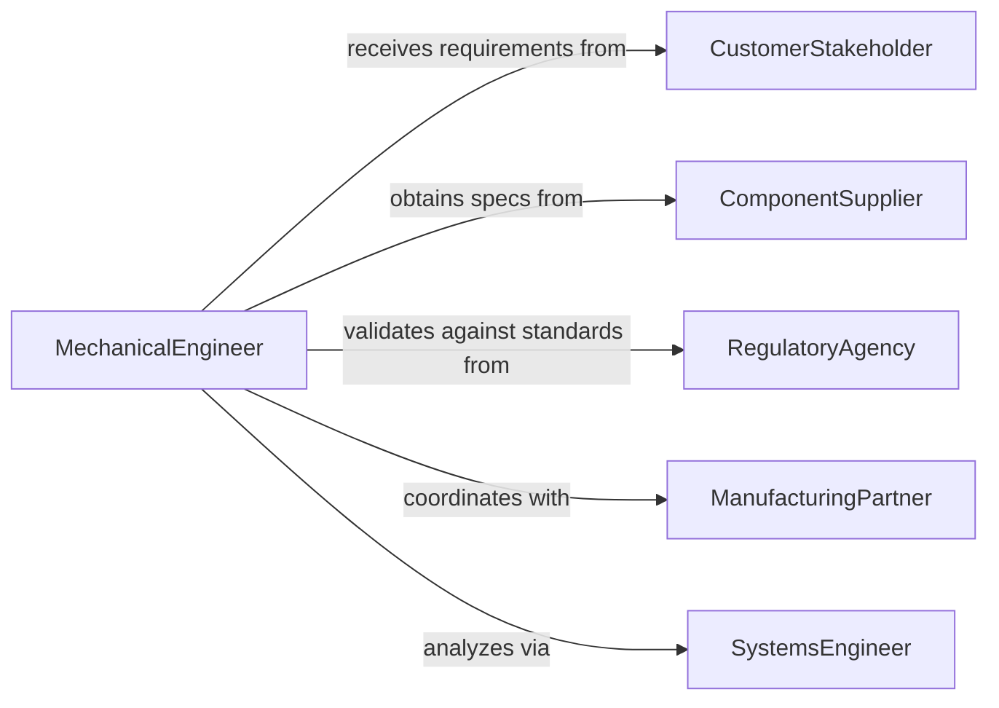

# Analyze Design Requirements Information Mechanical

> Business-as-Code definition for analyzing mechanical design requirements. Evaluates specifications, constraints, and performance criteria for mechanical equipment and systems.

## Overview

Mechanical design requirements analysis involves interpreting specifications, identifying constraints, and validating feasibility for mechanical systems and equipment. This definition provides actions for requirements extraction, constraint analysis, and specification validation, with events to trigger design iterations and engineering reviews.

## Actors

| Actor | Description |
|-------|-------------|
| CustomerStakeholder | End user defining functional requirements |
| ComponentSupplier | Manufacturer providing parts and materials |
| RegulatoryAgency | Authority setting safety and performance standards |
| TestingLaboratory | Facility validating design performance |
| ManufacturingPartner | Producer imposing manufacturing constraints |
| QualityAssurance | Team verifying compliance with specifications |

## Roles

| Role | Description |
|------|-------------|
| MechanicalEngineer | Analyzes and interprets design requirements |
| SystemsEngineer | Ensures requirements integration across subsystems |
| DesignReviewer | Validates requirement feasibility and completeness |
| RequirementsManager | Coordinates requirement documentation and traceability |

## Entities

| Entity | Description |
|--------|-------------|
| DesignRequirement | A specification for mechanical system performance or attributes |
| MechanicalSystem | Equipment or assembly being designed |
| PerformanceConstraint | Limitation on design parameters or operating conditions |
| FunctionalSpecification | Description of what the system must accomplish |
| MaterialProperty | Characteristics of materials used in the design |
| AnalysisReport | Documentation of requirements analysis findings |

## Actions

| Action | Description |
|--------|-------------|
| parseRequirements | Extract specifications from customer documents |
| identifyConstraints | Determine design limitations and boundaries |
| validateFeasibility | Assess whether requirements can be met technically |
| prioritizeSpecs | Rank requirements by criticality and impact |
| decomposeSystem | Break complex requirements into subsystem specs |
| traceRequirements | Link requirements to design elements and test cases |
| documentAnalysis | Produce formal analysis report for review |

## Events

| Event | Description |
|-------|-------------|
| requirementsParsed | Specifications have been extracted from documents |
| constraintsIdentified | Design limitations have been determined |
| feasibilityValidated | Technical achievability has been assessed |
| specsPrioritized | Requirements have been ranked by importance |
| systemDecomposed | Complex specs have been broken into subsystem requirements |
| requirementsTraced | Linkages to design and test have been established |
| analysisDocumented | Formal report has been produced |

## Searches

| Search | Description |
|--------|-------------|
| findRequirements | List requirements by system, priority, or source |
| getConstraints | Retrieve design limitations by category or subsystem |
| getSpecs | Find specifications by performance metric or component |
| getTraceability | List requirements linked to specific design elements |

## Workflow



## Actor Relationships



## Usage

### Calling Actions

```typescript
import { analyzeDesignRequirementsInformationMechanical } from '@headlessly/analyze-design-requirements-information-mechanical'

const requirements = analyzeDesignRequirementsInformationMechanical()

// Parse requirements from customer specification
const parsed = await requirements.parseRequirements({
  documentId: 'customer-spec-2026-01',
  systemType: 'hydraulic-actuator',
  extractionRules: ['performance', 'dimensions', 'materials', 'environmental']
})

// Identify manufacturing and regulatory constraints
const constraints = await requirements.identifyConstraints({
  systemId: 'hydraulic-actuator-v3',
  categories: ['manufacturing', 'regulatory', 'material', 'cost']
})

// Validate feasibility of meeting requirements
const feasibility = await requirements.validateFeasibility({
  requirementIds: parsed.requirements.map(r => r.id),
  constraintIds: constraints.constraints.map(c => c.id),
  validationMethods: ['analytical', 'simulation', 'prototype']
})
```

### Event-Driven Automation

```typescript
// Decompose system when constraints identified
requirements.constraintsIdentified(async ({ systemId, constraints }) => {
  if (constraints.length > 5) {
    await requirements.decomposeSystem({
      systemId,
      decompositionLevel: 'subsystem',
      traceability: true
    })
  }
})

// Document analysis after traceability established
requirements.requirementsTraced(async ({ systemId, traceMatrix }) => {
  await requirements.documentAnalysis({
    systemId,
    includeTraceability: true,
    includeRiskAssessment: true,
    format: 'engineering-report'
  })
})
```
