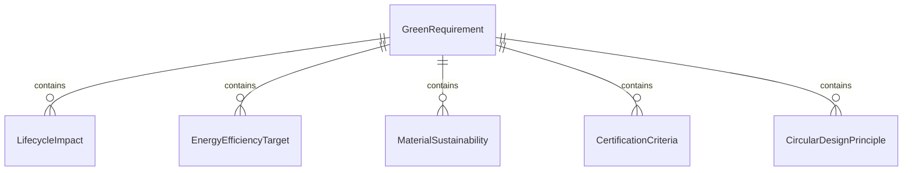
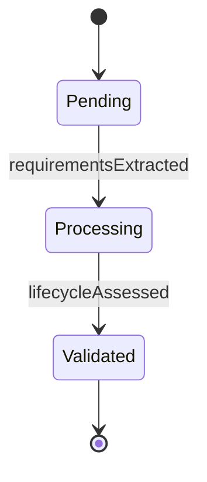
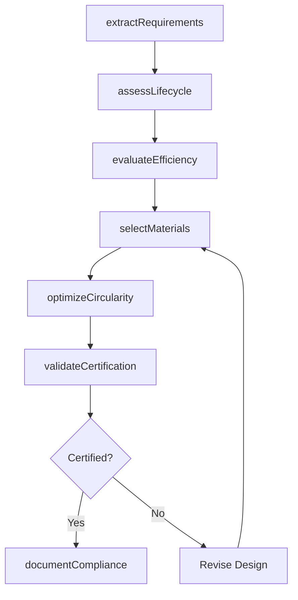
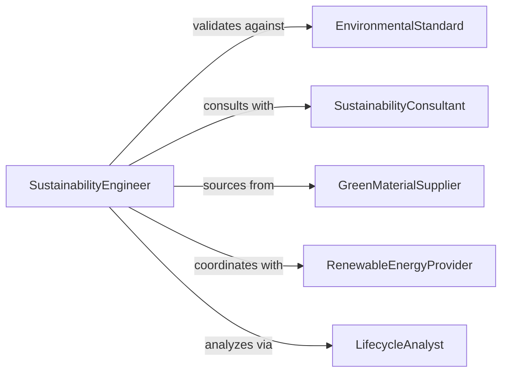

# Analyze Green Technology Design Requirements

> Business-as-Code definition for analyzing green technology design requirements. Evaluates sustainability criteria, environmental performance specifications, and eco-efficiency targets for technology solutions.

## Overview

Green technology design requirements analysis involves assessing environmental impact goals, energy efficiency targets, and circular economy principles in technology specifications. This definition provides actions for sustainability requirement extraction, lifecycle impact analysis, and green certification evaluation, with events to trigger eco-design iterations and sustainability reporting.

## Actors

| Actor | Description |
|-------|-------------|
| EnvironmentalStandard | Organization setting green technology certification criteria |
| SustainabilityConsultant | Advisor on eco-design best practices |
| GreenMaterialSupplier | Provider of sustainable components and materials |
| RenewableEnergyProvider | Supplier of clean energy for operations |
| ESGInvestor | Financial stakeholder evaluating environmental performance |
| CircularEconomyPartner | Organization facilitating product reuse and recycling |

## Roles

| Role | Description |
|------|-------------|
| SustainabilityEngineer | Analyzes and implements green design requirements |
| LifecycleAnalyst | Assesses environmental impact across product lifecycle |
| GreenTechnologySpecialist | Evaluates emerging sustainable technologies |
| CertificationCoordinator | Manages green certification and compliance processes |

## Entities

| Entity | Description |
|--------|-------------|
| GreenRequirement | Environmental or sustainability specification for design |
| LifecycleImpact | Environmental footprint across manufacturing, use, and disposal |
| EnergyEfficiencyTarget | Goal for reducing energy consumption |
| MaterialSustainability | Assessment of material environmental impact |
| CertificationCriteria | Standards for green technology certification |
| CircularDesignPrinciple | Guideline for recyclability and reusability |

## Actions

| Action | Description |
|--------|-------------|
| extractRequirements | Identify sustainability specifications from design brief |
| assessLifecycle | Evaluate environmental impact from cradle to grave |
| evaluateEfficiency | Analyze energy and resource consumption targets |
| selectMaterials | Choose sustainable materials meeting requirements |
| validateCertification | Confirm design meets green technology standards |
| optimizeCircularity | Enhance recyclability and material recovery |
| documentCompliance | Produce sustainability compliance report |

## Events

| Event | Description |
|-------|-------------|
| requirementsExtracted | Sustainability specifications have been identified |
| lifecycleAssessed | Environmental impact analysis has been completed |
| efficiencyEvaluated | Energy and resource targets have been analyzed |
| materialsSelected | Sustainable materials have been chosen |
| certificationValidated | Green technology standards compliance has been confirmed |
| circularityOptimized | Recyclability and reuse have been enhanced |
| complianceDocumented | Sustainability report has been produced |

## Searches

| Search | Description |
|--------|-------------|
| findRequirements | List green requirements by category, priority, or standard |
| getImpacts | Retrieve lifecycle assessments by phase or impact category |
| getMaterials | Find sustainable material options by properties or certification |
| getCertifications | List green technology certifications by standard or status |


## Entity Relationships



## State Diagram


## Workflow



## Actor Relationships



## Usage

### Calling Actions

```typescript
import { analyzeGreenTechnologyDesignRequirements } from '@headlessly/analyze-green-technology-design-requirements'

const greenDesign = analyzeGreenTechnologyDesignRequirements()

// Extract sustainability requirements from design brief
const requirements = await greenDesign.extractRequirements({
  projectId: 'solar-inverter-v4',
  standards: ['Energy Star', 'EPEAT Gold', 'Cradle to Cradle'],
  categories: ['energy-efficiency', 'material-health', 'recyclability']
})

// Assess lifecycle environmental impact
const lifecycle = await greenDesign.assessLifecycle({
  productId: 'solar-inverter-v4',
  phases: ['manufacturing', 'transportation', 'use', 'end-of-life'],
  impactCategories: ['carbon-footprint', 'water-use', 'waste-generation']
})

// Validate certification compliance
const certification = await greenDesign.validateCertification({
  productId: 'solar-inverter-v4',
  standards: ['Energy Star 8.0', 'EPEAT Gold'],
  testingLab: 'UL-Environment'
})
```

### Event-Driven Automation

```typescript
// Select materials after efficiency evaluation
greenDesign.efficiencyEvaluated(async ({ productId, targets }) => {
  await greenDesign.selectMaterials({
    productId,
    criteria: {
      recyclability: 'high',
      embodiedEnergy: 'low',
      toxicity: 'minimal'
    },
    preferredSuppliers: 'certified-green'
  })
})

// Document compliance after certification validated
greenDesign.certificationValidated(async ({ productId, certifications }) => {
  await greenDesign.documentCompliance({
    productId,
    certifications,
    includeLifecycleData: true,
    audience: 'stakeholders'
  })
})
```
