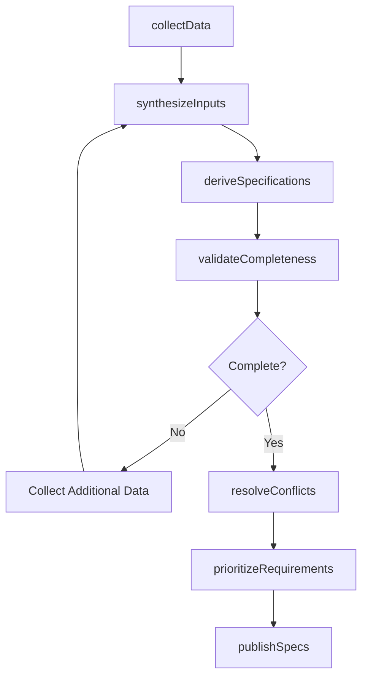
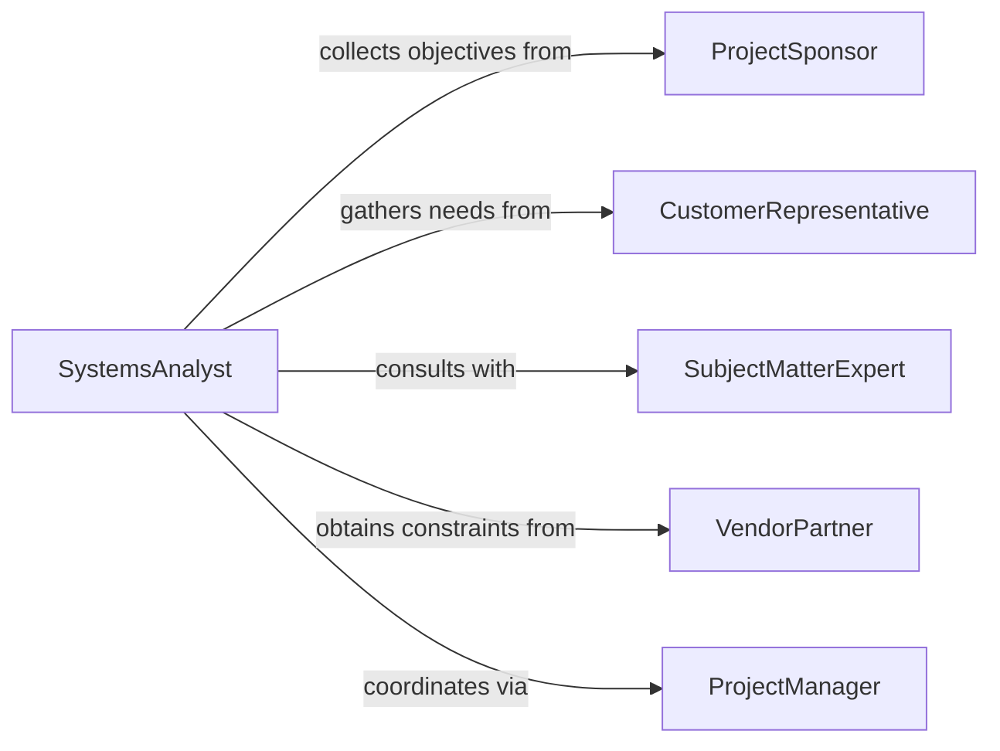

# Analyze Project Data Determine Specifications

> Business-as-Code definition for analyzing project data to determine specifications. Converts project information, stakeholder input, and constraints into formal technical requirements.

## Overview

Project data analysis for specification determination involves synthesizing diverse inputs to produce clear, actionable technical requirements. This definition provides actions for data aggregation, requirement derivation, and specification formalization, with events to trigger design phases and stakeholder review processes.

## Actors

| Actor | Description |
|-------|-------------|
| ProjectSponsor | Executive stakeholder defining project objectives |
| CustomerRepresentative | End user providing functional needs |
| SubjectMatterExpert | Domain specialist clarifying technical details |
| VendorPartner | Supplier providing component capabilities and constraints |
| RegulatoryConsultant | Advisor on compliance requirements |
| CompetitorBenchmark | Reference for industry standards and best practices |

## Roles

| Role | Description |
|------|-------------|
| SystemsAnalyst | Synthesizes data into formal specifications |
| ProjectManager | Coordinates data collection and stakeholder engagement |
| TechnicalWriter | Documents specifications for design teams |
| RequirementsEngineer | Validates completeness and traceability of specs |

## Entities

| Entity | Description |
|--------|-------------|
| ProjectData | Raw information about objectives, constraints, and context |
| Specification | Formal technical requirement derived from project data |
| StakeholderInput | Feedback or needs from project participants |
| DesignConstraint | Limitation affecting specification options |
| PerformanceCriteria | Measurable standard for evaluating solutions |
| SpecificationDocument | Formal documentation of project requirements |

## Actions

| Action | Description |
|--------|-------------|
| collectData | Gather project information from multiple sources |
| synthesizeInputs | Integrate stakeholder feedback into cohesive requirements |
| deriveSpecifications | Convert project data into formal technical specs |
| validateCompleteness | Ensure all project objectives are addressed |
| resolveConflicts | Address contradictory or incompatible requirements |
| prioritizeRequirements | Rank specifications by importance and feasibility |
| publishSpecs | Distribute formal specification document to stakeholders |

## Events

| Event | Description |
|-------|-------------|
| dataCollected | Project information has been gathered |
| inputsSynthesized | Stakeholder feedback has been integrated |
| specificationsD erived | Technical requirements have been formalized |
| completenessValidated | Coverage of project objectives has been confirmed |
| conflictsResolved | Incompatible requirements have been addressed |
| requirementsPrioritized | Specifications have been ranked |
| specsPublished | Formal documentation has been distributed |

## Searches

| Search | Description |
|--------|-------------|
| findProjectData | List data sources by type, stakeholder, or date |
| getSpecifications | Retrieve specifications by priority, category, or status |
| getConstraints | Find design limitations by source or impact |
| getCriteria | List performance standards by requirement or measurability |

## Workflow



## Actor Relationships



## Usage

### Calling Actions

```typescript
import { analyzeProjectDataDetermineSpecifications } from '@headlessly/analyze-project-data-determine-specifications'

const analysis = analyzeProjectDataDetermineSpecifications()

// Collect data from multiple project sources
const data = await analysis.collectData({
  projectId: 'mobile-app-redesign',
  sources: ['stakeholder-interviews', 'user-research', 'technical-audit', 'competitor-analysis'],
  completionDate: '2026-03-31'
})

// Derive formal specifications from collected data
const specs = await analysis.deriveSpecifications({
  projectId: 'mobile-app-redesign',
  dataIds: data.sources.map(s => s.id),
  specificationTypes: ['functional', 'performance', 'security', 'usability']
})

// Prioritize requirements for phased implementation
const prioritized = await analysis.prioritizeRequirements({
  projectId: 'mobile-app-redesign',
  criteria: ['business-value', 'technical-feasibility', 'user-impact'],
  tierCount: 3
})
```

### Event-Driven Automation

```typescript
// Validate completeness after specifications derived
analysis.specificationsDerived(async ({ projectId, specCount }) => {
  await analysis.validateCompleteness({
    projectId,
    checkAgainst: ['project-charter', 'stakeholder-needs', 'regulatory-requirements']
  })
})

// Publish specs after conflicts resolved
analysis.conflictsResolved(async ({ projectId, resolutionApproach }) => {
  await analysis.publishSpecs({
    projectId,
    format: 'technical-specification-document',
    recipients: ['design-team', 'development-team', 'qa-team'],
    approvalRequired: true
  })
})
```
