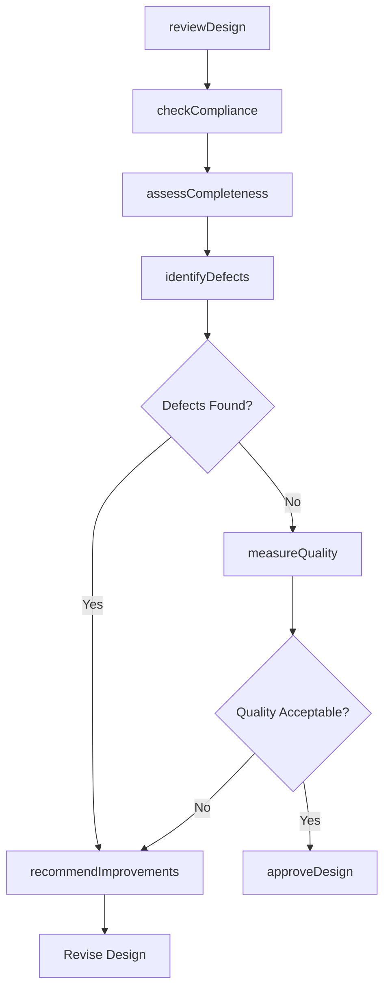
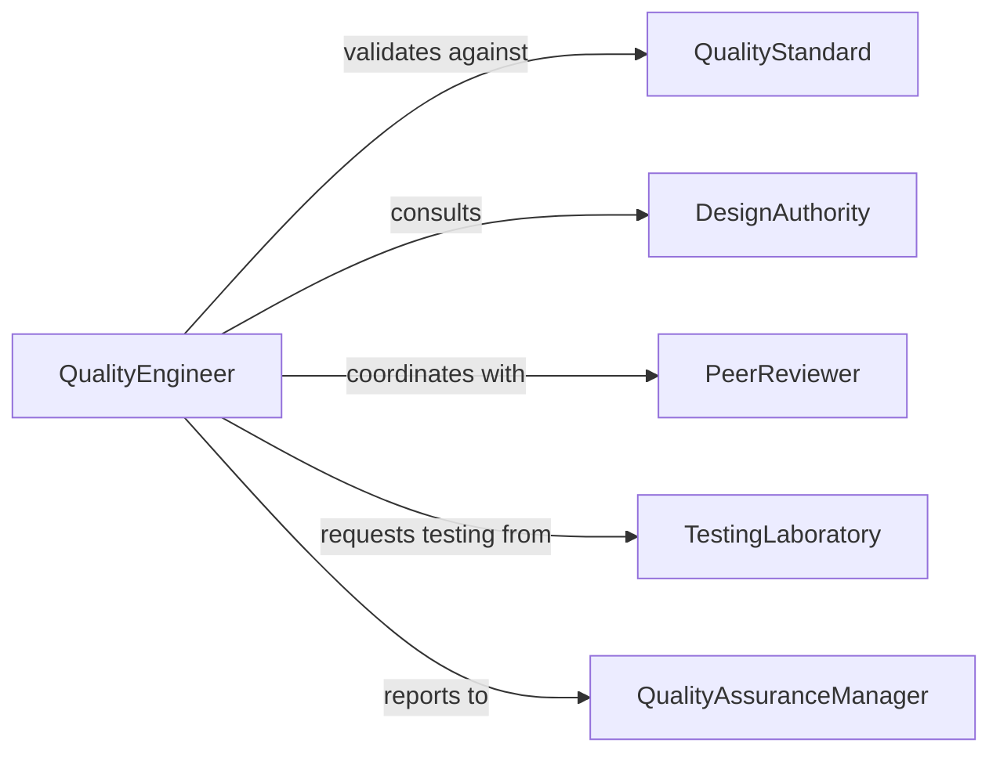

# Evaluate Designs Specifications Ensure Quality

> Business-as-Code definition for evaluating designs and specifications to ensure quality. Validates adherence to standards, identifies defects, and verifies completeness of technical documentation.

## Overview

Design and specification quality evaluation involves reviewing technical documents for accuracy, completeness, and compliance with organizational and industry standards. This definition provides actions for quality assessment, defect identification, and improvement recommendation, with events to trigger corrective actions and approval workflows.

## Actors

| Actor | Description |
|-------|-------------|
| QualityStandard | Regulatory or industry body defining quality criteria |
| DesignAuthority | Technical expert providing design guidance |
| PeerReviewer | Colleague evaluating design for quality issues |
| TestingLaboratory | Facility validating design performance |
| CustomerAcceptance | End user approving design quality |
| CertificationBody | Organization verifying compliance with standards |

## Roles

| Role | Description |
|------|-------------|
| QualityEngineer | Conducts formal quality evaluations |
| DesignReviewChair | Leads design review meetings and approval process |
| TechnicalReviewer | Examines specifications for technical accuracy |
| QualityAssuranceManager | Oversees quality processes and standards |

## Entities

| Entity | Description |
|--------|-------------|
| DesignDocument | Technical specification or drawing under evaluation |
| QualityChecklist | List of criteria for quality assessment |
| Defect | Quality issue or non-compliance found in design |
| ReviewFinding | Observation or recommendation from quality evaluation |
| QualityMetric | Measurable indicator of design quality |
| ApprovalStatus | Current state of design acceptance |

## Actions

| Action | Description |
|--------|-------------|
| reviewDesign | Conduct formal evaluation against quality criteria |
| checkCompliance | Verify adherence to standards and regulations |
| identifyDefects | Detect quality issues and non-conformances |
| assessCompleteness | Evaluate whether all required information is present |
| measureQuality | Quantify design quality using established metrics |
| recommendImprovements | Propose corrections or enhancements |
| approveDesign | Formally accept design for next phase |

## Events

| Event | Description |
|-------|-------------|
| designReviewed | Quality evaluation has been conducted |
| complianceChecked | Standards adherence has been verified |
| defectsIdentified | Quality issues have been detected |
| completenessAssessed | Information coverage has been evaluated |
| qualityMeasured | Quality metrics have been quantified |
| improvementsRecommended | Corrective actions have been proposed |
| designApproved | Design has been formally accepted |

## Searches

| Search | Description |
|--------|-------------|
| findDesigns | List designs by status, project, or review date |
| getDefects | Retrieve quality issues by severity, type, or design |
| getFindings | Find review observations by category or criticality |
| getMetrics | List quality measurements by design or metric type |

## Workflow



## Actor Relationships



## Usage

### Calling Actions

```typescript
import { evaluateDesignsSpecificationsEnsureQuality } from '@headlessly/evaluate-designs-specifications-ensure-quality'

const quality = evaluateDesignsSpecificationsEnsureQuality()

// Review a mechanical design for quality
const review = await quality.reviewDesign({
  designId: 'hvac-system-v2',
  checklistId: 'mechanical-design-checklist-v3',
  reviewers: ['senior-engineer-001', 'qa-specialist-002'],
  standards: ['ASME-Y14.5', 'ISO-9001']
})

// Identify defects during quality assessment
const defects = await quality.identifyDefects({
  designId: 'hvac-system-v2',
  reviewId: review.id,
  categories: ['dimensional', 'material', 'tolerance', 'documentation']
})

// Measure quality using established metrics
const metrics = await quality.measureQuality({
  designId: 'hvac-system-v2',
  metricTypes: ['completeness-score', 'defect-density', 'compliance-rate'],
  benchmarkAgainst: 'industry-standards'
})
```

### Event-Driven Automation

```typescript
// Recommend improvements when defects identified
quality.defectsIdentified(async ({ designId, defects }) => {
  if (defects.filter(d => d.severity === 'critical').length > 0) {
    await quality.recommendImprovements({
      designId,
      defects,
      priority: 'immediate',
      includeRootCause: true
    })
  }
})

// Approve design after quality measured
quality.qualityMeasured(async ({ designId, metrics }) => {
  if (metrics.every(m => m.value >= m.threshold)) {
    await quality.approveDesign({
      designId,
      approver: 'design-review-board',
      approvalType: 'release-to-manufacturing'
    })
  }
})
```
