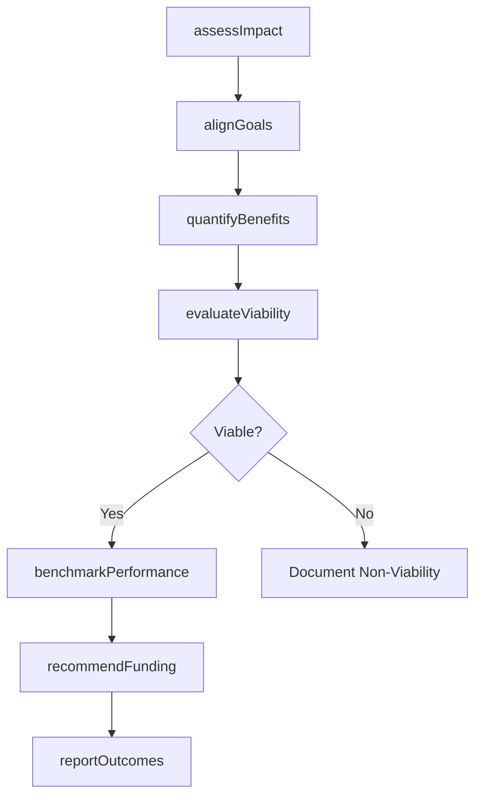
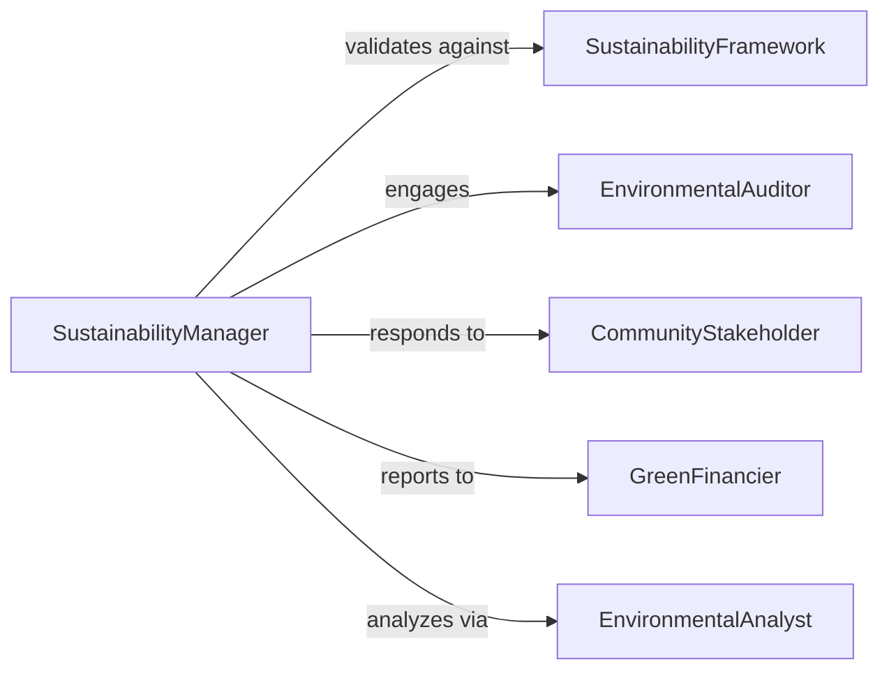

# Evaluate Environmental Sustainability Projects

> Business-as-Code definition for evaluating environmental and sustainability projects. Assesses project alignment with sustainability goals, environmental impact, and resource efficiency.

## Overview

Environmental sustainability project evaluation involves analyzing projects for ecological benefits, carbon reduction, and alignment with organizational ESG commitments. This definition provides actions for impact assessment, goal alignment verification, and sustainability metric tracking, with events to trigger reporting and investment decision workflows.

## Actors

| Actor | Description |
|-------|-------------|
| SustainabilityFramework | Standard-setting organization defining ESG criteria |
| EnvironmentalAuditor | Third-party verifying project environmental claims |
| CommunityStakeholder | Local group affected by project environmental impact |
| GreenFinancier | Investor providing funding for sustainability initiatives |
| RegulatoryAgency | Government body monitoring environmental compliance |
| IndustryBenchmark | Reference organization for sustainability best practices |

## Roles

| Role | Description |
|------|-------------|
| SustainabilityManager | Oversees evaluation of environmental projects |
| EnvironmentalAnalyst | Quantifies project ecological impacts |
| ESGReporter | Documents sustainability performance for stakeholders |
| ProjectEvaluator | Assesses project viability and goal alignment |

## Entities

| Entity | Description |
|--------|-------------|
| SustainabilityProject | Initiative aimed at improving environmental performance |
| ImpactAssessment | Evaluation of project environmental effects |
| SustainabilityGoal | Organizational target for environmental performance |
| EnvironmentalMetric | Quantifiable indicator of ecological impact |
| ProjectBenefit | Positive outcome of sustainability initiative |
| EvaluationReport | Documentation of project sustainability assessment |

## Actions

| Action | Description |
|--------|-------------|
| assessImpact | Evaluate project environmental effects and benefits |
| alignGoals | Verify project supports organizational sustainability targets |
| quantifyBenefits | Measure carbon reduction, resource savings, or other gains |
| evaluateViability | Assess project technical and financial feasibility |
| benchmarkPerformance | Compare project to industry sustainability standards |
| recommendFunding | Propose investment based on sustainability merits |
| reportOutcomes | Document evaluation findings for stakeholders |

## Events

| Event | Description |
|-------|-------------|
| impactAssessed | Environmental effects have been evaluated |
| goalsAligned | Project sustainability target alignment has been verified |
| benefitsQuantified | Ecological and resource gains have been measured |
| viabilityEvaluated | Project feasibility has been assessed |
| performanceBenchmarked | Industry comparison has been completed |
| fundingRecommended | Investment proposal has been made |
| outcomesReported | Evaluation findings have been documented |

## Searches

| Search | Description |
|--------|-------------|
| findProjects | List projects by type, status, or environmental focus |
| getAssessments | Retrieve impact evaluations by project or metric |
| getBenefits | Find quantified gains by category or magnitude |
| getReports | List evaluation documentation by date or audience |

## Workflow



## Actor Relationships



## Usage

### Calling Actions

```typescript
import { evaluateEnvironmentalSustainabilityProjects } from '@headlessly/evaluate-environmental-sustainability-projects'

const evaluation = evaluateEnvironmentalSustainabilityProjects()

// Assess environmental impact of a renewable energy project
const impact = await evaluation.assessImpact({
  projectId: 'solar-farm-expansion',
  impactCategories: ['carbon-reduction', 'land-use', 'biodiversity', 'water-consumption'],
  baselineYear: 2025
})

// Align project with organizational sustainability goals
const alignment = await evaluation.alignGoals({
  projectId: 'solar-farm-expansion',
  organizationalGoals: ['net-zero-2030', 'renewable-energy-50pct', 'scope3-reduction'],
  alignmentThreshold: 75
})

// Quantify project benefits over lifecycle
const benefits = await evaluation.quantifyBenefits({
  projectId: 'solar-farm-expansion',
  projectionPeriod: '20-years',
  benefitTypes: ['carbon-avoided', 'energy-generated', 'cost-savings']
})
```

### Event-Driven Automation

```typescript
// Evaluate viability after benefits quantified
evaluation.benefitsQuantified(async ({ projectId, benefits }) => {
  if (benefits.carbonAvoided > 50000) {
    await evaluation.evaluateViability({
      projectId,
      criteria: ['technical', 'financial', 'regulatory', 'stakeholder-support']
    })
  }
})

// Recommend funding after performance benchmarked
evaluation.performanceBenchmarked(async ({ projectId, ranking }) => {
  if (ranking === 'top-quartile') {
    await evaluation.recommendFunding({
      projectId,
      fundingLevel: 'full-budget',
      justification: 'exceptional-sustainability-performance'
    })
  }
})
```
