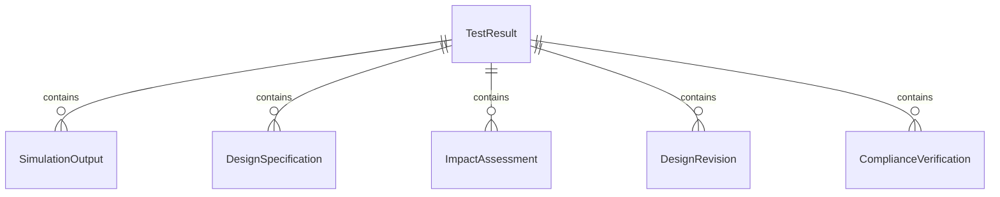
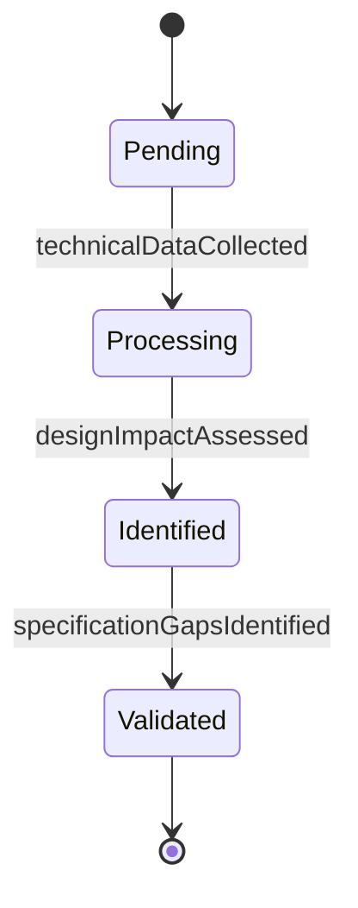
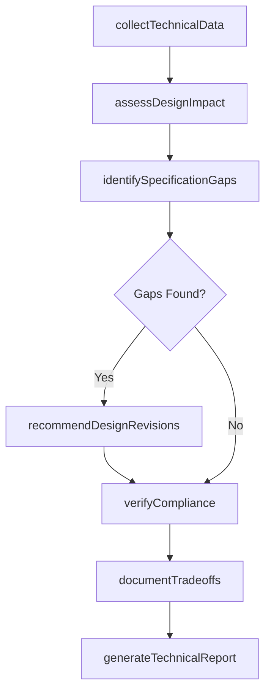
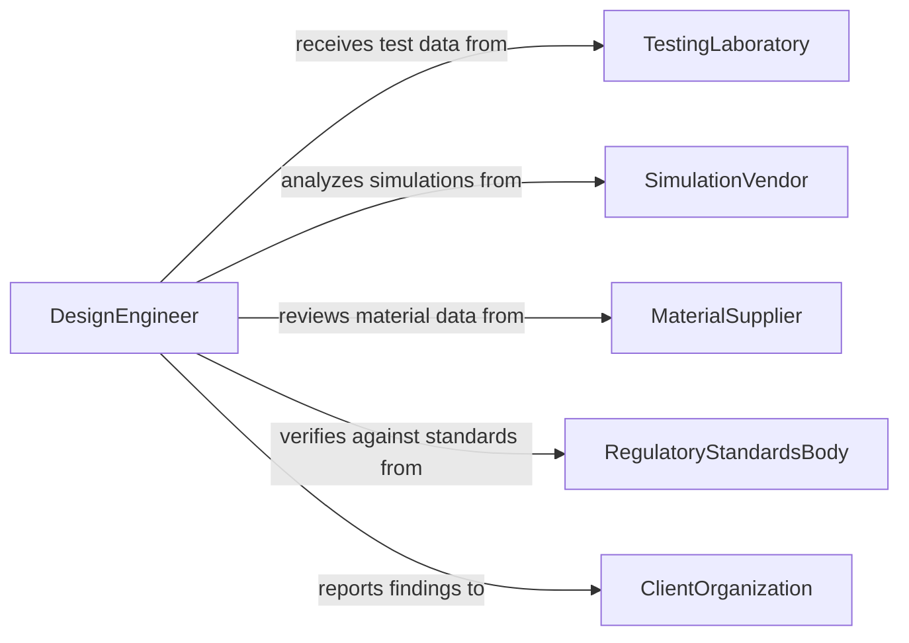

# Evaluate Technical Data to Determine Effect on Designs or Plans

> Business-as-Code definition for evaluating technical data to determine its effect on designs or plans. Models the assessment of test results, simulation outputs, material properties, and performance measurements to identify impacts on engineering designs, architectural plans, and technical specifications.

## Overview

Evaluating technical data to determine effect on designs or plans involves reviewing test results, simulation data, material characterization reports, field performance measurements, and compliance test outcomes to assess whether current designs meet requirements or need modification. This definition provides actions for data collection, impact analysis, design revision assessment, and technical reporting. It supports design engineers, project engineers, technical managers, and quality assurance specialists.

## Actors

| Actor | Description |
|-------|-------------|
| TestingLaboratory | Provides material testing, environmental testing, and performance test results |
| SimulationVendor | Supplies finite element analysis and computational simulation outputs |
| MaterialSupplier | Furnishes material property data sheets and certification documents |
| RegulatoryStandardsBody | Publishes technical standards that designs must satisfy |
| ClientOrganization | Specifies design requirements and performance criteria |

## Roles

| Role | Description |
|------|-------------|
| DesignEngineer | Assesses how technical data affects current design specifications |
| TestEngineer | Conducts tests and interprets results for design impact |
| TechnicalProjectManager | Coordinates design modifications based on data evaluation findings |
| QualityAssuranceEngineer | Verifies that designs meet specifications after data-driven changes |

## Entities

| Entity | Description |
|--------|-------------|
| TestResult | A measured outcome from a physical or environmental test |
| SimulationOutput | Computed predictions from engineering analysis software |
| DesignSpecification | A documented set of requirements a design must satisfy |
| ImpactAssessment | An evaluation of how technical data affects a design or plan |
| DesignRevision | A modification to specifications based on data evaluation findings |
| ComplianceVerification | A confirmation that a design meets applicable standards after revision |
| TechnicalReport | A document presenting data evaluation findings and design recommendations |

## Actions

| Action | Description |
|--------|-------------|
| collectTechnicalData | Gather test results, simulation outputs, and material data |
| assessDesignImpact | Evaluate how collected data affects current designs or plans |
| identifySpecificationGaps | Detect areas where designs fail to meet requirements based on data |
| recommendDesignRevisions | Propose modifications to address data-driven findings |
| verifyCompliance | Confirm that revised designs meet applicable standards and requirements |
| documentTradeoffs | Record technical tradeoffs considered during the evaluation |
| generateTechnicalReport | Produce a comprehensive evaluation of data impact on designs |

## Events

| Event | Description |
|-------|-------------|
| technicalDataCollected | Test results and simulation outputs have been gathered |
| designImpactAssessed | The effect of data on current designs has been evaluated |
| specificationGapsIdentified | Areas where designs fall short of requirements have been detected |
| designRevisionsRecommended | Modifications to address findings have been proposed |
| complianceVerified | Revised designs have been confirmed to meet standards |
| tradeoffsDocumented | Technical tradeoffs have been recorded |
| technicalReportGenerated | A comprehensive evaluation report has been produced |

## Searches

| Search | Description |
|--------|-------------|
| findEvaluations | List technical data evaluations by project, design, or date |
| getTestResults | Retrieve test data by type, material, or specification |
| getImpactAssessments | Access design impact evaluations by severity or component |
| getDesignRevisions | View proposed or approved design modifications by project |
| getComplianceStatus | Check compliance verification results by standard or design |


## Entity Relationships



## State Diagram


## Workflow



## Actor Relationships



## Usage

### Calling Actions

```typescript
import { evaluateTechnicalDataDetermineEffect } from '@headlessly/evaluate-technical-data-determine-effect'

const engineer = evaluateTechnicalDataDetermineEffect()

// Collect and assess technical data
const evaluation = await engineer.collectTechnicalData({
  projectId: 'bridge-retrofit-design-v3',
  sources: ['structural-load-tests', 'FEA-simulation-run-42', 'concrete-strength-certs'],
  designVersion: '3.1'
})

await engineer.assessDesignImpact({ evaluationId: evaluation.id })
await engineer.identifySpecificationGaps({ evaluationId: evaluation.id })

// Recommend and verify
await engineer.recommendDesignRevisions({ evaluationId: evaluation.id })
await engineer.verifyCompliance({
  evaluationId: evaluation.id,
  standards: ['AASHTO-LRFD', 'ACI-318']
})

// Document and report
await engineer.documentTradeoffs({ evaluationId: evaluation.id })
await engineer.generateTechnicalReport({ evaluationId: evaluation.id })
```

### Event-Driven Automation

```typescript
// Alert on critical specification gaps
engineer.specificationGapsIdentified(async ({ evaluationId, gaps }) => {
  const critical = gaps.filter(g => g.severity === 'critical')
  if (critical.length > 0) {
    await notify({
      to: 'project-engineering-team',
      message: `${critical.length} critical specification gaps found requiring immediate design revision`
    })
  }
})

// Distribute technical reports
engineer.technicalReportGenerated(async ({ evaluationId, reportId, projectId }) => {
  await distribute({ reportId, recipients: ['project-manager', 'client-engineering', 'quality-assurance'] })
})
```
