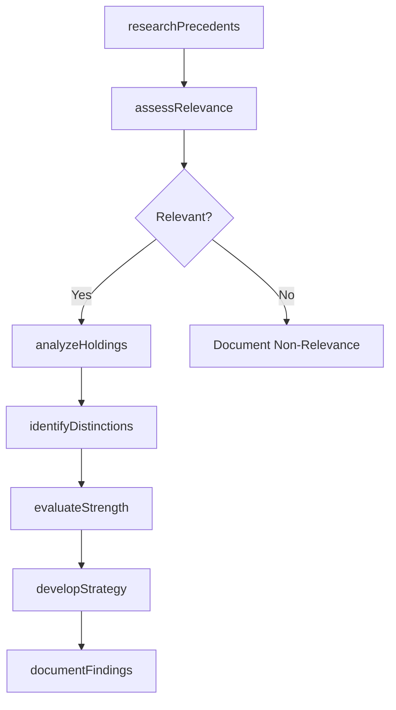
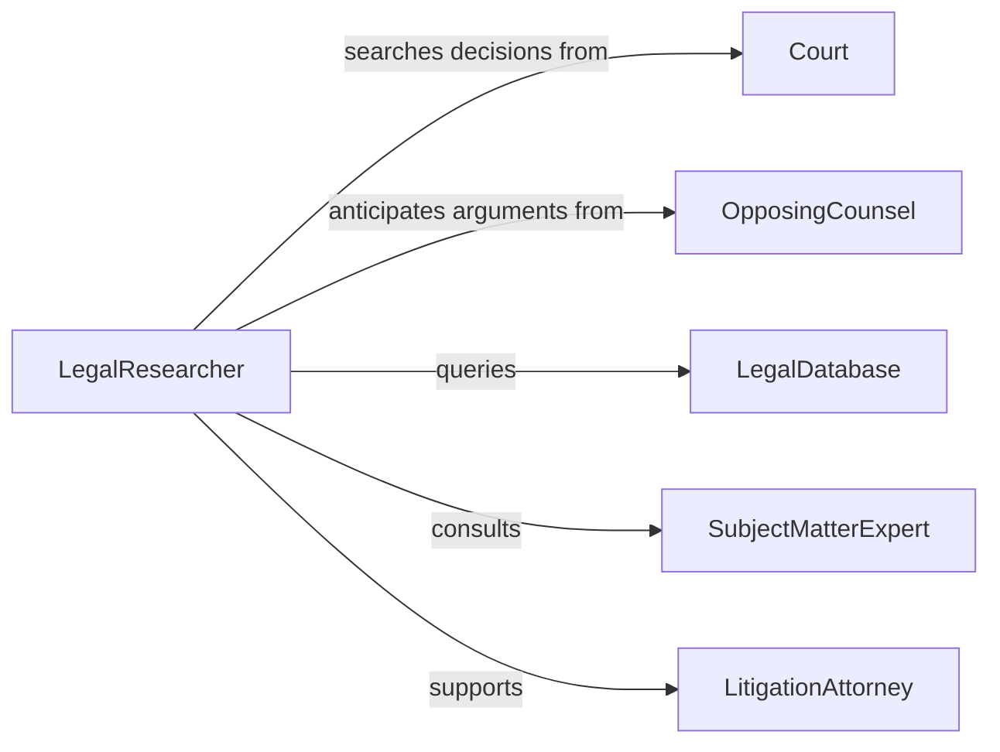

# Identify Implications Cases Legal Precedents

> Business-as-Code definition for identifying case implications from legal precedents. Analyzes how prior court decisions and legal rulings affect current cases and legal strategies.

## Overview

Legal precedent analysis involves researching case law, statutes, and judicial decisions to determine their relevance and impact on current matters. This definition provides actions for precedent research, relevance assessment, and strategic implication identification, with events to trigger legal strategy development and case preparation workflows.

## Actors

| Actor | Description |
|-------|-------------|
| Court | Judicial body that issued precedent-setting rulings |
| OpposingCounsel | Adversary who may cite precedents in litigation |
| LegalDatabase | Provider of case law and legal research tools |
| SubjectMatterExpert | Specialist in specific area of law |
| AppellateJudge | Higher court that may review precedent application |
| LegalScholar | Academic providing analysis of legal trends |

## Roles

| Role | Description |
|------|-------------|
| LegalResearcher | Conducts case law research and precedent analysis |
| LitigationAttorney | Applies precedent findings to case strategy |
| LegalAnalyst | Evaluates strength and relevance of precedents |
| ParalegalSupport | Assists with document retrieval and organization |

## Entities

| Entity | Description |
|--------|-------------|
| LegalPrecedent | Prior court decision with potential relevance |
| CurrentCase | Matter under consideration requiring precedent analysis |
| CaseImplication | Effect of precedent on current legal position |
| DistinguishingFactor | Difference between precedent and current case |
| LegalArgument | Position supported or challenged by precedents |
| ResearchMemo | Documentation of precedent analysis findings |

## Actions

| Action | Description |
|--------|-------------|
| researchPrecedents | Identify relevant prior court decisions and rulings |
| assessRelevance | Determine applicability of precedents to current case |
| analyzeHoldings | Examine legal principles established in precedents |
| identifyDistinctions | Find factual or legal differences from precedents |
| evaluateStrength | Assess persuasive power of precedents for arguments |
| developStrategy | Create legal approach based on precedent analysis |
| documentFindings | Produce research memorandum summarizing implications |

## Events

| Event | Description |
|-------|-------------|
| precedentsResearched | Relevant case law has been identified |
| relevanceAssessed | Applicability to current case has been determined |
| holdingsAnalyzed | Legal principles have been examined |
| distinctionsIdentified | Differences from precedents have been found |
| strengthEvaluated | Persuasive power has been assessed |
| strategyDeveloped | Legal approach has been created |
| findingsDocumented | Research memo has been produced |

## Searches

| Search | Description |
|--------|-------------|
| findPrecedents | List cases by jurisdiction, topic, or outcome |
| getImplications | Retrieve case effects by legal issue or argument |
| getDistinctions | Find factual or legal differences by precedent |
| getMemos | List research documentation by case or date |

## Workflow



## Actor Relationships



## Usage

### Calling Actions

```typescript
import { identifyImplicationsCasesLegalPrecedents } from '@headlessly/identify-implications-cases-legal-precedents'

const precedents = identifyImplicationsCasesLegalPrecedents()

// Research precedents for employment discrimination case
const research = await precedents.researchPrecedents({
  currentCaseId: 'smith-v-acme-corp',
  legalIssues: ['wrongful-termination', 'age-discrimination', 'retaliation'],
  jurisdictions: ['federal', 'state-california'],
  dateRange: { start: '2010-01-01', end: '2026-01-01' }
})

// Assess relevance of found precedents
const relevance = await precedents.assessRelevance({
  currentCaseId: 'smith-v-acme-corp',
  precedentIds: research.cases.map(c => c.id),
  factorsToMatch: ['employment-type', 'protected-class', 'damages-type']
})

// Develop legal strategy based on precedent analysis
const strategy = await precedents.developStrategy({
  currentCaseId: 'smith-v-acme-corp',
  strongPrecedents: relevance.strong,
  weakPrecedents: relevance.weak,
  strategicGoals: ['summary-judgment', 'damages-maximization']
})
```

### Event-Driven Automation

```typescript
// Analyze holdings when relevance assessed
precedents.relevanceAssessed(async ({ currentCaseId, relevantPrecedents }) => {
  if (relevantPrecedents.length > 0) {
    await precedents.analyzeHoldings({
      currentCaseId,
      precedentIds: relevantPrecedents.map(p => p.id),
      focusOn: ['legal-standards', 'burden-of-proof', 'remedy-types']
    })
  }
})

// Document findings after strategy developed
precedents.strategyDeveloped(async ({ currentCaseId, strategy }) => {
  await precedents.documentFindings({
    currentCaseId,
    includeStrategy: true,
    format: 'legal-memorandum',
    recipient: 'lead-counsel'
  })
})
```
