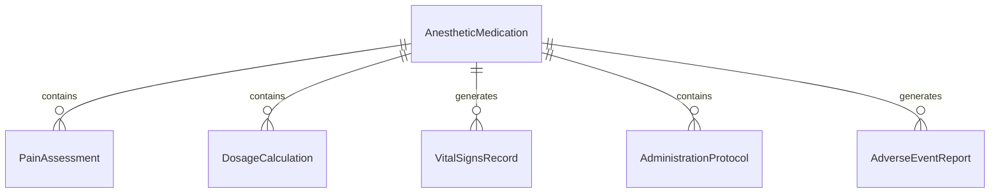
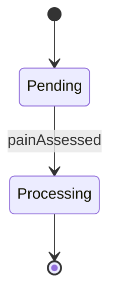
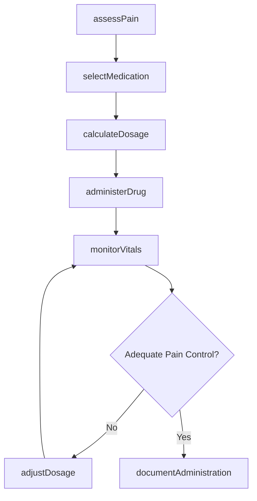
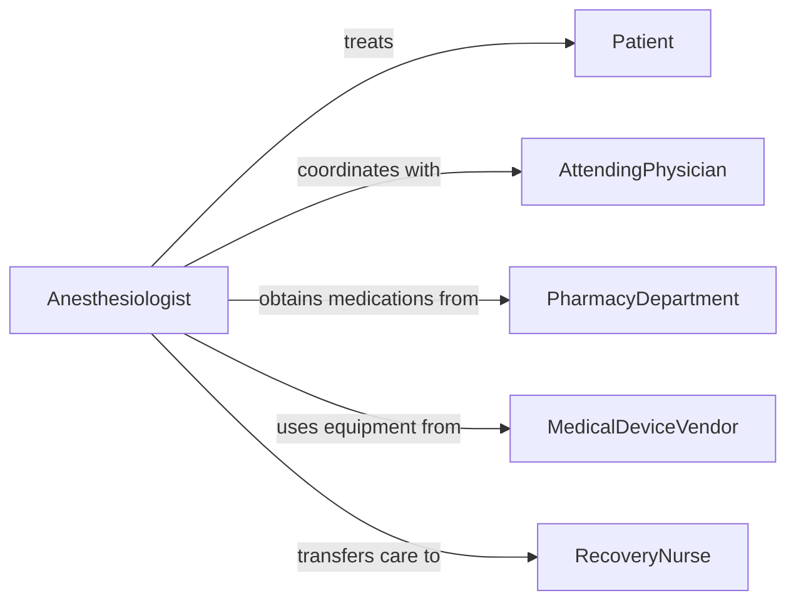

# Administer Anesthetics Sedatives Control Pain

> Business-as-Code definition for administering anesthetics and sedatives for pain control. Manages medication delivery, patient monitoring, and dosage adjustment for procedural and postoperative pain management.

## Overview

Anesthetic and sedative administration involves assessing patient needs, selecting appropriate medications, monitoring vital signs, and adjusting dosages to ensure safe and effective pain control. This definition provides actions for pain assessment, medication selection, dosage calculation, and patient monitoring, with events to trigger safety protocols and documentation workflows.

## Actors

| Actor | Description |
|-------|-------------|
| Patient | Individual receiving anesthesia or sedation |
| AttendingPhysician | Doctor overseeing procedure requiring pain control |
| PharmacyDepartment | Supplies medications and verifies prescriptions |
| MedicalDeviceVendor | Provider of monitoring equipment and infusion pumps |
| AnesthesiologyBoard | Regulatory body setting practice standards |
| RecoveryNurse | Clinician monitoring patient after sedation |

## Roles

| Role | Description |
|------|-------------|
| Anesthesiologist | Physician specializing in anesthesia administration |
| NurseAnesthetist | Advanced practice nurse administering anesthesia |
| PainManagementSpecialist | Clinician focusing on acute and chronic pain control |
| MonitoringTechnician | Staff tracking patient vital signs during sedation |

## Entities

| Entity | Description |
|--------|-------------|
| AnestheticMedication | Drug used to induce anesthesia or sedation |
| PainAssessment | Evaluation of patient pain level and characteristics |
| DosageCalculation | Determination of medication amount based on patient factors |
| VitalSignsRecord | Documentation of patient physiological parameters |
| AdministrationProtocol | Standardized procedure for medication delivery |
| AdverseEventReport | Documentation of complications or side effects |

## Actions

| Action | Description |
|--------|-------------|
| assessPain | Evaluate patient pain level and characteristics |
| selectMedication | Choose appropriate anesthetic or sedative agent |
| calculateDosage | Determine medication amount based on patient factors |
| administerDrug | Deliver medication via appropriate route |
| monitorVitals | Track patient heart rate, blood pressure, and respiration |
| adjustDosage | Modify medication amount based on patient response |
| documentAdministration | Record medication delivery and patient status |

## Events

| Event | Description |
|-------|-------------|
| painAssessed | Patient pain evaluation has been completed |
| medicationSelected | Anesthetic agent has been chosen |
| dosageCalculated | Medication amount has been determined |
| drugAdministered | Medication has been delivered to patient |
| vitalsMonitored | Patient physiological parameters have been tracked |
| dosageAdjusted | Medication amount has been modified |
| administrationDocumented | Delivery and status have been recorded |

## Searches

| Search | Description |
|--------|-------------|
| findAssessments | List pain evaluations by patient, date, or severity |
| getMedications | Retrieve anesthetic agents by class, route, or indication |
| getAdministrations | Find medication deliveries by patient or procedure |
| getVitals | List vital signs records by patient or time period |


## Entity Relationships



## State Diagram


## Workflow



## Actor Relationships



## Usage

### Calling Actions

```typescript
import { administerAnestheticsSedativesControlPain } from '@headlessly/administer-anesthetics-sedatives-control-pain'

const anesthesia = administerAnestheticsSedativesControlPain()

// Assess patient pain before procedure
const assessment = await anesthesia.assessPain({
  patientId: 'patient-12345',
  procedureType: 'colonoscopy',
  painScale: 'numeric-0-10',
  currentLevel: 7
})

// Select appropriate sedative medication
const medication = await anesthesia.selectMedication({
  patientId: 'patient-12345',
  assessmentId: assessment.id,
  procedureType: 'colonoscopy',
  patientFactors: ['age-65', 'weight-75kg', 'no-allergies'],
  sedationLevel: 'moderate-conscious'
})

// Calculate and administer initial dosage
const dosage = await anesthesia.calculateDosage({
  medicationId: medication.id,
  patientWeight: 75,
  patientAge: 65,
  targetSedationLevel: 'moderate-conscious'
})

await anesthesia.administerDrug({
  patientId: 'patient-12345',
  medicationId: medication.id,
  dosage: dosage.amount,
  route: 'intravenous',
  administeredBy: 'nurse-anesthetist-789'
})
```

### Event-Driven Automation

```typescript
// Monitor vitals immediately after drug administration
anesthesia.drugAdministered(async ({ patientId, medicationId, timestamp }) => {
  await anesthesia.monitorVitals({
    patientId,
    parameters: ['heart-rate', 'blood-pressure', 'oxygen-saturation', 'respiratory-rate'],
    frequency: 'every-5-minutes',
    alertThresholds: {
      oxygenSaturation: { min: 92 },
      heartRate: { min: 50, max: 120 }
    }
  })
})

// Adjust dosage if inadequate pain control
anesthesia.vitalsMonitored(async ({ patientId, painLevel, vitalsStable }) => {
  if (painLevel > 5 && vitalsStable) {
    await anesthesia.adjustDosage({
      patientId,
      adjustmentType: 'increase',
      percentageChange: 20,
      justification: 'inadequate-pain-control'
    })
  }
})
```
