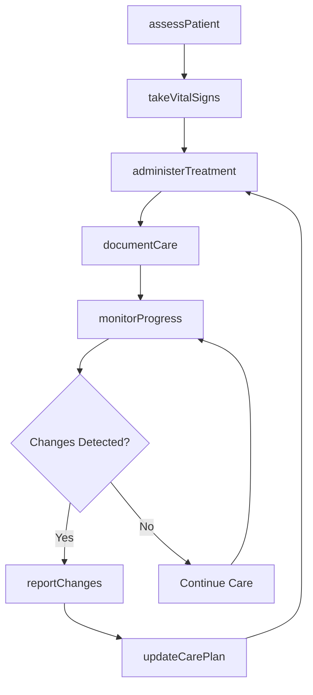
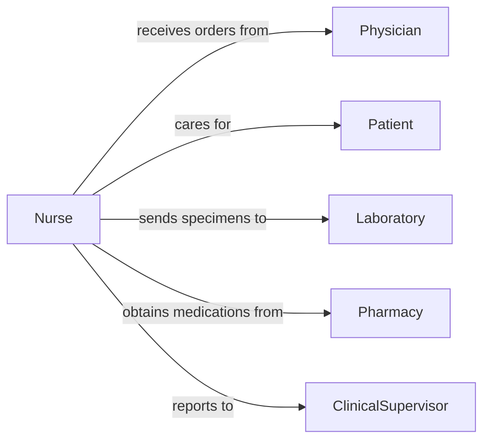

# Administer Basic Health Care Medical

> Business-as-Code definition for administering basic health care or medical treatments. Models routine medical care delivery including vital signs, wound care, and treatment administration.

## Overview

Basic healthcare administration encompasses routine medical treatments provided by healthcare professionals including taking vital signs, basic wound care, monitoring patient status, and administering prescribed treatments under clinical protocols.

## Actors

| Actor | Description |
|-------|-------------|
| Patient | Individual receiving basic health care services |
| Physician | Prescribes treatments and oversees care plans |
| Laboratory | Processes specimens and diagnostic tests |
| Pharmacy | Provides medications and supplies |
| InsuranceProvider | Covers medical treatment costs |
| FamilyMember | Provides patient history and consent |

## Roles

| Role | Description |
|------|-------------|
| Nurse | Administers treatments and monitors patients |
| MedicalAssistant | Assists with basic procedures and patient prep |
| ClinicalSupervisor | Oversees care quality and compliance |
| CareCoordinator | Schedules treatments and manages care plans |

## Entities

| Entity | Description |
|--------|-------------|
| Treatment | A prescribed medical intervention |
| VitalSigns | Blood pressure, temperature, pulse, respiration |
| MedicalRecord | Documentation of care provided |
| CarePlan | Protocol for ongoing patient treatment |
| Assessment | Evaluation of patient condition |
| Protocol | Standard procedures for treatment delivery |

## Actions

| Action | Description |
|--------|-------------|
| assessPatient | Evaluate patient condition and needs |
| takeVitalSigns | Measure blood pressure, temperature, pulse, respiration |
| administerTreatment | Deliver prescribed medical intervention |
| documentCare | Record treatment details in medical record |
| monitorProgress | Track patient response to treatment |
| reportChanges | Notify physician of condition changes |
| updateCarePlan | Modify treatment protocol based on progress |

## Events

| Event | Description |
|-------|-------------|
| patientAssessed | Initial evaluation completed |
| vitalSignsTaken | Vital signs measured and recorded |
| treatmentAdministered | Medical intervention delivered |
| careDocumented | Treatment recorded in medical record |
| progressMonitored | Patient response tracked |
| changesReported | Condition changes communicated to physician |
| carePlanUpdated | Treatment protocol modified |

## Searches

| Search | Description |
|--------|-------------|
| findPatients | Locate patients by status, condition, or schedule |
| getTreatments | Retrieve prescribed treatments by patient or type |
| getVitalSigns | Find vital sign measurements by patient and timeframe |
| getCarePlans | Access active care protocols by patient |

## Workflow



## Actor Relationships



## Usage

### Calling Actions

```typescript
import { administerBasicHealthCareMedical } from '@headlessly/administer-basic-health-care-medical'

const healthcare = administerBasicHealthCareMedical()

// Assess patient before treatment
const assessment = await healthcare.assessPatient({
  patientId: 'P12345',
  chiefComplaint: 'Wound care follow-up',
  symptoms: ['mild pain', 'healing incision']
})

// Take vital signs
const vitals = await healthcare.takeVitalSigns({
  patientId: 'P12345',
  bloodPressure: '120/80',
  temperature: 98.6,
  pulse: 72,
  respiration: 16
})

// Administer prescribed treatment
await healthcare.administerTreatment({
  patientId: 'P12345',
  treatmentType: 'wound care',
  procedure: 'dressing change',
  supplies: ['sterile gauze', 'adhesive tape', 'antiseptic']
})

// Document care provided
await healthcare.documentCare({
  patientId: 'P12345',
  assessmentId: assessment.id,
  vitalsId: vitals.id,
  treatment: 'Wound dressing changed, healing well',
  notes: 'No signs of infection, patient tolerated procedure'
})
```

### Event-Driven Automation

```typescript
// Alert on abnormal vital signs
healthcare.vitalSignsTaken(async ({ patientId, vitals }) => {
  if (vitals.temperature > 100.4 || vitals.bloodPressure.systolic > 140) {
    await healthcare.reportChanges({
      patientId,
      type: 'abnormal_vitals',
      urgency: 'moderate',
      details: vitals
    })
  }
})

// Update care plan after physician notification
healthcare.changesReported(async ({ patientId, physicianResponse }) => {
  if (physicianResponse.modifyCarePlan) {
    await healthcare.updateCarePlan({
      patientId,
      modifications: physicianResponse.newOrders,
      effectiveDate: new Date()
    })
  }
})
```
