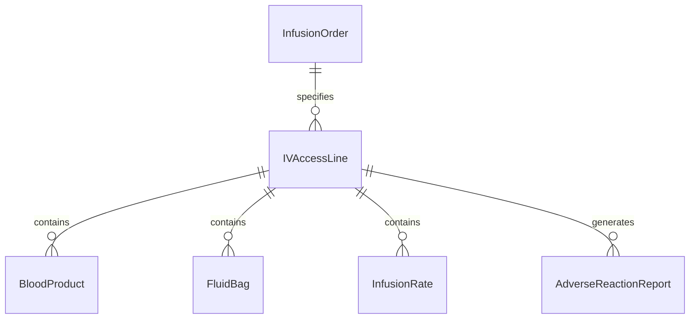
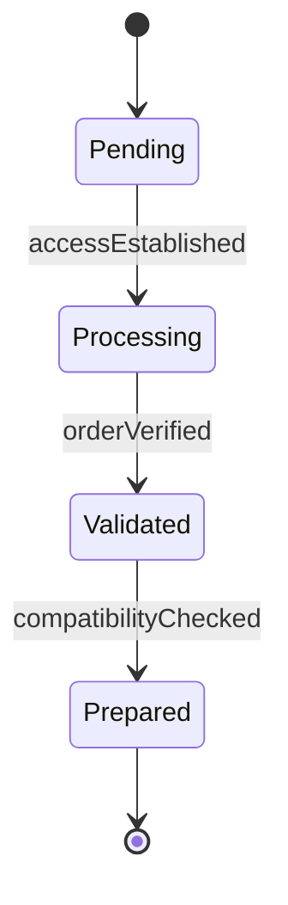
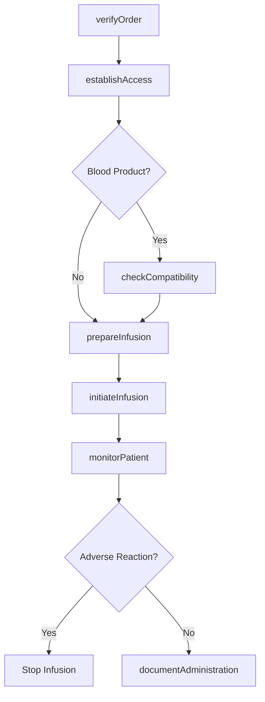
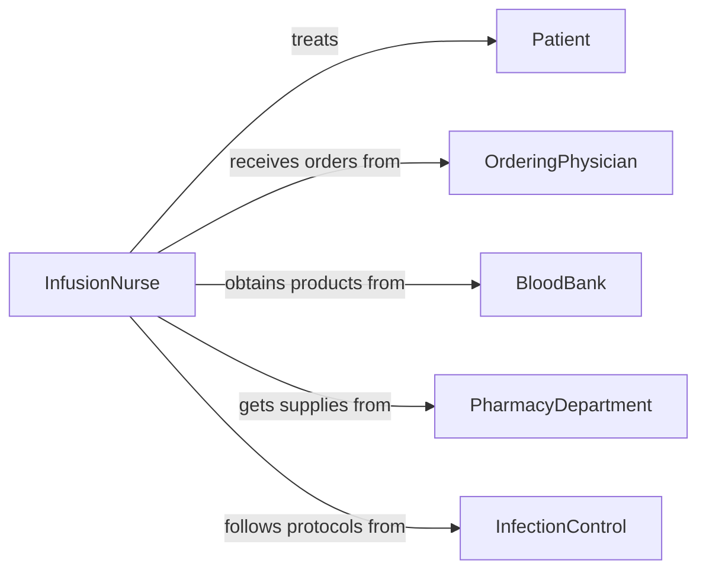

# Administer Blood Fluids Intravenously

> Business-as-Code definition for intravenous administration of blood products and fluids. Manages IV access, fluid selection, infusion rate, and patient monitoring for safe transfusion and hydration therapy.

## Overview

Intravenous fluid and blood administration involves establishing vascular access, verifying patient and product compatibility, setting infusion parameters, and monitoring for adverse reactions. This definition provides actions for IV line placement, product verification, infusion management, and complication monitoring, with events to trigger safety protocols and documentation requirements.

## Actors

| Actor | Description |
|-------|-------------|
| Patient | Individual receiving intravenous fluids or blood |
| OrderingPhysician | Doctor prescribing IV therapy or transfusion |
| BloodBank | Laboratory providing blood products |
| PharmacyDepartment | Supplies IV fluids and additives |
| InfectionControl | Team ensuring sterile technique compliance |
| TransfusionService | Specialist group managing blood product administration |

## Roles

| Role | Description |
|------|-------------|
| InfusionNurse | Clinician specializing in IV therapy |
| PhlebotomistTechnician | Staff trained in vascular access |
| TransfusionSpecialist | Expert in blood product administration |
| PatientMonitor | Staff tracking patient response to infusion |

## Entities

| Entity | Description |
|--------|-------------|
| IVAccessLine | Catheter or needle providing vascular entry |
| InfusionOrder | Prescription specifying fluid type and rate |
| BloodProduct | Packed cells, plasma, platelets, or other transfusion material |
| FluidBag | Container of intravenous hydration solution |
| InfusionRate | Speed at which fluid is delivered |
| AdverseReactionReport | Documentation of complications during infusion |

## Actions

| Action | Description |
|--------|-------------|
| establishAccess | Insert IV catheter or access existing line |
| verifyOrder | Confirm infusion prescription against patient record |
| checkCompatibility | Ensure blood type and crossmatch for transfusions |
| prepareInfusion | Set up fluid bag, tubing, and pump |
| initiateInfusion | Start fluid or blood product delivery |
| monitorPatient | Observe for adverse reactions during infusion |
| documentAdministration | Record infusion details and patient response |

## Events

| Event | Description |
|-------|-------------|
| accessEstablished | IV line has been successfully placed |
| orderVerified | Prescription has been confirmed accurate |
| compatibilityChecked | Blood product compatibility has been verified |
| infusionPrepared | Equipment has been set up for delivery |
| infusionInitiated | Fluid or blood product delivery has begun |
| patientMonitored | Observation for reactions has been performed |
| administrationDocumented | Infusion details have been recorded |

## Searches

| Search | Description |
|--------|-------------|
| findOrders | List infusion prescriptions by patient, status, or urgency |
| getInfusions | Retrieve active infusions by patient or fluid type |
| getReactions | Find adverse events by severity, type, or patient |
| getDocumentation | List administration records by date or clinician |


## Entity Relationships



## State Diagram


## Workflow



## Actor Relationships



## Usage

### Calling Actions

```typescript
import { administerBloodFluidsIntravenously } from '@headlessly/administer-blood-fluids-intravenously'

const infusion = administerBloodFluidsIntravenously()

// Verify IV therapy order
const order = await infusion.verifyOrder({
  patientId: 'patient-78901',
  orderId: 'iv-order-2026-001',
  fluidType: 'lactated-ringers',
  volume: 1000,
  rate: '125-ml-per-hour',
  duration: '8-hours'
})

// Establish IV access
const access = await infusion.establishAccess({
  patientId: 'patient-78901',
  accessType: 'peripheral-iv',
  location: 'left-forearm',
  catheterSize: '18-gauge',
  establishedBy: 'infusion-nurse-456'
})

// Prepare and initiate infusion
const prepared = await infusion.prepareInfusion({
  orderId: order.id,
  accessLineId: access.id,
  pumpType: 'programmable-infusion-pump',
  tubing: 'standard-iv-set'
})

await infusion.initiateInfusion({
  orderId: order.id,
  accessLineId: access.id,
  startTime: new Date().toISOString(),
  initiatedBy: 'infusion-nurse-456'
})
```

### Event-Driven Automation

```typescript
// Check compatibility immediately for blood products
infusion.orderVerified(async ({ orderId, fluidType, patientId }) => {
  if (fluidType.startsWith('blood-')) {
    await infusion.checkCompatibility({
      patientId,
      orderId,
      bloodProduct: fluidType,
      verificationMethod: 'bedside-crossmatch'
    })
  }
})

// Monitor patient continuously after infusion initiated
infusion.infusionInitiated(async ({ patientId, orderId }) => {
  await infusion.monitorPatient({
    patientId,
    orderId,
    parameters: ['vital-signs', 'infusion-site', 'patient-comfort'],
    frequency: 'every-15-minutes',
    alertOn: ['fever', 'rash', 'difficulty-breathing', 'chest-pain']
  })
})
```
