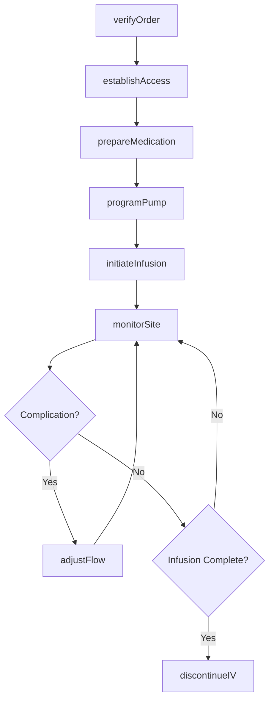
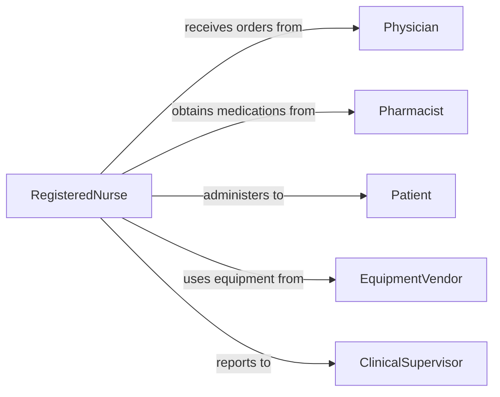

# Administer Intravenous Medications

> Business-as-Code definition for administering intravenous medications. Models IV therapy including line placement, medication preparation, infusion monitoring, and site care.

## Overview

Intravenous medication administration involves establishing vascular access, preparing sterile medications, programming infusion pumps, monitoring patient response, and maintaining IV site integrity according to clinical protocols and medication guidelines.

## Actors

| Actor | Description |
|-------|-------------|
| Patient | Individual receiving IV medication therapy |
| Physician | Prescribes IV medications and dosages |
| Pharmacist | Prepares and verifies IV medication orders |
| Laboratory | Monitors therapeutic drug levels and compatibility |
| EquipmentVendor | Provides IV pumps and administration supplies |
| InsuranceProvider | Covers IV therapy costs |

## Roles

| Role | Description |
|------|-------------|
| RegisteredNurse | Administers IV medications and monitors infusions |
| IVTherapist | Specializes in vascular access and IV care |
| PharmacyTechnician | Assists with IV medication preparation |
| ClinicalSupervisor | Oversees IV therapy protocols and safety |

## Entities

| Entity | Description |
|--------|-------------|
| IVOrder | Prescription for intravenous medication |
| IVLine | Vascular access device for medication delivery |
| Infusion | Continuous or intermittent IV medication administration |
| InfusionPump | Electronic device controlling IV flow rate |
| IVSite | Location where catheter enters vein |
| MedicationBag | Sterile container of prepared IV solution |

## Actions

| Action | Description |
|--------|-------------|
| verifyOrder | Confirm IV medication prescription and dosage |
| establishAccess | Insert IV catheter and secure line |
| prepareMedication | Mix and verify IV medication solution |
| programPump | Set infusion rate and volume parameters |
| initiateInfusion | Begin IV medication delivery |
| monitorSite | Check for infiltration, phlebitis, or infection |
| adjustFlow | Modify infusion rate per protocol or orders |

## Events

| Event | Description |
|-------|-------------|
| orderVerified | IV medication prescription confirmed |
| accessEstablished | IV line successfully placed and secured |
| medicationPrepared | IV solution mixed and ready for infusion |
| pumpProgrammed | Infusion device configured with parameters |
| infusionInitiated | IV medication delivery started |
| siteMonitored | IV site assessed for complications |
| flowAdjusted | Infusion rate modified |

## Searches

| Search | Description |
|--------|-------------|
| findActiveInfusions | Locate currently running IV medications |
| getIVOrders | Retrieve pending or active IV prescriptions |
| getSiteAssessments | Find IV site monitoring records |
| getPumpAlarms | Access infusion pump alerts and errors |

## Workflow



## Actor Relationships



## Usage

### Calling Actions

```typescript
import { administerIntravenousMedications } from '@headlessly/administer-intravenous-medications'

const ivTherapy = administerIntravenousMedications()

// Verify medication order
const order = await ivTherapy.verifyOrder({
  patientId: 'P12345',
  orderId: 'RX789',
  medication: 'Vancomycin 1g',
  route: 'IV',
  frequency: 'q12h'
})

// Establish vascular access
const access = await ivTherapy.establishAccess({
  patientId: 'P12345',
  siteLocation: 'left forearm',
  catheterSize: '20 gauge',
  attempts: 1
})

// Program infusion pump
await ivTherapy.programPump({
  patientId: 'P12345',
  medication: 'Vancomycin 1g in 250mL NS',
  rate: 125,
  rateUnit: 'mL/hr',
  vtbi: 250,
  duration: 120
})

// Initiate infusion
await ivTherapy.initiateInfusion({
  patientId: 'P12345',
  orderId: order.id,
  accessId: access.id,
  startTime: new Date()
})
```

### Event-Driven Automation

```typescript
// Monitor for IV site complications
ivTherapy.siteMonitored(async ({ patientId, siteId, assessment }) => {
  if (assessment.infiltration || assessment.phlebitis) {
    await ivTherapy.adjustFlow({
      patientId,
      action: 'discontinue',
      reason: assessment.complication,
      reestablishRequired: true
    })
  }
})

// Alert on pump alarms
ivTherapy.pumpProgrammed(async ({ patientId, pumpId }) => {
  const alarms = await ivTherapy.getPumpAlarms({ pumpId })
  alarms.forEach(alarm => {
    if (alarm.type === 'occlusion' || alarm.type === 'air_in_line') {
      notify({ urgency: 'high', patientId, alarm })
    }
  })
})
```
