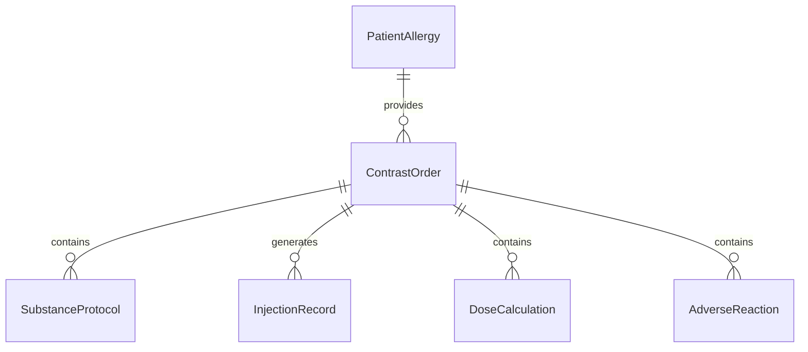
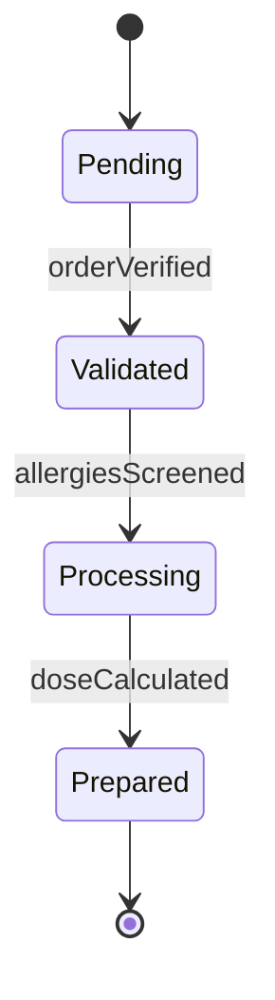
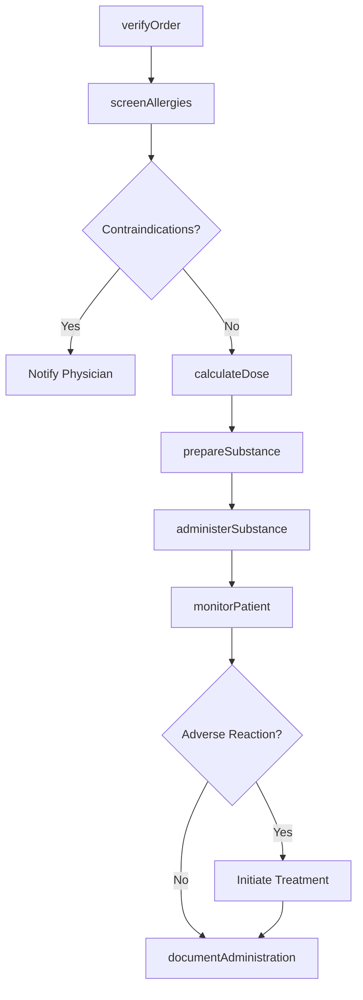
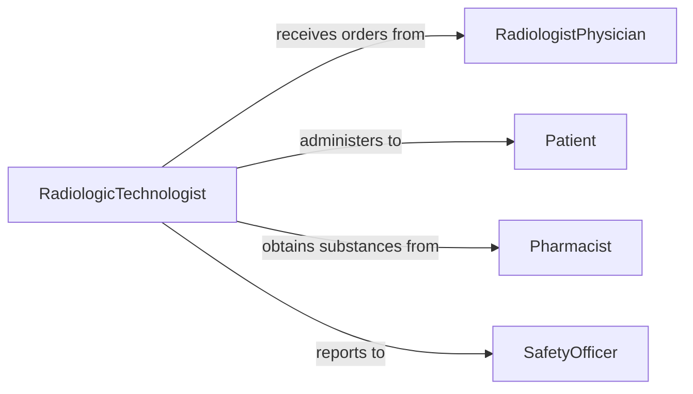

# Administer Medical Substances Imaging Procedures

> Business-as-Code definition for administering contrast agents, radiopharmaceuticals, and other medical substances used in diagnostic imaging and therapeutic procedures.

## Overview

Medical substance administration for imaging encompasses preparing, verifying, and delivering contrast media, radioisotopes, and diagnostic agents. This definition covers the complete workflow from prescription verification through post-administration monitoring, ensuring patient safety and optimal imaging results.

## Actors

| Actor | Description |
|-------|-------------|
| RadiologistPhysician | Orders imaging procedures and prescribes contrast protocols |
| Patient | Receives medical substances and undergoes imaging |
| Pharmacist | Prepares and dispenses radiopharmaceuticals and contrast agents |
| ImagingEquipmentVendor | Provides imaging systems and contrast delivery equipment |
| RegulatoryAuthority | Oversees radiation safety and substance administration standards |
| InsuranceProvider | Covers approved imaging procedures and substances |

## Roles

| Role | Description |
|------|-------------|
| RadiologicTechnologist | Administers substances and operates imaging equipment |
| NuclearMedicineTechnologist | Handles radiopharmaceuticals and performs nuclear imaging |
| InjectionSpecialist | Performs venipuncture and administers contrast agents |
| SafetyOfficer | Monitors radiation exposure and substance handling protocols |

## Entities

| Entity | Description |
|--------|-------------|
| ContrastOrder | Prescription for contrast agent or radiopharmaceutical |
| SubstanceProtocol | Guidelines for dosage, timing, and administration route |
| InjectionRecord | Documentation of substance administration details |
| PatientAllergy | Known allergies and contraindications |
| DoseCalculation | Patient-specific dosage based on weight and kidney function |
| AdverseReaction | Unexpected response to administered substance |

## Actions

| Action | Description |
|--------|-------------|
| verifyOrder | Confirm prescription details and patient identity |
| screenAllergies | Check patient history for contraindications |
| calculateDose | Determine appropriate substance volume and concentration |
| prepareSubstance | Draw up contrast agent or prepare radiopharmaceutical |
| administerSubstance | Inject or deliver substance via appropriate route |
| monitorPatient | Observe patient for adverse reactions post-administration |
| documentAdministration | Record substance details and patient response |

## Events

| Event | Description |
|-------|-------------|
| orderVerified | Contrast order has been validated against patient record |
| allergiesScreened | Patient allergy check completed successfully |
| doseCalculated | Substance dose computed for patient parameters |
| substancePrepared | Contrast agent or radiopharmaceutical is ready |
| substanceAdministered | Medical substance has been delivered to patient |
| reactionDetected | Adverse reaction observed during monitoring |
| administrationDocumented | Complete record saved to patient chart |

## Searches

| Search | Description |
|--------|-------------|
| findOrders | Retrieve contrast orders by patient or procedure type |
| getAllergies | Query patient allergy history for specific substances |
| getProtocols | Find administration protocols by imaging modality |
| getReactions | Search adverse reaction database by substance type |


## Entity Relationships



## State Diagram


## Workflow



## Actor Relationships



## Usage

### Calling Actions

```typescript
import { administerMedicalSubstancesImagingProcedures } from '@headlessly/administer-medical-substances-imaging-procedures'

const imaging = administerMedicalSubstancesImagingProcedures()

// Verify contrast order for CT scan
const order = await imaging.verifyOrder({
  patientId: 'PT-789012',
  procedureCode: 'CT-CHEST-CONTRAST',
  substanceType: 'iohexol',
  orderedBy: 'Dr. Martinez'
})

// Screen for allergies and calculate dose
await imaging.screenAllergies({
  patientId: 'PT-789012',
  substanceClass: 'iodinated-contrast'
})

const dose = await imaging.calculateDose({
  patientWeight: 75,
  creatinineLevel: 1.1,
  substanceConcentration: 300
})

// Administer contrast and monitor
await imaging.administerSubstance({
  orderId: order.id,
  volume: dose.volume,
  route: 'intravenous',
  injectionSite: 'right-antecubital',
  flowRate: 3.0
})

await imaging.monitorPatient({
  patientId: 'PT-789012',
  duration: 30,
  vitalSigns: true
})
```

### Event-Driven Automation

```typescript
// Alert on adverse reactions
imaging.reactionDetected(async ({ patientId, substance, severity }) => {
  if (severity === 'severe') {
    await notify({
      to: 'emergency-team',
      urgent: true,
      message: `Severe reaction to ${substance} in patient ${patientId}`
    })
    await startProtocol({ type: 'anaphylaxis', patientId })
  }
})

// Auto-document administration
imaging.substanceAdministered(async ({ orderId, patientId, substance }) => {
  await imaging.documentAdministration({
    orderId,
    patientId,
    substance,
    timestamp: new Date(),
    completedBy: getCurrentUser()
  })
})
```
