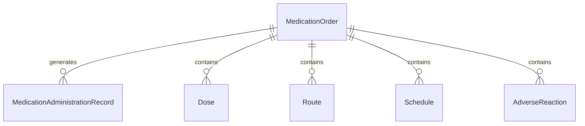
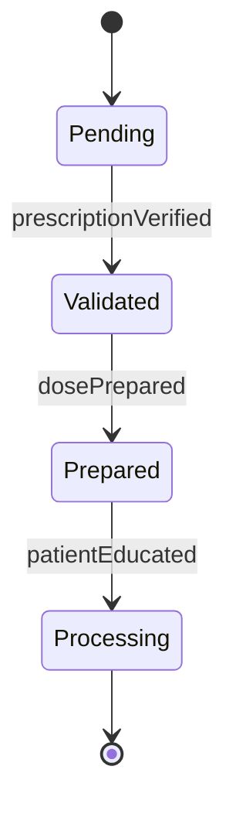
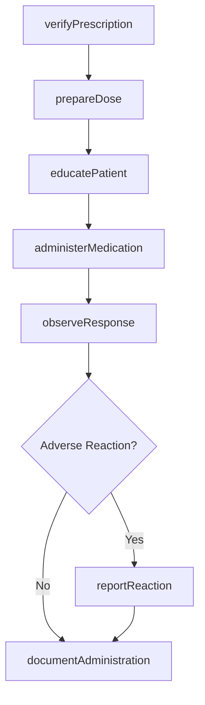
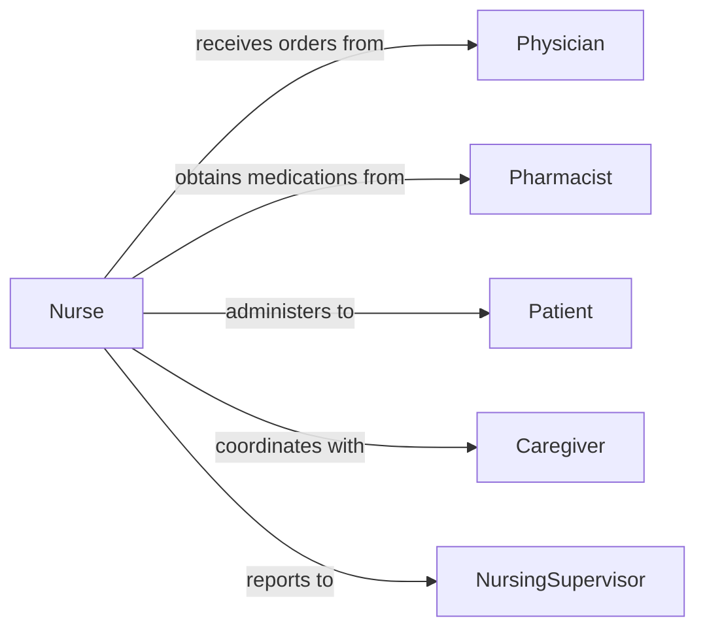

# Administer Non-intravenous Medications

> Business-as-Code definition for administering non-intravenous medications. Models oral, topical, sublingual, rectal, inhalation, and injection routes for medication delivery.

## Overview

Non-intravenous medication administration encompasses all routes excluding IV therapy, including oral tablets and liquids, topical applications, subcutaneous and intramuscular injections, inhalations, eye/ear drops, and suppositories following safe medication practices.

## Actors

| Actor | Description |
|-------|-------------|
| Patient | Individual receiving non-IV medications |
| Physician | Prescribes medications and routes |
| Pharmacist | Dispenses medications and counsels on usage |
| Caregiver | Assists with medication administration at home |
| InsuranceProvider | Covers prescription medication costs |
| DrugManufacturer | Produces medications and provides information |

## Roles

| Role | Description |
|------|-------------|
| Nurse | Administers medications and educates patients |
| MedicationTechnician | Assists with medication preparation and delivery |
| ClinicalPharmacist | Reviews medication regimens and interactions |
| NursingSupervisor | Oversees medication safety and compliance |

## Entities

| Entity | Description |
|--------|-------------|
| MedicationOrder | Prescription with route, dose, frequency |
| MedicationAdministrationRecord | Documentation of doses given |
| Dose | Specific amount of medication to administer |
| Route | Method of delivery (oral, topical, IM, SubQ, inhaled) |
| Schedule | Timing protocol for medication administration |
| AdverseReaction | Unwanted patient response to medication |

## Actions

| Action | Description |
|--------|-------------|
| verifyPrescription | Confirm five rights of medication administration |
| prepareDose | Measure or select correct medication amount |
| educatePatient | Explain medication purpose and side effects |
| administerMedication | Deliver medication via prescribed route |
| observeResponse | Monitor patient for therapeutic and adverse effects |
| documentAdministration | Record medication given in MAR |
| reportReaction | Notify provider of adverse or unexpected responses |

## Events

| Event | Description |
|-------|-------------|
| prescriptionVerified | Medication order confirmed against patient record |
| dosePrepared | Correct medication amount ready for administration |
| patientEducated | Instructions provided and understanding confirmed |
| medicationAdministered | Dose delivered via prescribed route |
| responseObserved | Patient monitored for medication effects |
| administrationDocumented | MAR updated with dose, time, route |
| reactionReported | Adverse event communicated to provider |

## Searches

| Search | Description |
|--------|-------------|
| findDuemedications | Locate medications scheduled for current time |
| getMedicationHistory | Retrieve past administration records by patient |
| getAllergies | Access patient allergy and reaction history |
| getInteractions | Check for drug-drug or drug-food interactions |


## Entity Relationships



## State Diagram


## Workflow



## Actor Relationships



## Usage

### Calling Actions

```typescript
import { administerNonIntravenousMedications } from '@headlessly/administer-non-intravenous-medications'

const medications = administerNonIntravenousMedications()

// Verify prescription before administration
const prescription = await medications.verifyPrescription({
  patientId: 'P12345',
  orderId: 'RX456',
  medication: 'Metformin 500mg',
  route: 'oral',
  dose: '500mg',
  frequency: 'BID',
  time: '0800'
})

// Prepare the dose
const dose = await medications.prepareDose({
  patientId: 'P12345',
  medication: 'Metformin 500mg',
  quantity: 1,
  unit: 'tablet'
})

// Educate patient
await medications.educatePatient({
  patientId: 'P12345',
  medication: 'Metformin',
  purpose: 'Control blood sugar',
  sideEffects: ['nausea', 'diarrhea'],
  instructions: 'Take with food'
})

// Administer medication
await medications.administerMedication({
  patientId: 'P12345',
  orderId: prescription.id,
  route: 'oral',
  time: new Date(),
  witnessedBy: 'RN Smith'
})

// Document administration
await medications.documentAdministration({
  patientId: 'P12345',
  orderId: prescription.id,
  givenBy: 'RN Smith',
  time: new Date(),
  notes: 'Patient took medication with water, no difficulty swallowing'
})
```

### Event-Driven Automation

```typescript
// Check for allergies before administration
medications.prescriptionVerified(async ({ patientId, medication }) => {
  const allergies = await medications.getAllergies({ patientId })
  const allergyMatch = allergies.find(a => a.medication === medication.name)

  if (allergyMatch) {
    await medications.reportReaction({
      patientId,
      type: 'allergy_alert',
      severity: allergyMatch.severity,
      action: 'hold_medication'
    })
  }
})

// Alert on adverse reactions
medications.responseObserved(async ({ patientId, response }) => {
  if (response.adverseEffects?.length > 0) {
    await medications.reportReaction({
      patientId,
      effects: response.adverseEffects,
      severity: response.severity,
      notifyPhysician: true
    })
  }
})
```
