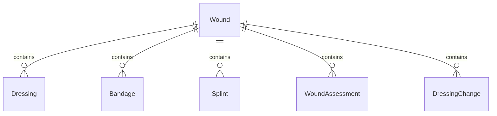
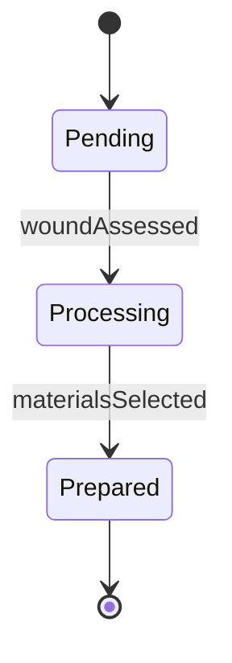
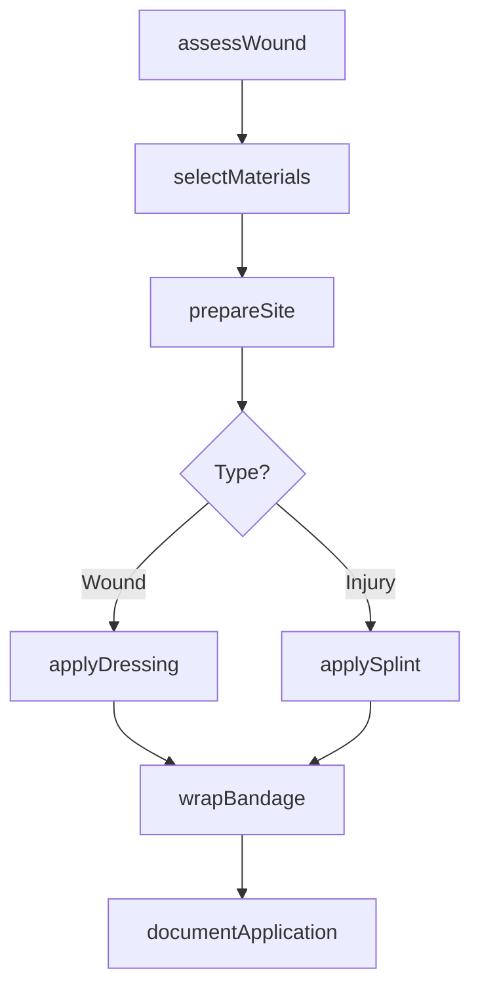
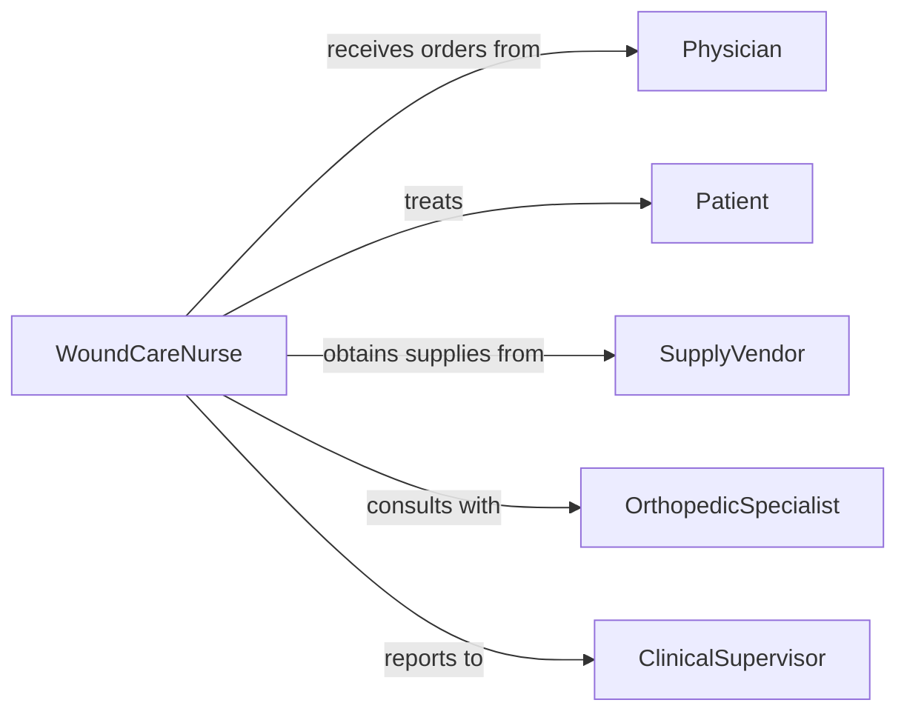

# Apply Bandages Dressings Splints

> Business-as-Code definition for applying bandages, dressings, or splints. Models wound care, orthopedic stabilization, and therapeutic wrapping procedures.

## Overview

Application of bandages, dressings, and splints involves wound assessment, selection of appropriate materials, sterile technique for dressings, proper wrapping techniques, and immobilization methods to promote healing, prevent infection, and stabilize injuries.

## Actors

| Actor | Description |
|-------|-------------|
| Patient | Individual receiving wound care or stabilization |
| Physician | Orders dressing changes and splint applications |
| SupplyVendor | Provides bandages, dressings, and splint materials |
| PhysicalTherapist | Assesses need for supportive devices |
| OrthopedicSpecialist | Prescribes splinting for fractures or sprains |
| InsuranceProvider | Covers wound care and splinting supplies |

## Roles

| Role | Description |
|------|-------------|
| WoundCareNurse | Applies dressings using sterile technique |
| EmergencyMedicalTechnician | Applies splints in acute injury situations |
| CertifiedNursingAssistant | Assists with bandage application |
| ClinicalSupervisor | Oversees wound care protocols and training |

## Entities

| Entity | Description |
|--------|-------------|
| Wound | Injury requiring dressing or bandage |
| Dressing | Sterile covering applied to wound |
| Bandage | Material used to secure dressing or provide support |
| Splint | Rigid device to immobilize injured body part |
| WoundAssessment | Evaluation of wound size, depth, drainage |
| DressingChange | Scheduled removal and replacement of wound covering |

## Actions

| Action | Description |
|--------|-------------|
| assessWound | Evaluate wound condition, size, and healing progress |
| selectMaterials | Choose appropriate dressing, bandage, or splint type |
| prepareSite | Clean and prepare wound or injury site |
| applyDressing | Place sterile covering on wound |
| wrapBandage | Secure dressing or provide compression support |
| applySplint | Immobilize injured extremity with rigid support |
| documentApplication | Record materials used and wound status |

## Events

| Event | Description |
|-------|-------------|
| woundAssessed | Wound evaluated and measurement recorded |
| materialsSelected | Appropriate supplies chosen for application |
| sitePrepared | Area cleaned and ready for dressing or splint |
| dressingApplied | Sterile covering placed on wound |
| bandageWrapped | Securing material properly positioned |
| splintApplied | Immobilization device correctly positioned |
| applicationDocumented | Details recorded in medical record |

## Searches

| Search | Description |
|--------|-------------|
| findWounds | Locate patients with active wound care orders |
| getDressingSchedule | Retrieve scheduled dressing change times |
| getSplintedPatients | Find patients with splints requiring monitoring |
| getWoundHistory | Access past wound assessments and progress |


## Entity Relationships



## State Diagram


## Workflow



## Actor Relationships



## Usage

### Calling Actions

```typescript
import { applyBandagesDressingsSplints } from '@headlessly/apply-bandages-dressings-splints'

const woundCare = applyBandagesDressingsSplints()

// Assess wound before dressing change
const assessment = await woundCare.assessWound({
  patientId: 'P12345',
  woundId: 'W001',
  location: 'left lower leg',
  size: { length: 5, width: 3, depth: 0.5, unit: 'cm' },
  drainage: 'moderate serous',
  healingStage: 'granulation'
})

// Select appropriate materials
const materials = await woundCare.selectMaterials({
  woundType: 'surgical incision',
  drainageLevel: 'moderate',
  materials: ['sterile gauze 4x4', 'foam dressing', 'rolled gauze', 'adhesive tape']
})

// Apply sterile dressing
await woundCare.applyDressing({
  patientId: 'P12345',
  woundId: 'W001',
  dressingType: 'foam',
  sterileGloves: true,
  technique: 'aseptic'
})

// Wrap securing bandage
await woundCare.wrapBandage({
  patientId: 'P12345',
  location: 'left lower leg',
  bandageType: 'rolled gauze',
  wrappingMethod: 'spiral',
  tension: 'moderate'
})

// Apply splint for wrist fracture
await woundCare.applySplint({
  patientId: 'P67890',
  injuryLocation: 'right wrist',
  splintType: 'volar',
  position: 'neutral',
  padding: 'adequate',
  securement: 'elastic bandage'
})
```

### Event-Driven Automation

```typescript
// Schedule next dressing change based on wound type
woundCare.dressingApplied(async ({ patientId, woundId, dressingType }) => {
  const changeInterval = getChangeInterval(dressingType)
  await woundCare.scheduleDressingChange({
    patientId,
    woundId,
    nextChange: addHours(new Date(), changeInterval)
  })
})

// Alert on signs of infection
woundCare.woundAssessed(async ({ patientId, woundId, assessment }) => {
  if (assessment.drainage === 'purulent' || assessment.erythema > 2) {
    await notify({
      urgency: 'high',
      message: `Possible infection in wound ${woundId}`,
      recipients: ['physician', 'infection-control']
    })
  }
})
```
