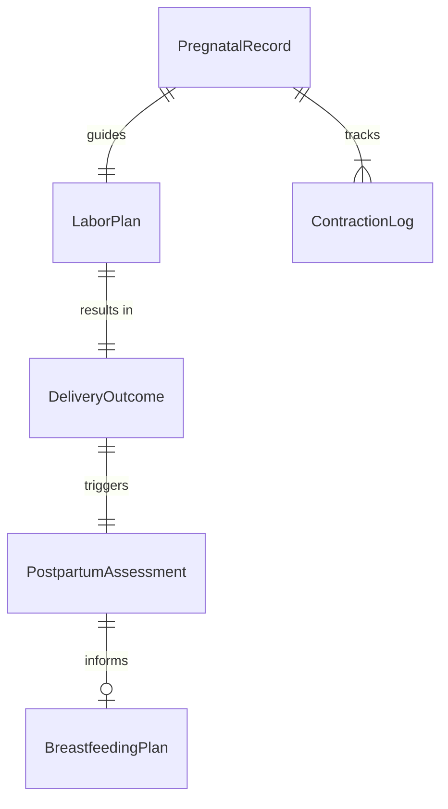
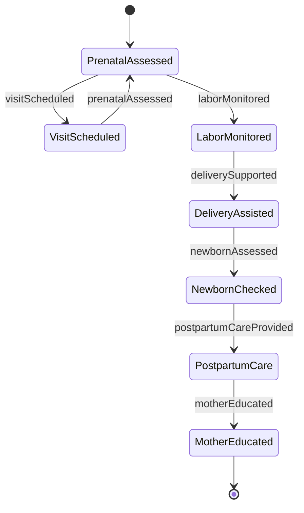
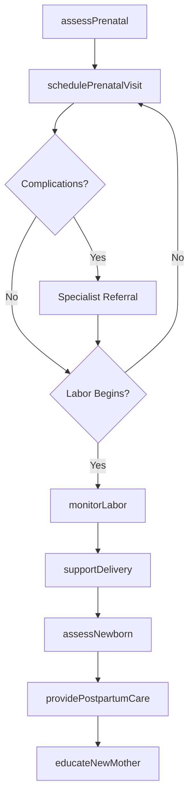
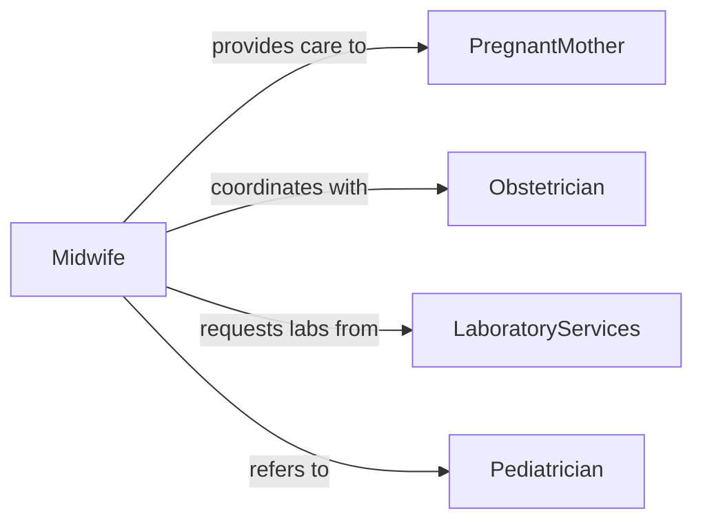

# Care Women During Pregnancy Childbirth

> Business-as-Code definition for comprehensive prenatal, labor, delivery, and postpartum care services provided throughout pregnancy and childbirth.

## Overview

Pregnancy and childbirth care encompasses monitoring maternal and fetal health from conception through postpartum recovery. This definition models prenatal assessments, labor support, delivery assistance, and postpartum care coordination, ensuring safe outcomes for mothers and newborns.

## Actors

| Actor | Description |
|-------|-------------|
| PregnantMother | Receives prenatal care and gives birth |
| Obstetrician | Provides medical oversight for pregnancy and delivery |
| Pediatrician | Examines and cares for newborn after birth |
| LaboratoryServices | Performs prenatal testing and blood work |
| UltrasoundCenter | Provides fetal imaging and diagnostic scans |
| InsuranceProvider | Covers maternity care and delivery services |

## Roles

| Role | Description |
|------|-------------|
| Midwife | Provides primary care during pregnancy and delivery |
| LaborNurse | Supports mother during labor and monitors vitals |
| DeliveryAttendant | Assists during childbirth and immediate newborn care |
| PostpartumCoordinator | Manages recovery care and discharge planning |

## Entities

| Entity | Description |
|--------|-------------|
| PregnatalRecord | Comprehensive health history and care timeline |
| LaborPlan | Preferences and medical plan for delivery |
| ContractionLog | Timing and intensity of labor contractions |
| DeliveryOutcome | Record of birth details and mother-infant status |
| PostpartumAssessment | Evaluation of recovery and complications |
| BreastfeedingPlan | Feeding approach and support needs |

## Actions

| Action | Description |
|--------|-------------|
| assessPrenatal | Evaluate maternal and fetal health during pregnancy |
| schedulePrenatalVisit | Arrange routine checkups and diagnostic tests |
| monitorLabor | Track contractions, dilation, and fetal heart rate |
| supportDelivery | Provide physical and emotional support during birth |
| assessNewborn | Perform initial examination and APGAR scoring |
| providePostpartumCare | Monitor recovery and address complications |
| educateNewMother | Teach infant care and self-care practices |

## Events

| Event | Description |
|-------|-------------|
| prenatalAssessed | Routine prenatal checkup completed |
| visitScheduled | Next prenatal appointment confirmed |
| laborMonitored | Labor progress updated and documented |
| deliverySupported | Active delivery assistance provided |
| newbornAssessed | Initial newborn evaluation completed |
| postpartumCareProvided | Recovery monitoring performed |
| motherEducated | Infant care instruction delivered |

## Searches

| Search | Description |
|--------|-------------|
| findPrenatalRecords | Retrieve pregnancy records by patient or due date |
| getLaborPlans | Query delivery preferences and medical plans |
| getDeliveryOutcomes | Search birth records by date or complications |
| getPostpartumAssessments | Find recovery evaluations by patient |


## Entity Relationships



## State Diagram


## Workflow



## Actor Relationships



## Usage

### Calling Actions

```typescript
import { careWomenDuringPregnancyChildbirth } from '@headlessly/care-women-during-pregnancy-childbirth'

const maternity = careWomenDuringPregnancyChildbirth()

// Conduct first trimester assessment
const assessment = await maternity.assessPrenatal({
  patientId: 'PT-456123',
  gestationalAge: 12,
  vitalSigns: { bp: '118/76', pulse: 72, weight: 145 },
  fetalHeartRate: 152
})

// Schedule regular prenatal visits
await maternity.schedulePrenatalVisit({
  patientId: 'PT-456123',
  visitType: 'routine-second-trimester',
  preferredDate: '2026-05-15',
  includeUltrasound: true
})

// Monitor active labor
await maternity.monitorLabor({
  patientId: 'PT-456123',
  cervicalDilation: 6,
  contractionInterval: 3,
  fetalPosition: 'vertex',
  painLevel: 7
})

// Assess newborn immediately after delivery
await maternity.assessNewborn({
  motherId: 'PT-456123',
  apgarScore: { oneMinute: 8, fiveMinutes: 9 },
  weight: 7.2,
  length: 20.5,
  abnormalities: 'none'
})
```

### Event-Driven Automation

```typescript
// Alert on concerning vital signs
maternity.prenatalAssessed(async ({ patientId, vitalSigns }) => {
  if (vitalSigns.bp.systolic > 140 || vitalSigns.bp.diastolic > 90) {
    await notify({
      to: 'obstetrician-on-call',
      message: `Elevated BP in patient ${patientId}`,
      priority: 'high'
    })
  }
})

// Auto-schedule postpartum follow-up
maternity.deliverySupported(async ({ patientId, deliveryDate }) => {
  await maternity.schedulePrenatalVisit({
    patientId,
    visitType: 'postpartum-checkup',
    scheduledDate: addDays(deliveryDate, 7)
  })
})
```
