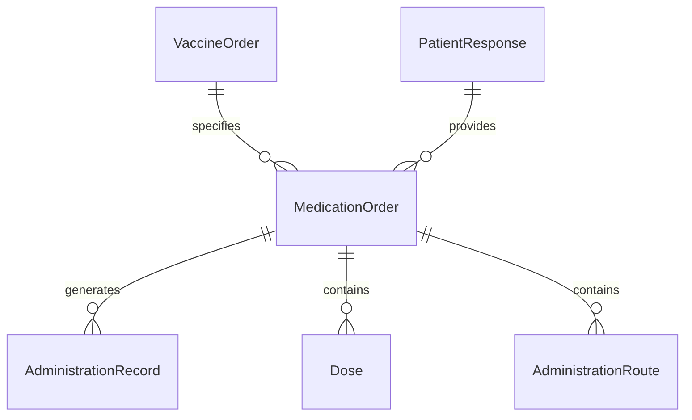
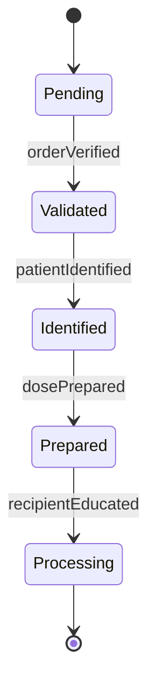
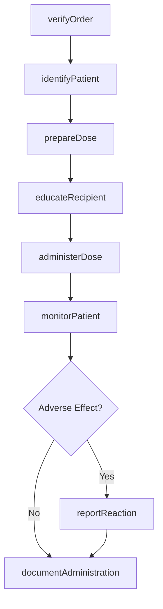
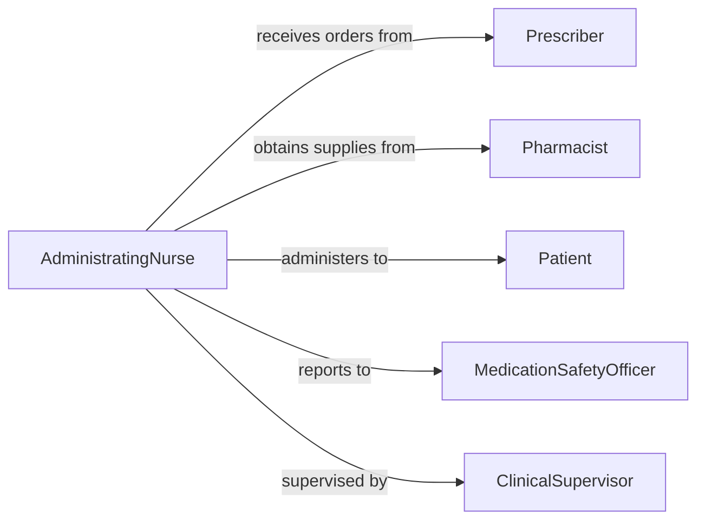

# Give Medications Immunizations

> Business-as-Code definition for giving medications or immunizations. Models the unified process for medication and vaccine administration including verification, delivery, and monitoring.

## Overview

Medication and immunization administration combines pharmaceutical and vaccine delivery processes including order verification, patient identification, dose preparation, safe administration, monitoring for effects, and complete documentation per clinical guidelines and regulatory standards.

## Actors

| Actor | Description |
|-------|-------------|
| Patient | Individual receiving medication or immunization |
| Prescriber | Orders medications and vaccines |
| Pharmacist | Dispenses and verifies pharmaceutical orders |
| InsuranceProvider | Covers medication and vaccine costs |
| DrugManufacturer | Produces medications and provides safety data |
| RegulatoryAgency | Oversees medication and vaccine safety standards |

## Roles

| Role | Description |
|------|-------------|
| AdministratingNurse | Gives medications and immunizations safely |
| PharmacyTechnician | Prepares doses and maintains medication stock |
| MedicationSafetyOfficer | Monitors for errors and adverse events |
| ClinicalSupervisor | Oversees administration protocols and training |

## Entities

| Entity | Description |
|--------|-------------|
| MedicationOrder | Prescription for pharmaceutical treatment |
| VaccineOrder | Order for immunization administration |
| AdministrationRecord | Documentation of medication or vaccine given |
| Dose | Specific amount of medication or vaccine |
| AdministrationRoute | Method of delivery (oral, IM, SubQ, IV, topical) |
| PatientResponse | Therapeutic or adverse effects observed |

## Actions

| Action | Description |
|--------|-------------|
| verifyOrder | Confirm medication or vaccine order accuracy |
| identifyPatient | Confirm patient identity using two identifiers |
| prepareDose | Ready medication or vaccine for administration |
| educateRecipient | Explain purpose, effects, and precautions |
| administerDose | Deliver medication or vaccine per protocol |
| monitorPatient | Observe for therapeutic and adverse effects |
| documentAdministration | Record details in medication administration record |

## Events

| Event | Description |
|-------|-------------|
| orderVerified | Prescription or vaccine order confirmed |
| patientIdentified | Identity confirmed using two identifiers |
| dosePrepared | Medication or vaccine ready for delivery |
| recipientEducated | Information provided and understanding verified |
| doseAdministered | Medication or vaccine delivered |
| patientMonitored | Effects observation completed |
| administrationDocumented | Record updated with administration details |

## Searches

| Search | Description |
|--------|-------------|
| findDueDoses | Locate medications and vaccines due for administration |
| getAdministrationHistory | Retrieve past medication and vaccine records |
| getAllergies | Access patient allergy and reaction history |
| getPatientEducation | Find materials for medication and vaccine counseling |


## Entity Relationships



## State Diagram


## Workflow



## Actor Relationships



## Usage

### Calling Actions

```typescript
import { giveMedicationsImmunizations } from '@headlessly/give-medications-immunizations'

const administration = giveMedicationsImmunizations()

// Verify medication order
const order = await administration.verifyOrder({
  patientId: 'P12345',
  orderId: 'RX789',
  type: 'medication',
  medication: 'Amoxicillin 500mg',
  route: 'oral',
  frequency: 'TID',
  duration: '10 days'
})

// Identify patient using two identifiers
await administration.identifyPatient({
  patientId: 'P12345',
  identifier1: { type: 'name', value: 'John Smith' },
  identifier2: { type: 'date of birth', value: '1975-06-15' }
})

// Prepare dose
const dose = await administration.prepareDose({
  orderId: order.id,
  medication: 'Amoxicillin 500mg',
  quantity: 1,
  unit: 'capsule'
})

// Educate patient
await administration.educateRecipient({
  patientId: 'P12345',
  item: 'Amoxicillin',
  purpose: 'Treat bacterial infection',
  sideEffects: ['nausea', 'diarrhea', 'rash'],
  instructions: 'Take with food, complete full course'
})

// Administer dose
await administration.administerDose({
  patientId: 'P12345',
  orderId: order.id,
  route: 'oral',
  time: new Date(),
  witnessedBy: 'RN Thompson'
})

// Give immunization
const vaccine = await administration.administerDose({
  patientId: 'P67890',
  type: 'vaccine',
  vaccine: 'Influenza quadrivalent',
  route: 'intramuscular',
  site: 'left deltoid',
  lotNumber: 'FL2345',
  expirationDate: '2026-10-31'
})
```

### Event-Driven Automation

```typescript
// Check allergies before administration
administration.orderVerified(async ({ patientId, medication }) => {
  const allergies = await administration.getAllergies({ patientId })
  const allergyMatch = allergies.find(a => a.substance === medication.name)

  if (allergyMatch) {
    await administration.reportReaction({
      patientId,
      type: 'allergy_alert',
      severity: allergyMatch.severity,
      action: 'hold_order',
      notifyPrescriber: true
    })
  }
})

// Monitor for adverse reactions
administration.patientMonitored(async ({ patientId, response }) => {
  if (response.adverseEffects?.length > 0) {
    await administration.reportReaction({
      patientId,
      effects: response.adverseEffects,
      severity: assessSeverity(response.adverseEffects),
      reportToPharmacy: true,
      reportToFDA: response.severity === 'serious'
    })
  }
})
```
