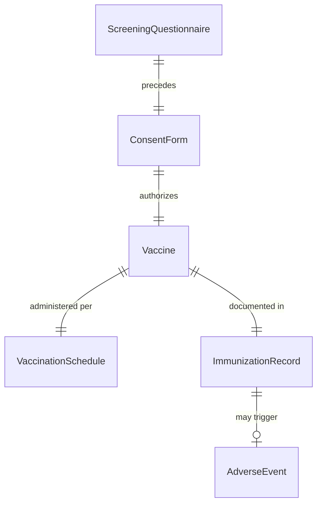
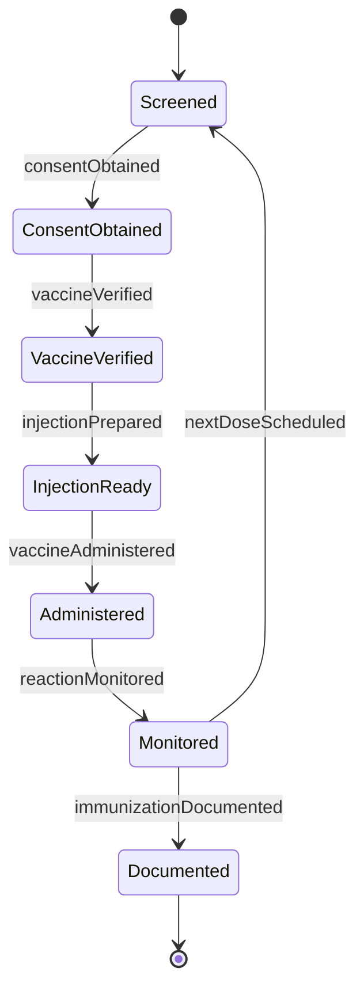
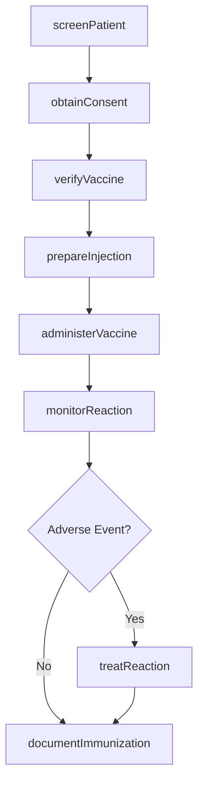
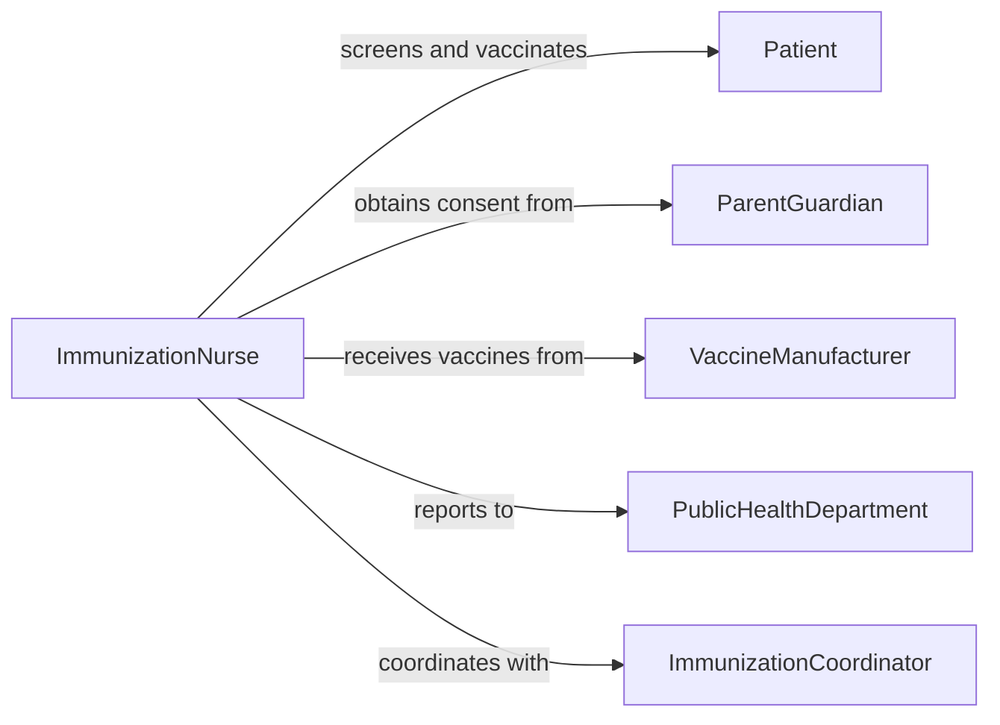

# Immunize Patients

> Business-as-Code definition for immunizing patients. Models vaccine administration including screening, consent, injection, documentation, and adverse reaction monitoring.

## Overview

Patient immunization encompasses the complete vaccination process from screening for contraindications, obtaining informed consent, preparing and administering vaccines, monitoring for adverse reactions, and maintaining accurate immunization records per CDC and state guidelines.

## Actors

| Actor | Description |
|-------|-------------|
| Patient | Individual receiving immunization |
| ParentGuardian | Provides consent for minor immunizations |
| VaccineManufacturer | Produces vaccines with lot numbers and expiration |
| PublicHealthDepartment | Tracks immunization rates and outbreak prevention |
| InsuranceProvider | Covers vaccine costs and administration fees |
| SchoolEmployer | Requires immunization records for enrollment or employment |

## Roles

| Role | Description |
|------|-------------|
| ImmunizationNurse | Administers vaccines and monitors patients |
| PharmacyTechnician | Prepares and stores vaccines properly |
| MedicalAssistant | Screens patients and obtains consent |
| ImmunizationCoordinator | Manages vaccine inventory and schedules |

## Entities

| Entity | Description |
|--------|-------------|
| Vaccine | Immunization product with specific lot and expiration |
| ImmunizationRecord | Documentation of vaccines administered |
| VaccinationSchedule | CDC-recommended timing for vaccine series |
| ConsentForm | Signed authorization for immunization |
| ScreeningQuestionnaire | Pre-vaccination health assessment |
| AdverseEvent | Unexpected reaction to vaccine |

## Actions

| Action | Description |
|--------|-------------|
| screenPatient | Assess for contraindications and allergies |
| obtainConsent | Secure signed authorization for immunization |
| verifyVaccine | Confirm correct vaccine, lot number, expiration |
| prepareInjection | Draw vaccine dose using sterile technique |
| administerVaccine | Inject vaccine at correct site and angle |
| monitorReaction | Observe patient for immediate adverse effects |
| documentImmunization | Record vaccine details in immunization registry |

## Events

| Event | Description |
|-------|-------------|
| patientScreened | Contraindication assessment completed |
| consentObtained | Authorization signed and documented |
| vaccineVerified | Correct vaccine and lot number confirmed |
| injectionPrepared | Dose drawn and ready for administration |
| vaccineAdministered | Immunization delivered at correct site |
| reactionMonitored | Post-vaccination observation completed |
| immunizationDocumented | Record submitted to state registry |

## Searches

| Search | Description |
|--------|-------------|
| findDueImmunizations | Locate patients needing scheduled vaccines |
| getImmunizationHistory | Retrieve patient vaccination records |
| getVaccineInventory | Check available vaccine stock and expirations |
| getAdverseEvents | Access reported vaccine reactions by type |


## Entity Relationships



## State Diagram


## Workflow



## Actor Relationships



## Usage

### Calling Actions

```typescript
import { immunizePatients } from '@headlessly/immunize-patients'

const immunizations = immunizePatients()

// Screen patient before vaccination
const screening = await immunizations.screenPatient({
  patientId: 'P12345',
  vaccine: 'COVID-19 mRNA',
  allergies: [],
  currentIllness: false,
  immunocompromised: false,
  pregnant: false
})

// Obtain informed consent
const consent = await immunizations.obtainConsent({
  patientId: 'P12345',
  vaccine: 'COVID-19 mRNA',
  signedBy: 'patient',
  risksExplained: true,
  questionsAnswered: true
})

// Verify vaccine before administration
const vaccine = await immunizations.verifyVaccine({
  vaccineType: 'COVID-19 mRNA',
  manufacturer: 'Pfizer',
  lotNumber: 'EW0182',
  expirationDate: '2026-06-30',
  storageTemp: 'within range'
})

// Administer vaccine
await immunizations.administerVaccine({
  patientId: 'P12345',
  vaccine: vaccine.id,
  site: 'left deltoid',
  route: 'intramuscular',
  dose: '0.3 mL',
  administeredBy: 'RN Johnson'
})

// Monitor for reactions
await immunizations.monitorReaction({
  patientId: 'P12345',
  duration: 15,
  unit: 'minutes',
  observations: 'No adverse reactions noted'
})

// Document in registry
await immunizations.documentImmunization({
  patientId: 'P12345',
  vaccine: vaccine.id,
  lotNumber: 'EW0182',
  site: 'left deltoid',
  registry: 'state immunization information system'
})
```

### Event-Driven Automation

```typescript
// Report adverse events to VAERS
immunizations.reactionMonitored(async ({ patientId, vaccineId, reaction }) => {
  if (reaction.severity === 'serious') {
    await immunizations.reportAdverseEvent({
      patientId,
      vaccineId,
      system: 'VAERS',
      severity: reaction.severity,
      symptoms: reaction.symptoms
    })
  }
})

// Schedule next dose in series
immunizations.vaccineAdministered(async ({ patientId, vaccine }) => {
  const schedule = await immunizations.getVaccinationSchedule({ vaccine })
  if (schedule.nextDose) {
    await immunizations.scheduleFollowUp({
      patientId,
      vaccine: schedule.nextDose,
      dueDate: schedule.dueDate
    })
  }
})
```
