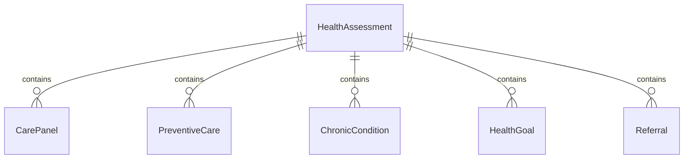
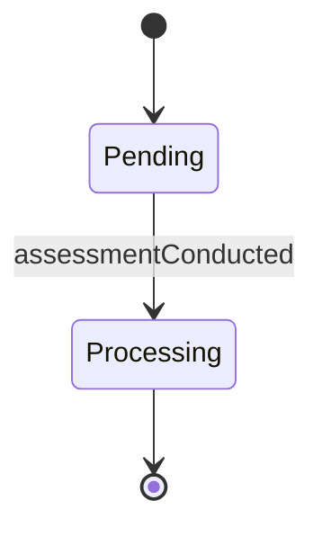
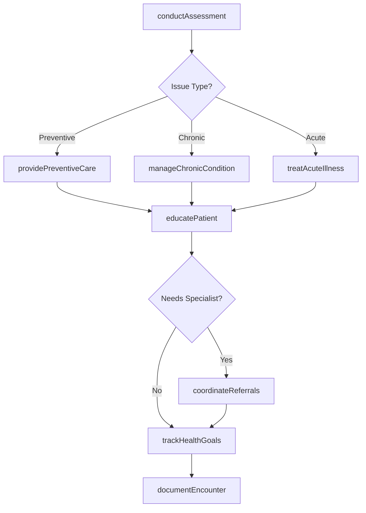
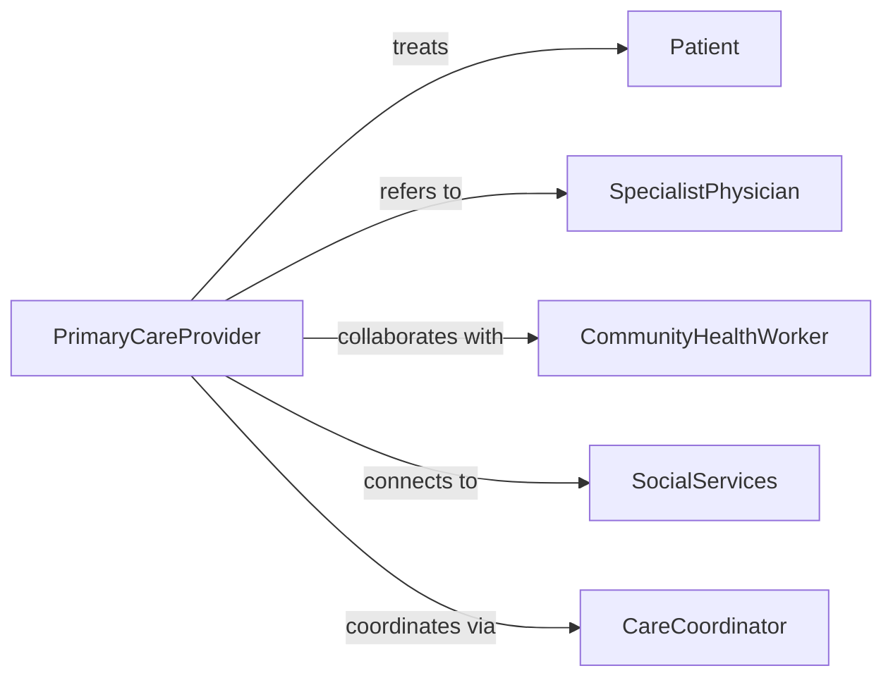

# Provide Basic Health Care Services

> Business-as-Code definition for providing basic health care services. Models comprehensive primary care delivery including assessment, treatment, education, and care coordination.

## Overview

Basic healthcare services provision encompasses routine health assessment, preventive care, health education, management of chronic conditions, minor acute illness treatment, and coordination of specialty referrals in primary care and community health settings.

## Actors

| Actor | Description |
|-------|-------------|
| Patient | Individual receiving healthcare services |
| SpecialistPhysician | Receives referrals for complex conditions |
| CommunityHealthWorker | Provides outreach and health education |
| SocialServices | Addresses social determinants of health |
| InsuranceProvider | Covers preventive and primary care services |
| PublicHealthAgency | Coordinates population health initiatives |

## Roles

| Role | Description |
|------|-------------|
| PrimaryCareProvider | Delivers comprehensive health services |
| FamilyNurse | Provides care across patient lifespan |
| HealthEducator | Teaches disease prevention and self-care |
| CareCoordinator | Manages transitions and referrals |

## Entities

| Entity | Description |
|--------|-------------|
| HealthAssessment | Comprehensive evaluation of patient health status |
| CarePanel | Group of patients assigned to provider |
| PreventiveCare | Screenings and interventions to prevent disease |
| ChronicCondition | Ongoing health issue requiring management |
| HealthGoal | Patient-specific target for improvement |
| Referral | Transfer of care to specialist or service |

## Actions

| Action | Description |
|--------|-------------|
| conductAssessment | Perform comprehensive health evaluation |
| providePreventiveCare | Deliver screenings and health maintenance |
| manageChronicCondition | Treat ongoing health issues per protocol |
| educatePatient | Teach self-care and disease management |
| coordinateReferrals | Arrange specialist consultations and services |
| trackHealthGoals | Monitor progress toward patient objectives |
| documentEncounter | Record visit details and care provided |

## Events

| Event | Description |
|-------|-------------|
| assessmentConducted | Health evaluation completed |
| preventiveCareProvided | Screening or immunization delivered |
| chronicConditionManaged | Ongoing illness addressed per protocol |
| patientEducated | Self-care instruction provided |
| referralCoordinated | Specialist appointment arranged |
| healthGoalTracked | Progress toward objective measured |
| encounterDocumented | Visit details recorded in health record |

## Searches

| Search | Description |
|--------|-------------|
| findCarePanel | Locate patients assigned to provider |
| getDuePreventiveCare | Identify patients needing screenings |
| getChronicPatients | Find patients with specific conditions |
| getPendingReferrals | Access active specialist referrals |


## Entity Relationships



## State Diagram


## Workflow



## Actor Relationships



## Usage

### Calling Actions

```typescript
import { provideBasicHealthCareServices } from '@headlessly/provide-basic-health-care-services'

const primaryCare = provideBasicHealthCareServices()

// Conduct comprehensive health assessment
const assessment = await primaryCare.conductAssessment({
  patientId: 'P12345',
  assessmentType: 'annual wellness visit',
  vitalSigns: {
    bloodPressure: '118/76',
    pulse: 68,
    temperature: 98.4,
    weight: 165,
    height: 68
  },
  reviewOfSystems: 'complete',
  physicalExam: 'unremarkable'
})

// Provide preventive care
await primaryCare.providePreventiveCare({
  patientId: 'P12345',
  services: [
    { type: 'colorectal screening', method: 'FIT test' },
    { type: 'lipid panel', status: 'ordered' },
    { type: 'pneumococcal vaccine', status: 'administered' }
  ]
})

// Manage chronic condition
await primaryCare.manageChronicCondition({
  patientId: 'P12345',
  condition: 'type 2 diabetes',
  assessments: {
    hba1c: 7.1,
    footExam: 'intact sensation',
    eyeExam: 'scheduled'
  },
  medications: [
    { name: 'Metformin 1000mg', frequency: 'BID', compliance: 'good' }
  ],
  goals: { hba1c: '<7.0', bloodPressure: '<130/80' }
})

// Coordinate specialty referral
await primaryCare.coordinateReferrals({
  patientId: 'P12345',
  specialty: 'endocrinology',
  reason: 'diabetes management optimization',
  urgency: 'routine',
  insuranceAuthorization: 'required'
})
```

### Event-Driven Automation

```typescript
// Alert on preventive care due dates
primaryCare.assessmentConducted(async ({ patientId, assessment }) => {
  const dueCare = await primaryCare.getDuePreventiveCare({ patientId })
  if (dueCare.length > 0) {
    await primaryCare.providePreventiveCare({
      patientId,
      services: dueCare
    })
  }
})

// Track chronic disease goals
primaryCare.chronicConditionManaged(async ({ patientId, condition, metrics }) => {
  await primaryCare.trackHealthGoals({
    patientId,
    condition,
    currentMetrics: metrics,
    targetGoals: condition.goals,
    achievementStatus: calculateProgress(metrics, condition.goals)
  })
})
```
