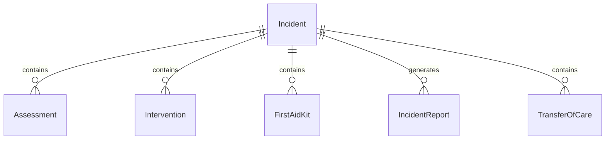
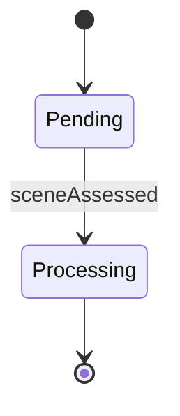
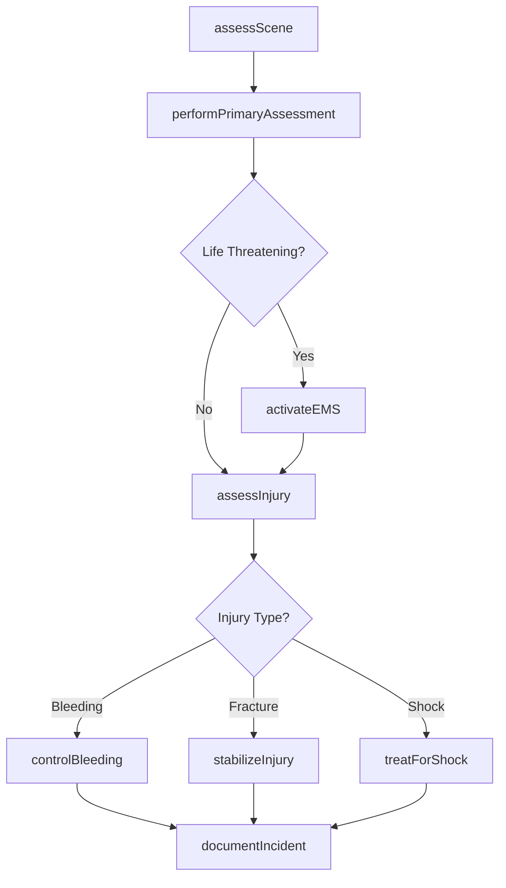
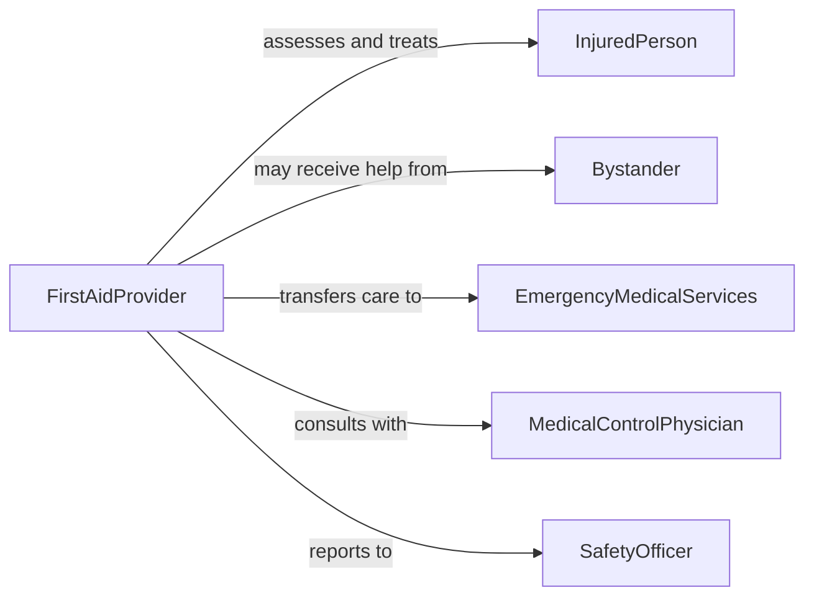

# Administer First Aid

> Business-as-Code definition for administering first aid. Models immediate care for injuries and sudden illness including assessment, intervention, and stabilization until advanced care is available.

## Overview

First aid administration provides immediate, temporary care for injuries, sudden illness, or medical emergencies to preserve life, prevent condition deterioration, promote recovery, and ensure safe transfer to advanced medical care when needed.

## Actors

| Actor | Description |
|-------|-------------|
| InjuredPerson | Individual requiring first aid intervention |
| Bystander | Witnesses emergency and may assist |
| EmergencyMedicalServices | Provides advanced care and transport |
| MedicalControlPhysician | Gives remote guidance for interventions |
| SafetyOfficer | Oversees workplace safety and first aid readiness |
| FamilyMember | Provides medical history and authorizes care |

## Roles

| Role | Description |
|------|-------------|
| FirstAidProvider | Trained individual delivering initial care |
| CPRResponder | Certified in cardiopulmonary resuscitation |
| OccupationalNurse | Provides workplace first aid and triage |
| SafetyCoordinator | Maintains first aid supplies and training |

## Entities

| Entity | Description |
|--------|-------------|
| Incident | Event requiring first aid intervention |
| Assessment | Evaluation of injury or illness severity |
| Intervention | First aid treatment applied |
| FirstAidKit | Supplies for immediate care delivery |
| IncidentReport | Documentation of emergency and care provided |
| TransferOfCare | Handoff to advanced medical personnel |

## Actions

| Action | Description |
|--------|-------------|
| assessScene | Evaluate safety and nature of emergency |
| performPrimaryAssessment | Check airway, breathing, circulation |
| controlBleeding | Apply direct pressure and dressings |
| stabilizeInjury | Immobilize fractures and prevent movement |
| treatForShock | Position patient and maintain warmth |
| activateEMS | Call for advanced medical assistance |
| documentIncident | Record details of emergency and care provided |

## Events

| Event | Description |
|-------|-------------|
| sceneAssessed | Safety evaluation and emergency identified |
| primaryAssessmentPerformed | Life-threatening conditions checked |
| bleedingControlled | Hemorrhage stopped or slowed |
| injuryStabilized | Fracture or injury immobilized |
| shockTreated | Circulation support provided |
| emsActivated | Advanced care summoned |
| incidentDocumented | Emergency report completed |

## Searches

| Search | Description |
|--------|-------------|
| findFirstAidKits | Locate available emergency supplies |
| getCertifiedResponders | Identify trained first aid providers nearby |
| getIncidentHistory | Retrieve past emergency reports for location |
| getProtocols | Access first aid procedures by injury type |


## Entity Relationships



## State Diagram


## Workflow



## Actor Relationships



## Usage

### Calling Actions

```typescript
import { administerFirstAid } from '@headlessly/administer-first-aid'

const firstAid = administerFirstAid()

// Assess emergency scene
const scene = await firstAid.assessScene({
  location: 'warehouse floor 2',
  hazards: ['electrical equipment nearby'],
  safeToApproach: true,
  numberOfVictims: 1
})

// Perform primary assessment
const assessment = await firstAid.performPrimaryAssessment({
  incidentId: scene.incidentId,
  airway: 'patent',
  breathing: 'adequate, 18/min',
  circulation: 'rapid pulse, active bleeding right arm',
  consciousness: 'alert and oriented'
})

// Control bleeding
await firstAid.controlBleeding({
  incidentId: scene.incidentId,
  location: 'right forearm laceration',
  method: 'direct pressure',
  dressing: 'sterile gauze',
  bleedingControlled: true
})

// Activate EMS
await firstAid.activateEMS({
  incidentId: scene.incidentId,
  urgency: 'moderate',
  chiefComplaint: 'laceration with controlled bleeding',
  vitals: assessment.vitals,
  treatmentProvided: 'bleeding control, wound dressing'
})

// Stabilize fracture
await firstAid.stabilizeInjury({
  incidentId: 'INC002',
  injuryType: 'suspected wrist fracture',
  method: 'rigid splint',
  position: 'neutral',
  distalCirculation: 'intact'
})
```

### Event-Driven Automation

```typescript
// Auto-activate EMS for critical conditions
firstAid.primaryAssessmentPerformed(async ({ incidentId, assessment }) => {
  if (!assessment.breathing || !assessment.circulation || assessment.consciousness === 'unresponsive') {
    await firstAid.activateEMS({
      incidentId,
      urgency: 'critical',
      lifeThreat: true,
      assessment
    })
  }
})

// Document all incidents for safety review
firstAid.emsActivated(async ({ incidentId, transferredTo }) => {
  await firstAid.documentIncident({
    incidentId,
    timestamp: new Date(),
    careProvided: await getInterventions(incidentId),
    outcome: 'transferred to EMS',
    emsUnit: transferredTo
  })
})
```
