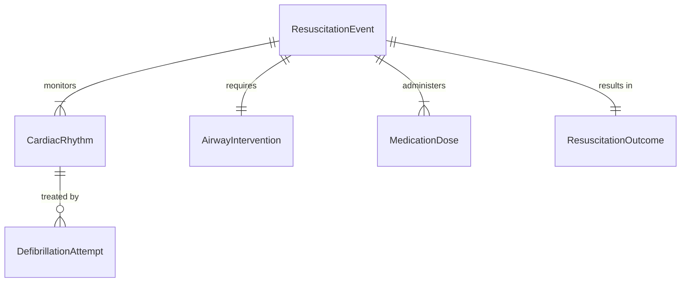
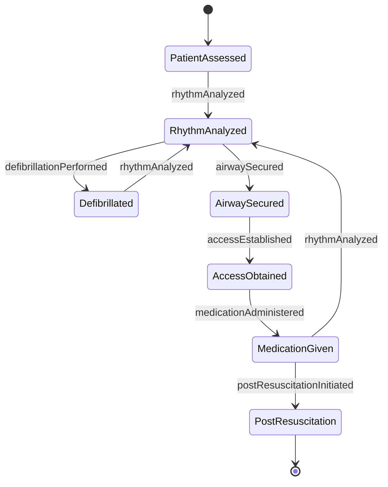
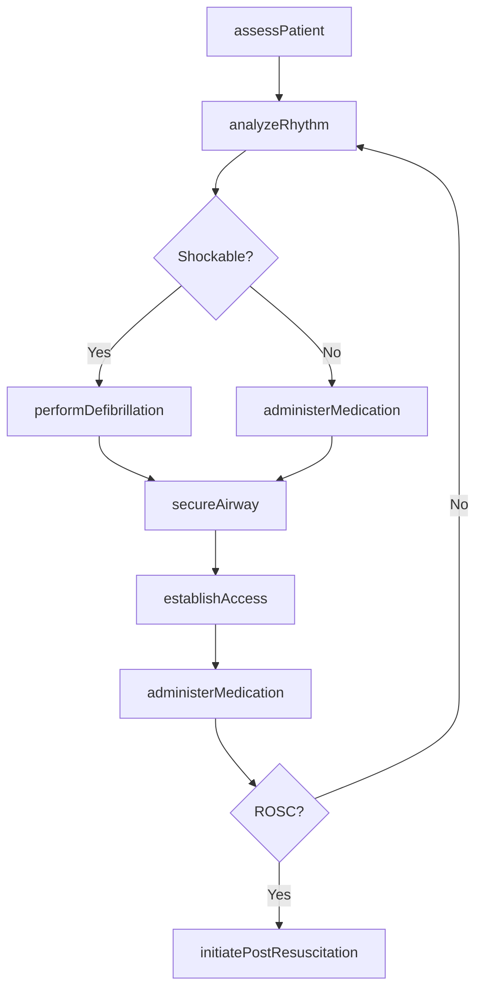
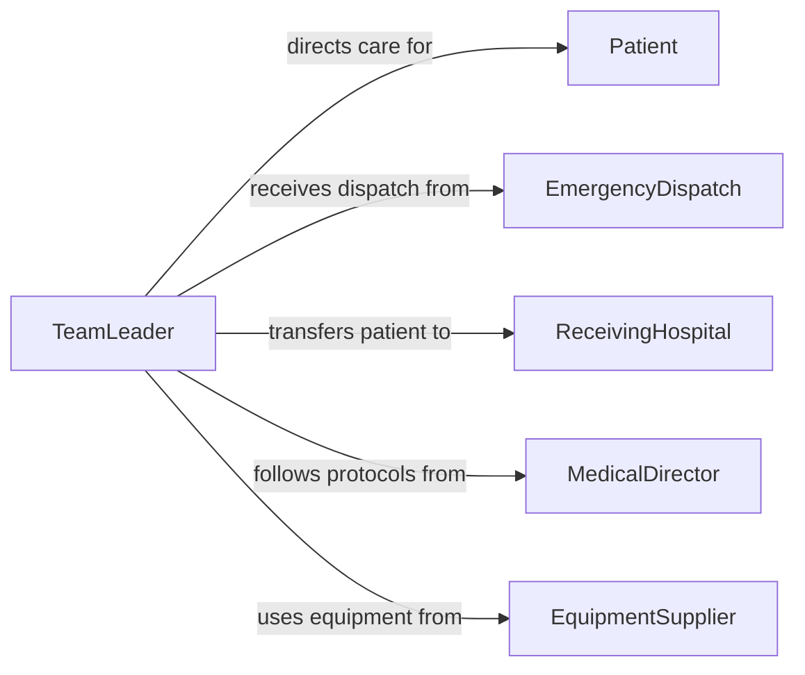

# Implement Advanced Life Support Techniques

> Business-as-Code definition for implementing advanced life support techniques. Models the emergency resuscitation workflow including cardiac rhythm analysis, advanced airway management, intravenous access, medication administration, and post-resuscitation care.

## Overview

Implementing advanced life support techniques involves performing advanced cardiac life support (ACLS), pediatric advanced life support (PALS), and advanced trauma life support (ATLS) procedures during medical emergencies. This activity encompasses cardiac rhythm interpretation, defibrillation, advanced airway management including intubation, intravenous or intraosseous access, emergency medication administration, and coordinated team-based resuscitation. It applies across emergency departments, pre-hospital settings, and critical care environments, requiring rapid assessment, protocol-driven interventions, and continuous patient monitoring.

## Actors

| Actor | Description |
|-------|-------------|
| Patient | Individual experiencing a life-threatening medical emergency |
| EmergencyDispatch | Coordinates emergency response and provides pre-arrival instructions |
| ReceivingHospital | Facility prepared to accept and continue care after field stabilization |
| MedicalDirector | Physician providing online or offline medical direction for protocols |
| EquipmentSupplier | Vendor providing advanced life support equipment and medications |

## Roles

| Role | Description |
|------|-------------|
| TeamLeader | Directs the resuscitation team and makes clinical decisions |
| AirwayManager | Performs advanced airway interventions including intubation |
| MedicationAdministrator | Establishes vascular access and delivers emergency drugs |
| DefibrillationOperator | Analyzes cardiac rhythms and delivers electrical therapy |
| Recorder | Documents interventions, times, and patient responses during resuscitation |

## Entities

| Entity | Description |
|--------|-------------|
| ResuscitationEvent | A documented cardiac arrest or life-threatening emergency encounter |
| CardiacRhythm | An interpreted heart rhythm guiding treatment decisions |
| AirwayIntervention | An advanced airway procedure such as intubation or surgical airway |
| MedicationDose | A specific drug, dose, and route administered during resuscitation |
| DefibrillationAttempt | An electrical shock delivered to restore cardiac rhythm |
| ResuscitationOutcome | The result of the resuscitation effort including return of spontaneous circulation |

## Actions

| Action | Description |
|--------|-------------|
| assessPatient | Perform rapid primary assessment of airway, breathing, and circulation |
| analyzeRhythm | Interpret the cardiac rhythm to determine the appropriate intervention |
| performDefibrillation | Deliver electrical shock to treat a shockable cardiac rhythm |
| secureAirway | Establish an advanced airway through intubation or alternative method |
| establishAccess | Obtain intravenous or intraosseous vascular access |
| administerMedication | Deliver emergency drugs per advanced life support protocols |
| initiatePostResuscitation | Begin targeted temperature management and stabilization after ROSC |

## Events

| Event | Description |
|-------|-------------|
| patientAssessed | Rapid primary assessment has been completed |
| rhythmAnalyzed | A cardiac rhythm has been interpreted |
| defibrillationPerformed | An electrical shock has been delivered |
| airwaySecured | An advanced airway has been established |
| accessEstablished | Vascular access has been obtained |
| medicationAdministered | Emergency drugs have been delivered |
| postResuscitationInitiated | Post-ROSC stabilization has been started |

## Searches

| Search | Description |
|--------|-------------|
| findResuscitationEvents | Retrieve resuscitation records by patient, date, or outcome |
| getMedicationLog | List all medications administered during a resuscitation event |
| getDefibrillationHistory | Retrieve shock delivery records by event or rhythm type |
| findOutcomeStatistics | Query resuscitation outcomes by protocol, location, or time period |


## Entity Relationships



## State Diagram


## Workflow



## Actor Relationships



## Usage

### Calling Actions

```typescript
import { implementAdvancedLifeSupportTechniques } from '@headlessly/implement-advanced-life-support-techniques'

const als = implementAdvancedLifeSupportTechniques()

// Assess patient in cardiac arrest
const assessment = await als.assessPatient({
  patientId: 'patient-emergency-001',
  airway: 'unprotected',
  breathing: 'absent',
  circulation: 'pulseless',
  estimatedDownTime: '4-minutes'
})

// Analyze rhythm and defibrillate
const rhythm = await als.analyzeRhythm({
  eventId: assessment.eventId,
  rhythm: 'ventricular-fibrillation'
})

await als.performDefibrillation({
  eventId: assessment.eventId,
  energy: 200,
  waveform: 'biphasic',
  attemptNumber: 1
})

// Secure airway and establish access
await als.secureAirway({
  eventId: assessment.eventId,
  method: 'endotracheal-intubation',
  tubeSize: '7.5mm',
  confirmedBy: 'waveform-capnography'
})

await als.establishAccess({
  eventId: assessment.eventId,
  type: 'intravenous',
  site: 'antecubital-right',
  gauge: 18
})

// Administer epinephrine
await als.administerMedication({
  eventId: assessment.eventId,
  drug: 'Epinephrine',
  dose: '1mg',
  route: 'IV-push',
  intervalMinutes: 3
})
```

### Event-Driven Automation

```typescript
// Notify receiving hospital on ROSC
als.postResuscitationInitiated(async ({ eventId, patientId, rosc }) => {
  await notify({
    to: 'receiving-hospital-ed',
    message: `ROSC achieved for patient ${patientId}. ETA 12 minutes. Prepare for targeted temperature management.`
  })
})

// Auto-generate resuscitation report
als.defibrillationPerformed(async ({ eventId, attemptNumber, rhythm, outcome }) => {
  await logResuscitationEvent({
    eventId,
    intervention: 'defibrillation',
    details: { attemptNumber, rhythm, outcome },
    timestamp: new Date().toISOString()
  })
})
```
