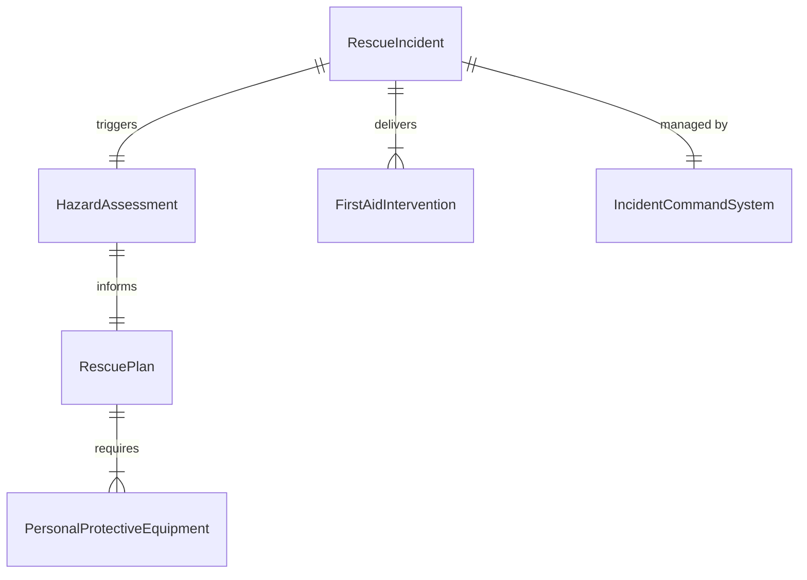
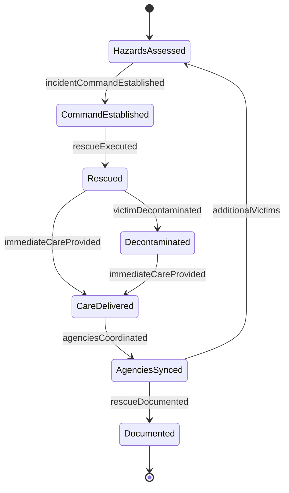
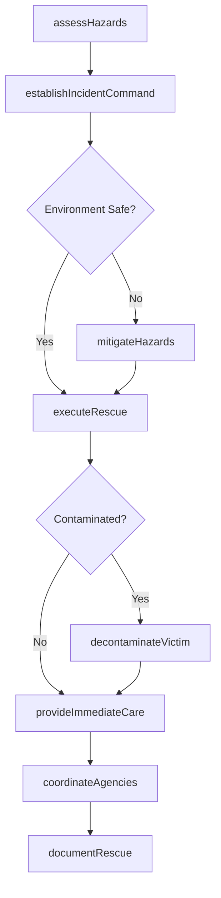
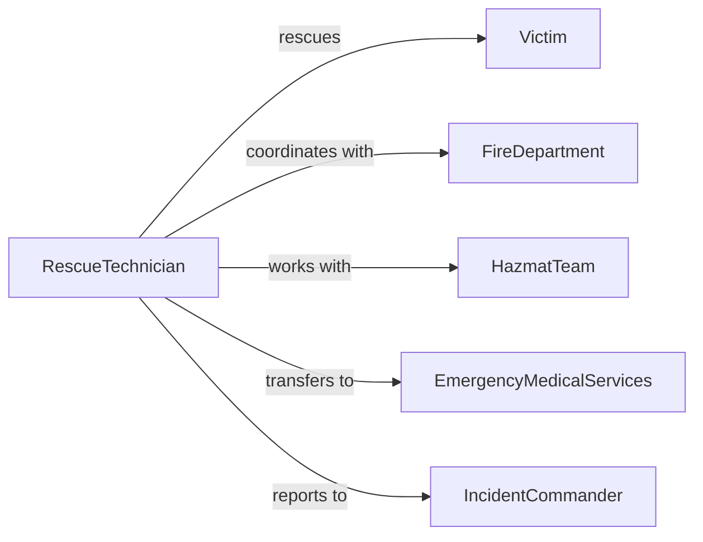

# Provide First Aid Rescue Assistance

> Business-as-Code definition for providing first aid or rescue assistance in emergencies. Models combined rescue operations and immediate medical care in hazardous or complex emergency situations.

## Overview

First aid rescue assistance integrates emergency extraction, environmental hazard mitigation, and immediate medical care for victims in dangerous situations including confined spaces, water rescue, fire, collapse, or hazardous material incidents requiring specialized response.

## Actors

| Actor | Description |
|-------|-------------|
| Victim | Person requiring rescue and first aid |
| Bystander | Witnesses emergency and provides information |
| FireDepartment | Provides rescue and fire suppression |
| HazmatTeam | Handles hazardous material incidents |
| SearchAndRescue | Conducts specialized rescue operations |
| EmergencyMedicalServices | Transports to hospital after rescue |

## Roles

| Role | Description |
|------|-------------|
| RescueTechnician | Performs technical rescue operations |
| FirstResponder | Provides initial first aid at scene |
| IncidentCommander | Coordinates multi-agency response |
| SafetyOfficer | Monitors responder safety during operations |

## Entities

| Entity | Description |
|--------|-------------|
| RescueIncident | Emergency requiring extraction and care |
| HazardAssessment | Evaluation of environmental dangers |
| RescuePlan | Strategy for safe victim extraction |
| FirstAidIntervention | Medical care during or after rescue |
| PersonalProtectiveEquipment | Safety gear for responders |
| IncidentCommandSystem | Organizational structure for response |

## Actions

| Action | Description |
|--------|-------------|
| assessHazards | Evaluate environmental risks to responders and victims |
| establishIncidentCommand | Set up coordinated response structure |
| executeRescue | Safely extract victim from dangerous situation |
| provideImmediateCare | Deliver first aid during or after rescue |
| decontaminateVictim | Remove hazardous materials before treatment |
| coordinateAgencies | Integrate multiple response organizations |
| documentRescue | Record rescue operations and medical care |

## Events

| Event | Description |
|-------|-------------|
| hazardsAssessed | Environmental risks identified and documented |
| incidentCommandEstablished | Response structure activated |
| rescueExecuted | Victim successfully extracted from danger |
| immediateCareProvided | First aid delivered at rescue scene |
| victimDecontaminated | Hazardous materials removed safely |
| agenciesCoordinated | Multi-organization response synchronized |
| rescueDocumented | Complete incident report filed |

## Searches

| Search | Description |
|--------|-------------|
| findActiveRescues | Locate ongoing rescue operations |
| getRescueResources | Identify available specialized equipment and teams |
| getHazardProtocols | Access procedures for specific environmental dangers |
| getRescueHistory | Retrieve past incidents at location |


## Entity Relationships



## State Diagram


## Workflow



## Actor Relationships



## Usage

### Calling Actions

```typescript
import { provideFirstAidRescueAssistance } from '@headlessly/provide-first-aid-rescue-assistance'

const rescue = provideFirstAidRescueAssistance()

// Assess hazards at rescue scene
const hazards = await rescue.assessHazards({
  incidentId: 'RESCUE-789',
  location: 'industrial warehouse, confined space',
  environmentalRisks: ['oxygen deficiency', 'chemical vapors', 'structural instability'],
  victimCount: 2,
  responderSafety: 'requires SCBA and harness'
})

// Establish incident command
await rescue.establishIncidentCommand({
  incidentId: 'RESCUE-789',
  incidentCommander: 'Battalion Chief Johnson',
  agencies: ['fire department', 'hazmat', 'EMS'],
  unifiedCommand: true
})

// Execute confined space rescue
await rescue.executeRescue({
  incidentId: 'RESCUE-789',
  rescueType: 'confined space',
  method: 'vertical extraction with tripod',
  ppe: ['SCBA', 'full body harness', 'helmet', 'gloves'],
  safetyLine: true,
  victimCondition: 'unconscious, breathing'
})

// Provide immediate care after extraction
await rescue.provideImmediateCare({
  incidentId: 'RESCUE-789',
  victimId: 'V1',
  assessment: {
    airway: 'patent',
    breathing: 'shallow, 10/min',
    circulation: 'weak pulse, 110 bpm'
  },
  interventions: [
    'high-flow oxygen via non-rebreather',
    'spinal immobilization',
    'monitor vital signs'
  ]
})

// Decontaminate after chemical exposure
await rescue.decontaminateVictim({
  incidentId: 'RESCUE-456',
  victimId: 'V2',
  contaminant: 'industrial solvent',
  method: 'water rinse, clothing removal',
  deconTeam: 'hazmat',
  cleared: true
})
```

### Event-Driven Automation

```typescript
// Activate specialized teams based on hazard type
rescue.hazardsAssessed(async ({ incidentId, hazards }) => {
  if (hazards.includes('hazardous materials')) {
    await rescue.coordinateAgencies({
      incidentId,
      requestTeam: 'hazmat',
      urgency: 'immediate'
    })
  }
  if (hazards.includes('water rescue')) {
    await rescue.coordinateAgencies({
      incidentId,
      requestTeam: 'swift water rescue',
      urgency: 'immediate'
    })
  }
})

// Transition to EMS after rescue completion
rescue.immediateCareProvided(async ({ incidentId, victimId, condition }) => {
  await rescue.coordinateAgencies({
    incidentId,
    transferTo: 'EMS',
    victimId,
    condition,
    transportDestination: determineDestination(condition)
  })
})
```
