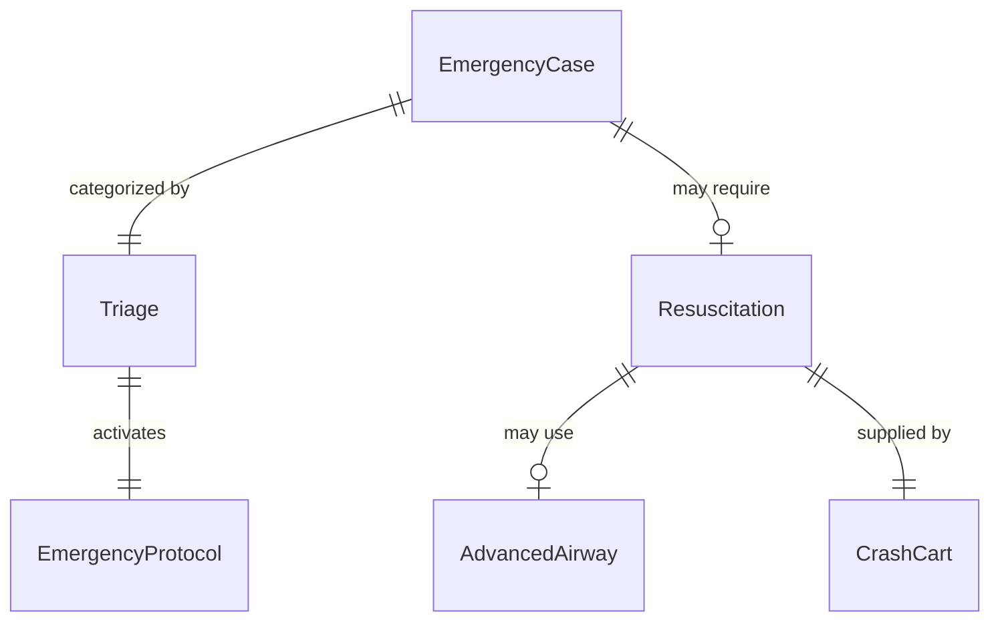
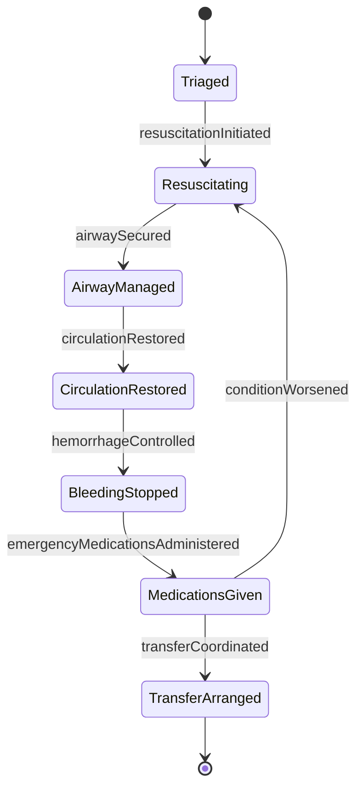
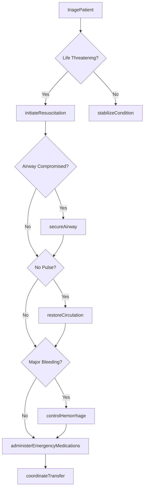
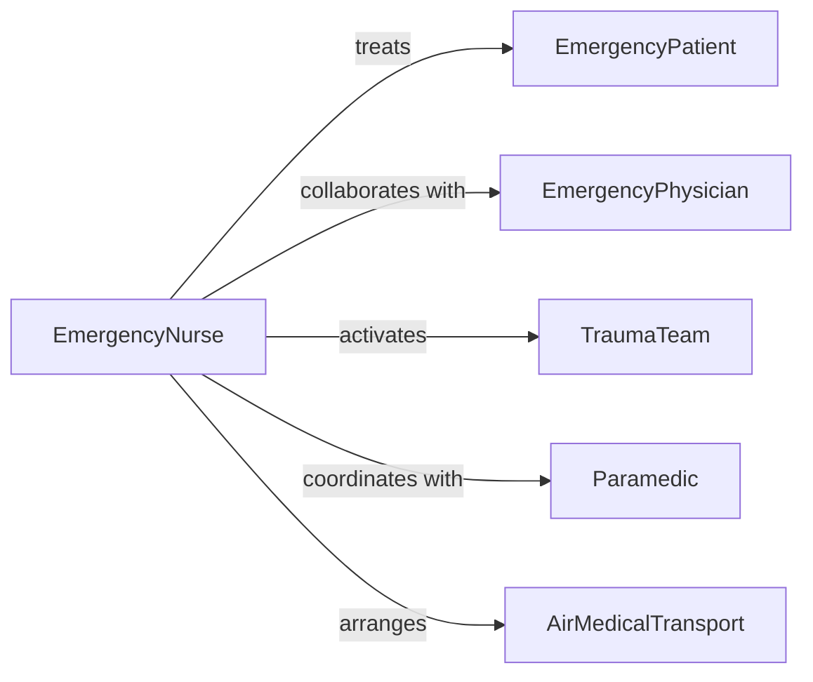

# Treat Medical Emergencies

> Business-as-Code definition for treating medical emergencies. Models acute care for life-threatening conditions including rapid assessment, intervention, stabilization, and critical care coordination.

## Overview

Medical emergency treatment provides immediate, life-saving interventions for acute conditions including cardiac arrest, respiratory failure, severe trauma, stroke, and other critical illnesses requiring rapid assessment, advanced life support, and coordinated emergency response.

## Actors

| Actor | Description |
|-------|-------------|
| EmergencyPatient | Individual experiencing life-threatening condition |
| EmergencyPhysician | Directs emergency medical care |
| TraumaTeam | Specialized group for severe injury management |
| AirMedicalTransport | Provides helicopter or fixed-wing emergency transport |
| BloodBank | Supplies emergency transfusion products |
| FamilyMember | Provides consent and medical history in crisis |

## Roles

| Role | Description |
|------|-------------|
| EmergencyNurse | Delivers rapid assessment and interventions |
| Paramedic | Provides pre-hospital advanced life support |
| EmergencyMedicalTechnician | Delivers basic life support and transport |
| TraumaSurgeon | Performs emergency surgical interventions |
| CriticalCareSpecialist | Manages ICU-level emergency care |

## Entities

| Entity | Description |
|--------|-------------|
| EmergencyCase | Documented medical emergency encounter |
| Triage | Priority categorization of emergency severity |
| Resuscitation | Life-saving interventions for critical patients |
| CrashCart | Emergency equipment and medications |
| AdvancedAirway | Intubation or surgical airway device |
| EmergencyProtocol | Standardized response for specific conditions |

## Actions

| Action | Description |
|--------|-------------|
| triagePatient | Assess and prioritize emergency severity |
| initiateResuscitation | Begin life-saving interventions immediately |
| secureAirway | Establish definitive airway control |
| restoreCirculation | Perform CPR, defibrillation, or cardiac interventions |
| controlHemorrhage | Stop major bleeding with direct or surgical methods |
| administerEmergencyMedications | Give time-critical drugs per protocol |
| coordinateTransfer | Arrange transport to definitive care facility |

## Events

| Event | Description |
|-------|-------------|
| patientTriaged | Emergency severity assessed and categorized |
| resuscitationInitiated | Life-saving measures started |
| airwaySecured | Definitive airway established |
| circulationRestored | Cardiac output re-established |
| hemorrhageControlled | Major bleeding stopped |
| emergencyMedicationsAdministered | Critical drugs delivered |
| transferCoordinated | Higher-level care arranged |

## Searches

| Search | Description |
|--------|-------------|
| findActiveCodes | Locate ongoing cardiac arrest responses |
| getTraumaAlerts | Access active major trauma notifications |
| getCrashCarts | Find emergency equipment locations |
| getProtocolsByCondition | Retrieve emergency care algorithms |


## Entity Relationships



## State Diagram


## Workflow



## Actor Relationships



## Usage

### Calling Actions

```typescript
import { treatMedicalEmergencies } from '@headlessly/treat-medical-emergencies'

const emergencyCare = treatMedicalEmergencies()

// Triage incoming emergency patient
const triage = await emergencyCare.triagePatient({
  patientId: 'ER-2345',
  arrivalMethod: 'ambulance',
  chiefComplaint: 'chest pain',
  vitalSigns: {
    bloodPressure: '80/50',
    pulse: 120,
    respiration: 24,
    oxygen: 88
  },
  triageLevel: 'critical',
  esi: 1
})

// Initiate resuscitation for cardiac arrest
await emergencyCare.initiateResuscitation({
  patientId: 'ER-2345',
  condition: 'cardiac arrest',
  rhythm: 'ventricular fibrillation',
  cprStarted: true,
  compressionRate: 110,
  teamActivated: true
})

// Secure airway
await emergencyCare.secureAirway({
  patientId: 'ER-2345',
  method: 'endotracheal intubation',
  tubeSize: 7.5,
  confirmation: 'end-tidal CO2 detected',
  ventilationEstablished: true
})

// Restore circulation with defibrillation
await emergencyCare.restoreCirculation({
  patientId: 'ER-2345',
  intervention: 'defibrillation',
  energy: 200,
  joules: true,
  rhythm: 'sinus tachycardia',
  pulseRestored: true
})

// Administer emergency medications
await emergencyCare.administerEmergencyMedications({
  patientId: 'ER-2345',
  medications: [
    { drug: 'epinephrine', dose: '1mg', route: 'IV', indication: 'cardiac arrest' },
    { drug: 'amiodarone', dose: '300mg', route: 'IV', indication: 'VF' }
  ]
})
```

### Event-Driven Automation

```typescript
// Auto-activate trauma team for high-severity cases
emergencyCare.patientTriaged(async ({ patientId, triage }) => {
  if (triage.esi <= 1 || triage.traumaAlert) {
    await emergencyCare.activateTraumaTeam({
      patientId,
      level: triage.traumaLevel,
      eta: triage.arrivalTime
    })
  }
})

// Coordinate transfer after stabilization
emergencyCare.circulationRestored(async ({ patientId, condition }) => {
  if (condition === 'STEMI' || condition === 'stroke') {
    await emergencyCare.coordinateTransfer({
      patientId,
      destination: 'comprehensive stroke center',
      urgency: 'immediate',
      transport: 'air medical'
    })
  }
})
```
