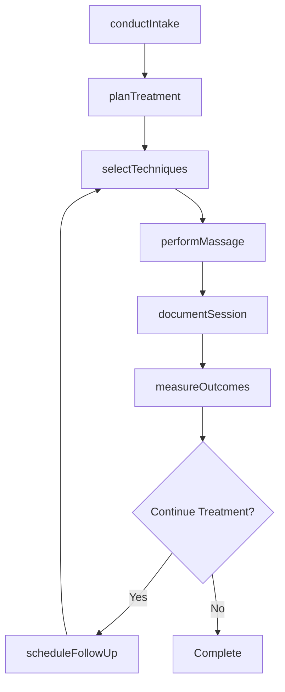
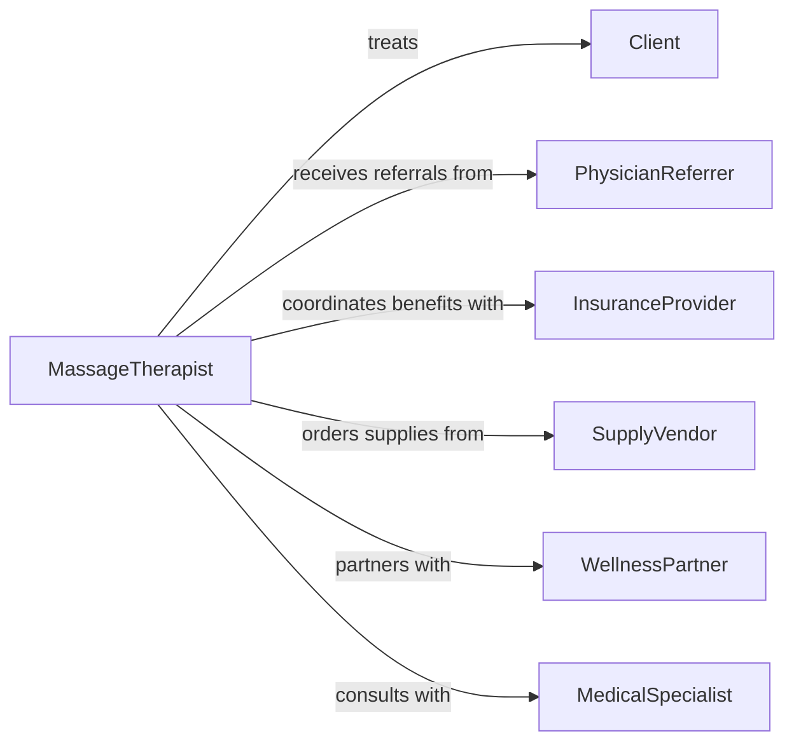

# Administer Therapeutic Massages

> Business-as-Code definition for therapeutic massage services. Models client intake, treatment delivery, and outcome tracking for massage therapy practices.

## Overview

Therapeutic massage administration involves assessing client conditions, selecting appropriate massage techniques, and delivering manual therapy to relieve pain, reduce muscle tension, and promote healing. This definition supports scheduling, treatment documentation, and client relationship management.

## Actors

| Actor | Description |
|-------|-------------|
| Client | Individual receiving massage therapy services |
| PhysicianReferrer | Provides medical referrals for therapeutic massage |
| InsuranceProvider | Authorizes coverage for medically necessary massage |
| SupplyVendor | Provides massage oils, linens, and equipment |
| WellnessPartner | Refers clients from integrated health programs |
| MedicalSpecialist | Collaborates on treatment for complex conditions |

## Roles

| Role | Description |
|------|-------------|
| MassageTherapist | Licensed practitioner who delivers massage treatment |
| IntakeCoordinator | Manages client onboarding and appointment scheduling |
| BillingSpecialist | Processes payments and insurance claims |
| PracticeManager | Oversees operations and therapist scheduling |

## Entities

| Entity | Description |
|--------|-------------|
| ClientIntake | Initial assessment of health history and treatment goals |
| MassageSession | Individual treatment appointment with techniques used |
| TreatmentPlan | Series of sessions designed for specific therapeutic goals |
| TechniqueProtocol | Specific massage modality with pressure and duration |
| SessionNote | Documentation of treatment provided and client response |
| OutcomeMeasure | Tracked improvements in pain, mobility, or stress level |

## Actions

| Action | Description |
|--------|-------------|
| conductIntake | Assess client health history and contraindications |
| planTreatment | Design session or series based on client needs |
| selectTechniques | Choose massage modalities for therapeutic effect |
| performMassage | Deliver hands-on treatment using selected techniques |
| documentSession | Record techniques used and client response |
| measureOutcomes | Track pain reduction, mobility, and satisfaction |
| scheduleFollowUp | Book additional sessions based on treatment plan |

## Events

| Event | Description |
|-------|-------------|
| intakeConducted | Client assessment completed with health screening |
| treatmentPlanned | Session or series designed and approved |
| techniquesSelected | Massage modalities determined for session |
| massagePerformed | Treatment delivered and completed |
| sessionDocumented | Progress note finalized in client record |
| outcomesMeasured | Therapeutic results assessed and recorded |
| followUpScheduled | Next appointment booked with client |

## Searches

| Search | Description |
|--------|-------------|
| findClients | List clients by therapist, condition, or treatment status |
| getSessions | Retrieve massage sessions by date or client |
| getTreatmentPlans | Find active treatment series by client or goal |
| getOutcomes | Review client progress over multiple sessions |

## Workflow



## Actor Relationships



## Usage

### Calling Actions

```typescript
import { administerTherapeuticMassages } from '@headlessly/administer-therapeutic-massages'

const massage = administerTherapeuticMassages()

// Conduct initial client intake
const intake = await massage.conductIntake({
  clientId: 'CLT-2026-150',
  healthHistory: {
    conditions: ['Chronic neck pain', 'Tension headaches'],
    medications: ['Ibuprofen PRN'],
    contraindications: []
  },
  goals: ['Reduce neck pain', 'Improve range of motion', 'Decrease headache frequency']
})

// Plan treatment series
await massage.planTreatment({
  intakeId: intake.id,
  duration: 60,
  frequency: 'Weekly for 6 weeks',
  focus: 'Neck, shoulders, and upper back',
  modalities: ['Deep tissue', 'Trigger point therapy', 'Myofascial release']
})

// Document completed session
await massage.documentSession({
  clientId: 'CLT-2026-150',
  date: '2026-02-05',
  techniques: [
    { type: 'Deep tissue', area: 'Upper trapezius', duration: 15 },
    { type: 'Trigger point', area: 'Levator scapulae', duration: 10 },
    { type: 'Swedish', area: 'Full back', duration: 35 }
  ],
  painBefore: 7,
  painAfter: 3,
  clientFeedback: 'Significant relief, better range of motion'
})
```

### Event-Driven Automation

```typescript
// Auto-schedule follow-up based on treatment plan
massage.sessionDocumented(async ({ clientId, treatmentPlanId, sessionNumber, totalSessions }) => {
  if (sessionNumber < totalSessions) {
    await massage.scheduleFollowUp({
      clientId,
      daysFromNow: 7,
      duration: 60
    })
  }
})

// Alert on contraindication detected
massage.intakeConducted(async ({ clientId, contraindications }) => {
  if (contraindications.length > 0) {
    await notify({
      to: 'practice-manager',
      message: `Client ${clientId} has contraindications requiring physician clearance`
    })
  }
})
```
