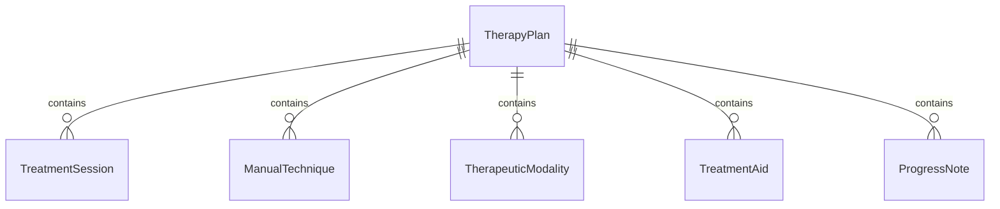
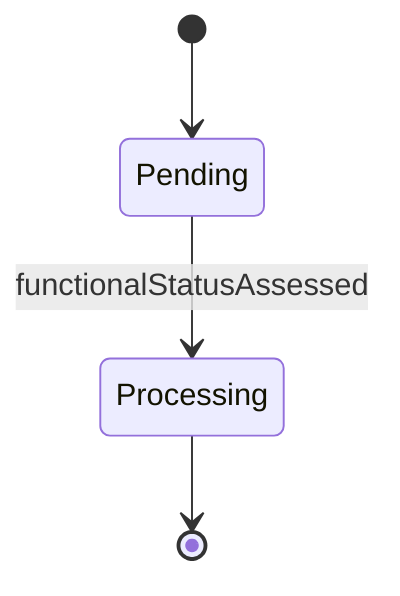
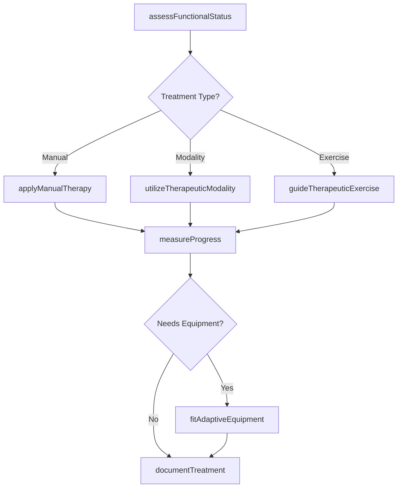
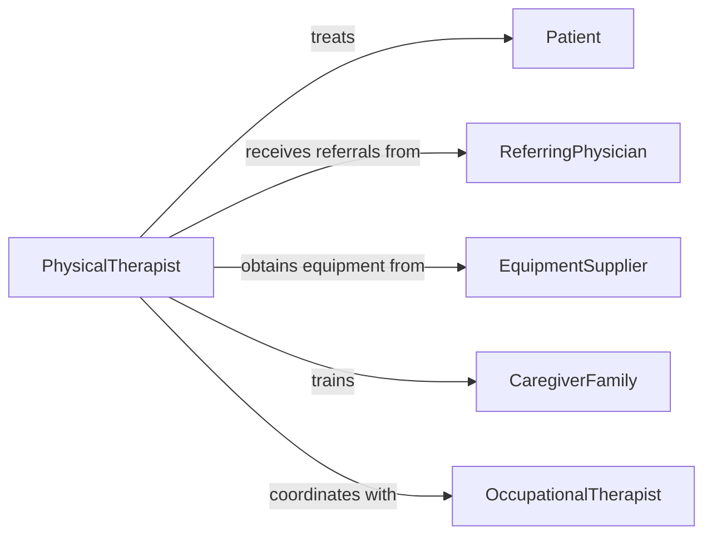

# Administer Therapy Treatments Patients Using

> Business-as-Code definition for administering therapy treatments to patients using hands or physical treatment aids. Models hands-on therapeutic interventions including manual therapy, assistive devices, and therapeutic modalities.

## Overview

Hands-on therapy administration delivers therapeutic interventions through manual techniques, physical treatment aids, and modalities to improve mobility, reduce pain, restore function, and promote healing under prescribed treatment plans.

## Actors

| Actor | Description |
|-------|-------------|
| Patient | Individual receiving hands-on therapy |
| ReferringPhysician | Prescribes therapy and monitors progress |
| EquipmentSupplier | Provides therapeutic devices and aids |
| InsuranceProvider | Covers therapy sessions and equipment |
| CaregiverFamily | Assists with home therapy program |
| OccupationalHealthProvider | Supports return-to-work therapy goals |

## Roles

| Role | Description |
|------|-------------|
| PhysicalTherapist | Delivers manual therapy and exercise programs |
| OccupationalTherapist | Provides functional rehabilitation and adaptive techniques |
| MassageTherapist | Applies manual soft tissue techniques |
| TherapyAssistant | Supports therapist with treatment delivery |

## Entities

| Entity | Description |
|--------|-------------|
| TherapyPlan | Prescribed course of treatment with goals |
| TreatmentSession | Individual therapy appointment |
| ManualTechnique | Hands-on therapeutic method |
| TherapeuticModality | Physical agent used in treatment (heat, cold, electrical) |
| TreatmentAid | Device or tool used to deliver therapy |
| ProgressNote | Documentation of session and patient response |

## Actions

| Action | Description |
|--------|-------------|
| assessFunctionalStatus | Evaluate patient mobility and limitations |
| applyManualTherapy | Deliver hands-on techniques for pain or mobility |
| utilizeTherapeuticModality | Apply heat, cold, ultrasound, or electrical stimulation |
| guideTherapeuticExercise | Instruct and assist with movement activities |
| fitAdaptiveEquipment | Provide and adjust assistive devices |
| measureProgress | Track functional improvements and goal achievement |
| documentTreatment | Record session details and patient response |

## Events

| Event | Description |
|-------|-------------|
| functionalStatusAssessed | Baseline evaluation completed |
| manualTherapyApplied | Hands-on technique delivered |
| therapeuticModalityUtilized | Physical agent treatment administered |
| therapeuticExerciseGuided | Movement therapy session completed |
| adaptiveEquipmentFitted | Assistive device provided and adjusted |
| progressMeasured | Functional gains documented |
| treatmentDocumented | Session note completed in record |

## Searches

| Search | Description |
|--------|-------------|
| findScheduledSessions | Locate upcoming therapy appointments |
| getTherapyPlans | Retrieve active treatment plans by patient |
| getProgressMeasures | Access functional outcome assessments |
| getEquipmentLoans | Find assistive devices issued to patients |


## Entity Relationships



## State Diagram


## Workflow



## Actor Relationships



## Usage

### Calling Actions

```typescript
import { administerTherapyTreatmentsPatientsUsing } from '@headlessly/administer-therapy-treatments-patients-using'

const therapy = administerTherapyTreatmentsPatientsUsing()

// Assess functional status
const assessment = await therapy.assessFunctionalStatus({
  patientId: 'PT12345',
  sessionId: 'S001',
  rangeOfMotion: { shoulder: '0-90 degrees', limited: true },
  strength: { grade: '3/5', weakness: 'shoulder abduction' },
  pain: { level: 6, scale: '0-10', location: 'left shoulder' },
  function: { difficulty: 'reaching overhead', adl: 'limited' }
})

// Apply manual therapy
await therapy.applyManualTherapy({
  patientId: 'PT12345',
  sessionId: 'S001',
  technique: 'joint mobilization',
  target: 'glenohumeral joint',
  grade: 'grade III',
  duration: 10,
  patientResponse: 'improved ROM, decreased pain to 4/10'
})

// Utilize therapeutic modality
await therapy.utilizeTherapeuticModality({
  patientId: 'PT12345',
  sessionId: 'S001',
  modality: 'moist heat pack',
  location: 'left shoulder',
  duration: 15,
  temperature: 'medium',
  effect: 'muscle relaxation, pain reduction'
})

// Guide therapeutic exercise
await therapy.guideTherapeuticExercise({
  patientId: 'PT12345',
  sessionId: 'S001',
  exercises: [
    { name: 'pendulum swing', sets: 2, reps: 10, assistance: 'minimal' },
    { name: 'wall climb', sets: 3, reps: 8, progression: 'increased height' }
  ],
  tolerance: 'good, no pain exacerbation'
})

// Fit adaptive equipment
await therapy.fitAdaptiveEquipment({
  patientId: 'PT12345',
  equipment: 'reacher/grabber',
  reason: 'compensate for limited shoulder ROM',
  training: 'proper use demonstrated',
  patientUnderstanding: 'excellent'
})
```

### Event-Driven Automation

```typescript
// Track progress toward discharge goals
therapy.progressMeasured(async ({ patientId, measures }) => {
  const plan = await therapy.getTherapyPlans({ patientId })
  const goalAchievement = assessGoals(measures, plan.goals)

  if (goalAchievement >= 80) {
    await therapy.recommendDischarge({
      patientId,
      achievement: goalAchievement,
      homeProgram: true
    })
  }
})

// Alert on adverse patient responses
therapy.manualTherapyApplied(async ({ patientId, response }) => {
  if (response.includes('increased pain') || response.includes('new symptoms')) {
    await therapy.modifyTreatment({
      patientId,
      alert: 'adverse response',
      notifyPhysician: true
    })
  }
})
```
