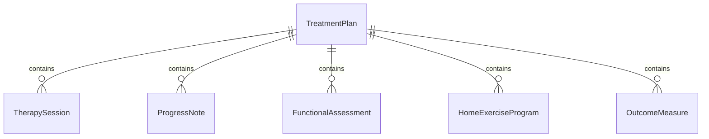
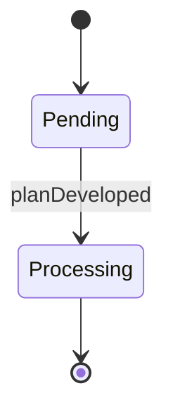
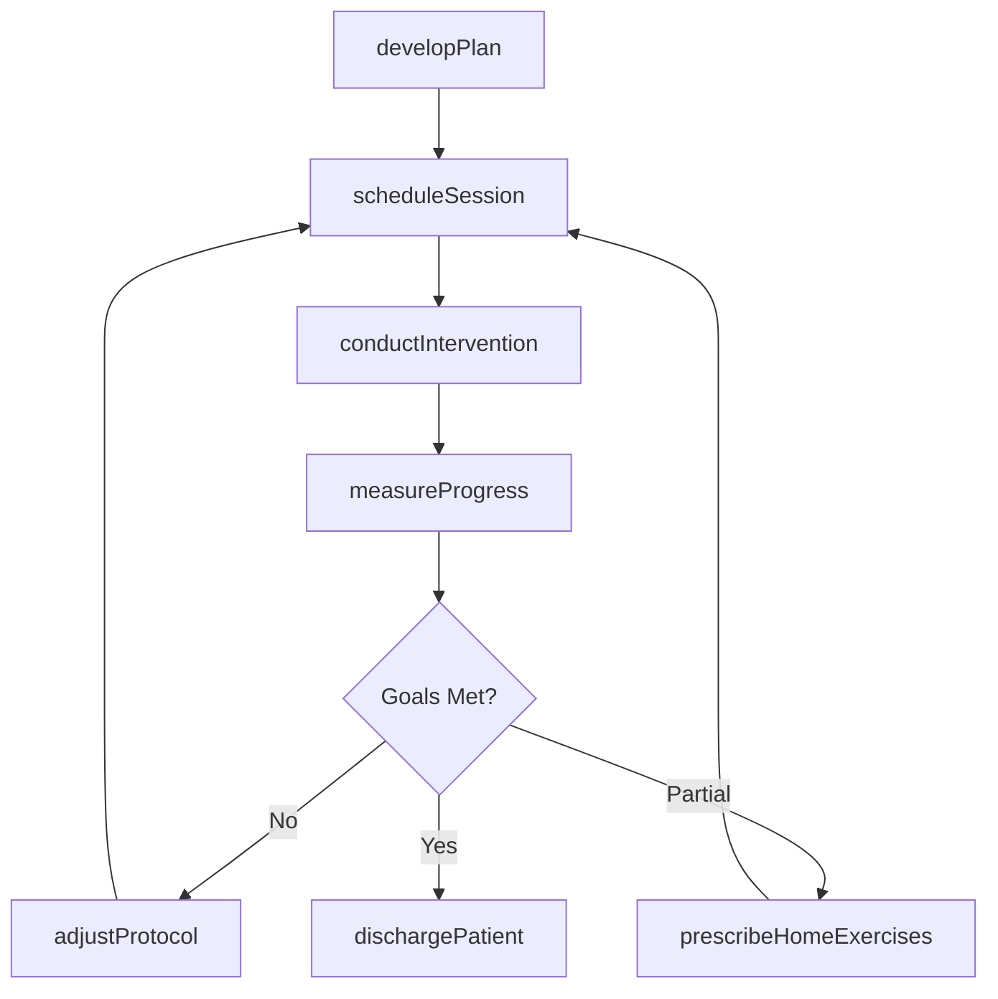
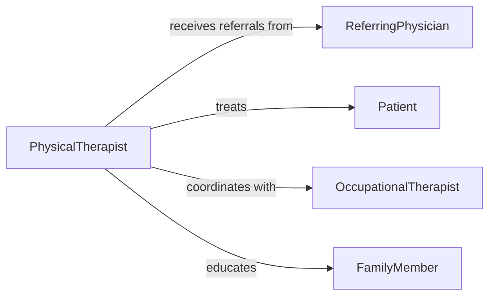

# Implement Therapeutic Programs Improve Patient

> Business-as-Code definition for designing and executing structured therapeutic interventions to restore, maintain, or enhance patient physical, cognitive, and functional abilities.

## Overview

Therapeutic program implementation involves creating individualized treatment plans, conducting therapy sessions, tracking patient progress, and adjusting interventions based on outcomes. This definition covers rehabilitation, occupational therapy, physical therapy, and cognitive therapy programs aimed at improving patient functioning and quality of life.

## Actors

| Actor | Description |
|-------|-------------|
| Patient | Participates in therapeutic interventions to improve functioning |
| ReferringPhysician | Orders therapeutic services and reviews progress |
| FamilyMember | Supports patient adherence and home exercise programs |
| EquipmentSupplier | Provides assistive devices and therapeutic equipment |
| InsuranceProvider | Authorizes and covers therapy sessions |
| DischargeCoordinator | Plans transition from therapy to independent functioning |

## Roles

| Role | Description |
|------|-------------|
| PhysicalTherapist | Develops and implements mobility and strength programs |
| OccupationalTherapist | Focuses on daily living skills and adaptive strategies |
| TherapyAssistant | Conducts sessions under therapist supervision |
| ProgressEvaluator | Assesses patient improvement and program effectiveness |

## Entities

| Entity | Description |
|--------|-------------|
| TreatmentPlan | Individualized therapeutic goals and intervention strategies |
| TherapySession | Scheduled treatment appointment with exercises and activities |
| ProgressNote | Documentation of patient response and functional gains |
| FunctionalAssessment | Standardized evaluation of patient capabilities |
| HomeExerciseProgram | Activities prescribed for independent practice |
| OutcomeMeasure | Quantitative metric of therapeutic effectiveness |

## Actions

| Action | Description |
|--------|-------------|
| developPlan | Create individualized therapeutic treatment plan |
| scheduleSession | Arrange therapy appointments and resources |
| conductIntervention | Deliver therapeutic exercises and activities |
| measureProgress | Assess functional gains using standardized tools |
| adjustProtocol | Modify interventions based on patient response |
| prescribeHomeExercises | Assign activities for independent practice |
| dischargePatient | Complete therapy program and provide recommendations |

## Events

| Event | Description |
|-------|-------------|
| planDeveloped | Treatment plan created and approved |
| sessionScheduled | Therapy appointment confirmed |
| interventionConducted | Therapeutic session completed |
| progressMeasured | Functional assessment performed |
| protocolAdjusted | Treatment plan modified based on outcomes |
| homeExercisesPrescribed | Independent activities assigned to patient |
| patientDischarged | Therapy program concluded successfully |

## Searches

| Search | Description |
|--------|-------------|
| findTreatmentPlans | Retrieve therapy plans by patient or diagnosis |
| getProgressNotes | Query session documentation by date range |
| getOutcomeMeasures | Find functional assessment scores over time |
| getHomePrograms | Search assigned home exercises by patient |


## Entity Relationships



## State Diagram


## Workflow



## Actor Relationships



## Usage

### Calling Actions

```typescript
import { implementTherapeuticProgramsImprovePatient } from '@headlessly/implement-therapeutic-programs-improve-patient'

const therapy = implementTherapeuticProgramsImprovePatient()

// Develop treatment plan for stroke recovery
const plan = await therapy.developPlan({
  patientId: 'PT-991234',
  diagnosis: 'cerebrovascular-accident',
  functionalLimitations: ['left-hemiparesis', 'gait-impairment'],
  goals: [
    'ambulate-50-feet-independently',
    'climb-stairs-with-rail',
    'transfer-bed-to-chair-safely'
  ],
  frequencyWeeks: 12,
  sessionsPerWeek: 3
})

// Conduct therapy session
await therapy.conductIntervention({
  planId: plan.id,
  sessionNumber: 5,
  activities: [
    { exercise: 'gait-training', duration: 20, assistLevel: 'contact-guard' },
    { exercise: 'balance-exercises', duration: 15, assistLevel: 'minimal' },
    { exercise: 'lower-extremity-strengthening', duration: 15, reps: 10 }
  ],
  patientTolerance: 'good',
  painLevel: 2
})

// Measure progress at 4-week mark
const assessment = await therapy.measureProgress({
  planId: plan.id,
  assessmentType: 'timed-up-and-go',
  score: 18,
  comparedToBaseline: -7
})

// Adjust protocol based on progress
if (assessment.improvementPercentage > 30) {
  await therapy.adjustProtocol({
    planId: plan.id,
    changes: ['increase-gait-distance', 'reduce-assist-level', 'add-stair-training']
  })
}
```

### Event-Driven Automation

```typescript
// Alert therapist to schedule reassessment
therapy.progressMeasured(async ({ planId, sessionCount }) => {
  if (sessionCount % 12 === 0) {
    await notify({
      to: 'assigned-therapist',
      message: `Comprehensive reassessment due for plan ${planId}`
    })
  }
})

// Auto-generate home exercise program
therapy.protocolAdjusted(async ({ planId, patientId }) => {
  await therapy.prescribeHomeExercises({
    planId,
    patientId,
    exercises: await generateHomeProgram({ planId }),
    frequency: 'daily',
    instructionsProvided: true
  })
})
```
