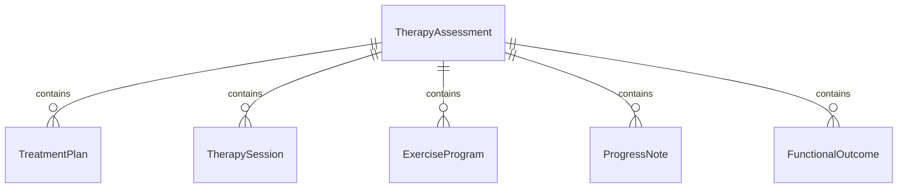
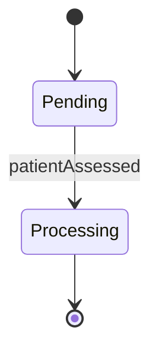
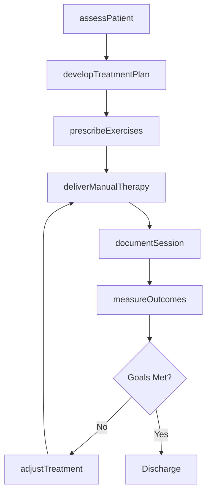
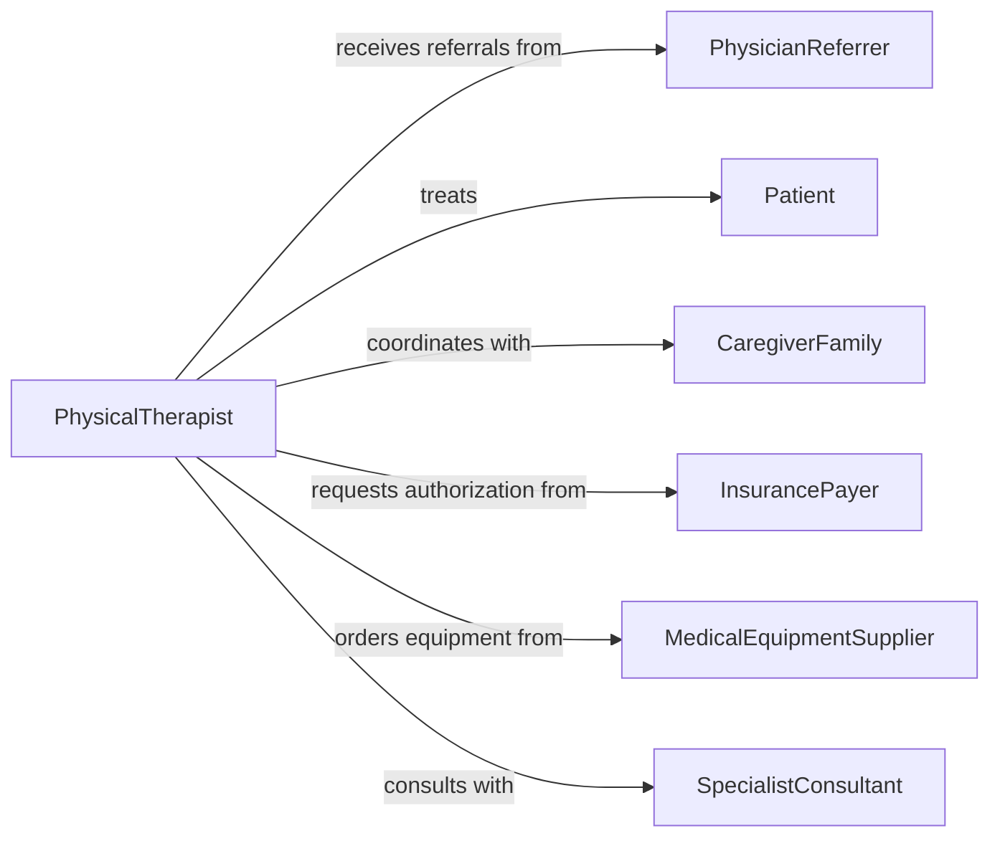

# Treat Patients Using Physical Therapy

> Business-as-Code definition for physical therapy treatment delivery. Models the complete therapy cycle from assessment through exercise prescription and progress monitoring.

## Overview

Physical therapy treatment involves evaluating patient conditions, developing therapeutic exercise programs, and providing manual therapy interventions to restore mobility, reduce pain, and improve functional capacity. This definition exposes actions for assessment, treatment planning, and outcome measurement.

## Actors

| Actor | Description |
|-------|-------------|
| Patient | Individual receiving physical therapy treatment |
| PhysicianReferrer | Provides medical referrals and treatment authorization |
| InsurancePayer | Authorizes and reimburses therapy services |
| MedicalEquipmentSupplier | Provides assistive devices and therapeutic equipment |
| CaregiverFamily | Supports home exercise program compliance |
| SpecialistConsultant | Provides expert guidance on complex cases |

## Roles

| Role | Description |
|------|-------------|
| PhysicalTherapist | Licensed clinician who delivers treatment |
| TherapyAssistant | Supports treatment delivery under supervision |
| RehabCoordinator | Schedules appointments and coordinates care |
| OutcomesAnalyst | Tracks treatment effectiveness and patient progress |

## Entities

| Entity | Description |
|--------|-------------|
| TherapyAssessment | Initial evaluation of patient condition and functional status |
| TreatmentPlan | Structured plan with goals, interventions, and frequency |
| TherapySession | Individual treatment encounter with exercises and modalities |
| ExerciseProgram | Prescribed movements for strength, flexibility, and function |
| ProgressNote | Documentation of session activities and patient response |
| FunctionalOutcome | Measured improvement in mobility, strength, or pain level |

## Actions

| Action | Description |
|--------|-------------|
| assessPatient | Evaluate patient condition, mobility, and functional limitations |
| developTreatmentPlan | Create structured therapy plan with goals and interventions |
| prescribeExercises | Design therapeutic exercise program for patient needs |
| deliverManualTherapy | Perform hands-on techniques for mobilization and pain relief |
| documentSession | Record treatment activities and patient response |
| measureOutcomes | Track functional improvements and goal achievement |
| adjustTreatment | Modify plan based on patient progress and response |

## Events

| Event | Description |
|-------|-------------|
| patientAssessed | Initial evaluation completed with baseline measurements |
| treatmentPlanDeveloped | Therapy plan created and approved for implementation |
| exercisesPrescribed | Exercise program documented and taught to patient |
| manualTherapyDelivered | Hands-on treatment intervention completed |
| sessionDocumented | Progress note finalized in medical record |
| outcomesMeasured | Functional status assessed and compared to baseline |
| treatmentAdjusted | Plan modified based on patient response |

## Searches

| Search | Description |
|--------|-------------|
| findPatients | List patients by condition, therapist, or treatment status |
| getTreatmentPlans | Retrieve therapy plans by patient or diagnosis |
| getSessions | Find therapy sessions by date, patient, or therapist |
| getOutcomes | Review functional improvement metrics over time |


## Entity Relationships



## State Diagram


## Workflow



## Actor Relationships



## Usage

### Calling Actions

```typescript
import { treatPatientsUsingPhysicalTherapy } from '@headlessly/treat-patients-using-physical-therapy'

const therapy = treatPatientsUsingPhysicalTherapy()

// Assess a new patient
const assessment = await therapy.assessPatient({
  patientId: 'PT-2026-001',
  chiefComplaint: 'Lower back pain with radiating leg symptoms',
  functionalLimitations: ['Difficulty walking > 10 minutes', 'Unable to sit > 30 minutes'],
  painLevel: 7,
  rangeOfMotion: { lumbarFlexion: 30, lumbarExtension: 10 }
})

// Develop treatment plan
await therapy.developTreatmentPlan({
  assessmentId: assessment.id,
  goals: [
    { description: 'Reduce pain to 3/10 or less', timeframe: '4 weeks' },
    { description: 'Walk 30 minutes without pain', timeframe: '6 weeks' }
  ],
  frequency: '2x per week for 8 weeks',
  interventions: ['Manual therapy', 'Therapeutic exercise', 'Patient education']
})

// Document a therapy session
await therapy.documentSession({
  patientId: 'PT-2026-001',
  date: '2026-02-05',
  duration: 45,
  interventions: [
    'Lumbar mobilization grade III',
    'Core stabilization exercises',
    'Hamstring stretching'
  ],
  patientResponse: 'Tolerated well, pain decreased to 4/10 post-treatment'
})
```

### Event-Driven Automation

```typescript
// Auto-schedule follow-up when outcomes measured
therapy.outcomesMeasured(async ({ patientId, outcomes, goalsAchieved }) => {
  if (goalsAchieved < 50) {
    await therapy.adjustTreatment({
      patientId,
      modifications: 'Increase manual therapy frequency, reduce exercise intensity'
    })
  }
})

// Alert on missed sessions
therapy.sessionDocumented(async ({ patientId, attendanceRate }) => {
  if (attendanceRate < 70) {
    await notify({
      to: 'rehab-coordinator',
      message: `Patient ${patientId} has low attendance, may need outreach`
    })
  }
})
```
