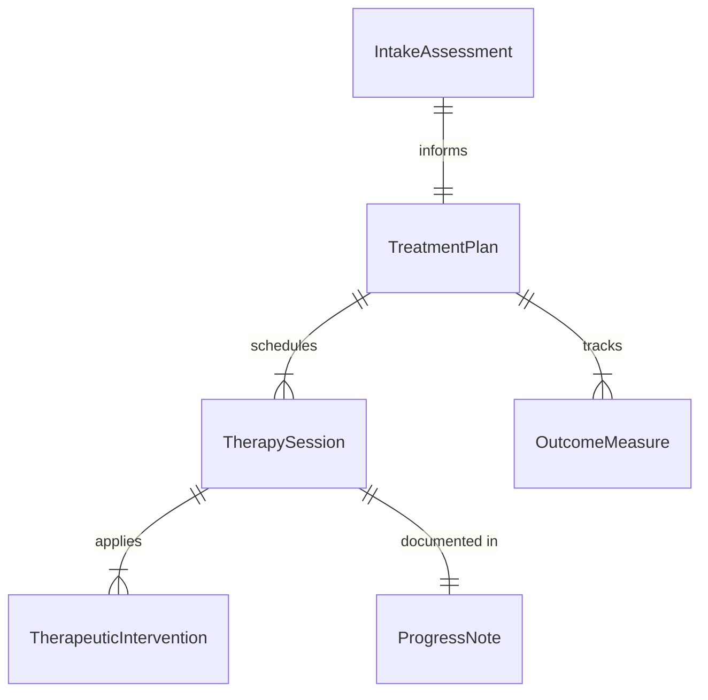
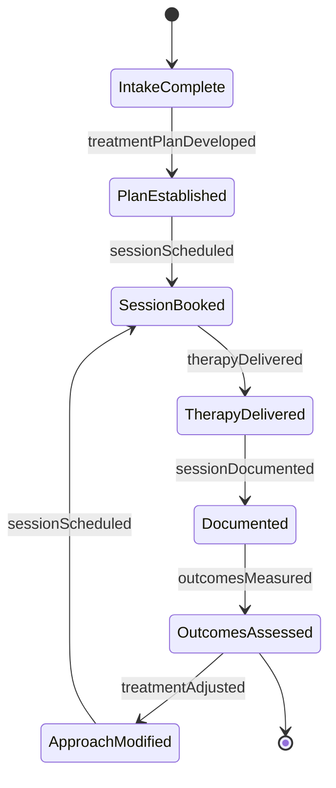
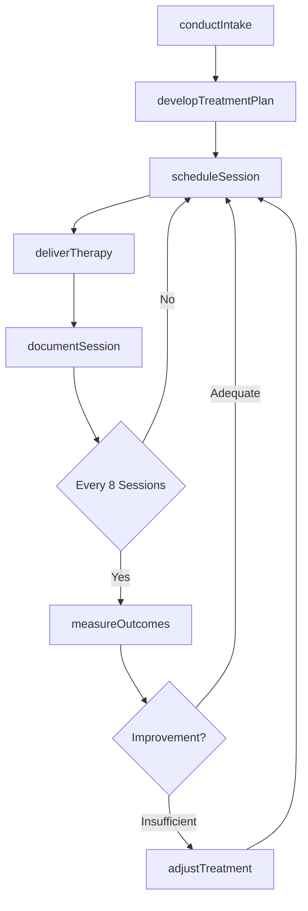
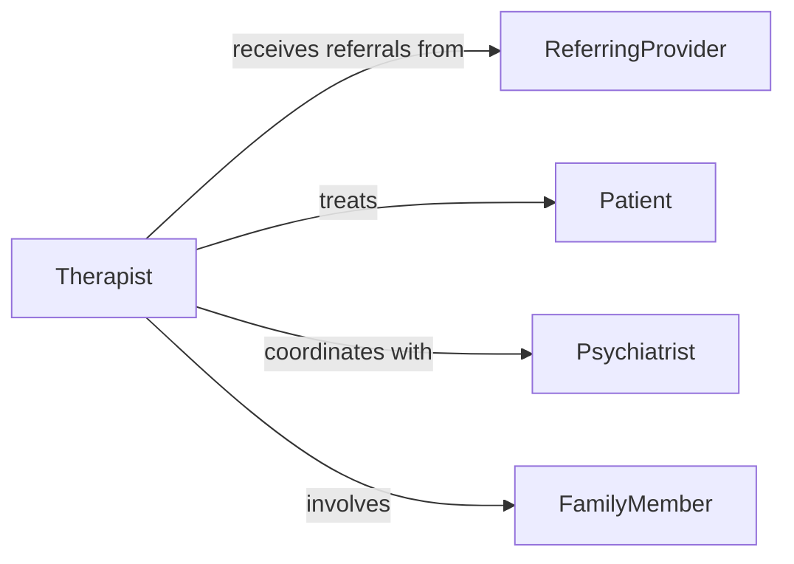

# Treat Patients Using Psychological Therapies

> Business-as-Code definition for providing evidence-based psychotherapeutic interventions to address mental health conditions, emotional distress, and behavioral challenges.

## Overview

Psychological therapy treatment involves conducting structured therapeutic sessions using modalities such as cognitive-behavioral therapy, psychodynamic therapy, and solution-focused therapy. This definition models the complete treatment lifecycle from intake assessment through session delivery, progress monitoring, and treatment completion.

## Actors

| Actor | Description |
|-------|-------------|
| Patient | Engages in therapy to address mental health concerns |
| ReferringProvider | Identifies need for psychological treatment |
| Psychiatrist | Prescribes medications and coordinates with therapy |
| FamilyMember | Participates in family therapy sessions when appropriate |
| InsuranceProvider | Authorizes and covers therapy sessions |
| CrisisLine | Provides emergency support between therapy sessions |

## Roles

| Role | Description |
|------|-------------|
| Psychologist | Conducts therapy using licensed psychological approaches |
| Therapist | Delivers counseling and therapeutic interventions |
| IntakeCounselor | Performs initial assessment and treatment planning |
| CaseManager | Coordinates care and tracks treatment outcomes |

## Entities

| Entity | Description |
|--------|-------------|
| IntakeAssessment | Initial evaluation of symptoms and treatment needs |
| TreatmentPlan | Therapeutic goals and intervention approach |
| TherapySession | Individual appointment with structured interventions |
| ProgressNote | Clinical documentation of session content and outcomes |
| TherapeuticIntervention | Specific technique applied during session |
| OutcomeMeasure | Standardized assessment of symptom improvement |

## Actions

| Action | Description |
|--------|-------------|
| conductIntake | Perform initial assessment and establish therapeutic alliance |
| developTreatmentPlan | Create goals and select evidence-based modalities |
| scheduleSession | Arrange therapy appointments and confirm attendance |
| deliverTherapy | Conduct structured therapeutic session |
| documentSession | Record session content and clinical observations |
| measureOutcomes | Assess symptom changes using standardized tools |
| adjustTreatment | Modify approach based on patient response |

## Events

| Event | Description |
|-------|-------------|
| intakeConducted | Initial assessment completed and documented |
| treatmentPlanDeveloped | Therapeutic goals and approach established |
| sessionScheduled | Therapy appointment confirmed |
| therapyDelivered | Therapeutic session completed |
| sessionDocumented | Progress note finalized in clinical record |
| outcomesMeasured | Symptom improvement assessed |
| treatmentAdjusted | Therapeutic approach modified |

## Searches

| Search | Description |
|--------|-------------|
| findTreatmentPlans | Retrieve therapy plans by patient or diagnosis |
| getSessions | Query session history by date range or therapist |
| getProgressNotes | Find clinical documentation by patient |
| getOutcomes | Search symptom assessments and improvement trends |


## Entity Relationships



## State Diagram


## Workflow



## Actor Relationships



## Usage

### Calling Actions

```typescript
import { treatPatientsUsingPsychologicalTherapies } from '@headlessly/treat-patients-using-psychological-therapies'

const therapy = treatPatientsUsingPsychologicalTherapies()

// Conduct intake assessment
const intake = await therapy.conductIntake({
  patientId: 'PT-778899',
  presentingProblems: ['generalized-anxiety', 'panic-attacks'],
  symptomSeverity: 7,
  priorTherapy: true,
  medications: ['sertraline-50mg'],
  suicidalIdeation: false
})

// Develop evidence-based treatment plan
const plan = await therapy.developTreatmentPlan({
  patientId: 'PT-778899',
  diagnosis: 'generalized-anxiety-disorder',
  modality: 'cognitive-behavioral-therapy',
  goals: [
    'reduce-anxiety-severity-by-50-percent',
    'eliminate-panic-attacks',
    'develop-coping-strategies'
  ],
  sessionFrequency: 'weekly',
  estimatedDuration: 16
})

// Deliver therapy session
await therapy.deliverTherapy({
  planId: plan.id,
  sessionNumber: 5,
  interventions: [
    { technique: 'cognitive-restructuring', duration: 20 },
    { technique: 'exposure-hierarchy', duration: 25 },
    { technique: 'relaxation-training', duration: 10 }
  ],
  homework: 'practice-diaphragmatic-breathing-daily',
  patientEngagement: 'high'
})

// Measure treatment outcomes
const outcomes = await therapy.measureOutcomes({
  planId: plan.id,
  assessmentType: 'GAD-7',
  score: 11,
  comparedToBaseline: -8
})
```

### Event-Driven Automation

```typescript
// Alert on concerning clinical indicators
therapy.intakeConducted(async ({ patientId, suicidalIdeation, riskLevel }) => {
  if (riskLevel === 'high') {
    await notify({
      to: 'crisis-team',
      urgent: true,
      message: `High-risk patient ${patientId} requires immediate safety planning`
    })
  }
})

// Auto-schedule outcome assessment
therapy.sessionDocumented(async ({ planId, sessionNumber }) => {
  if (sessionNumber % 8 === 0) {
    await therapy.measureOutcomes({
      planId,
      assessmentType: 'PHQ-9',
      scheduledDate: nextSessionDate(planId)
    })
  }
})
```
