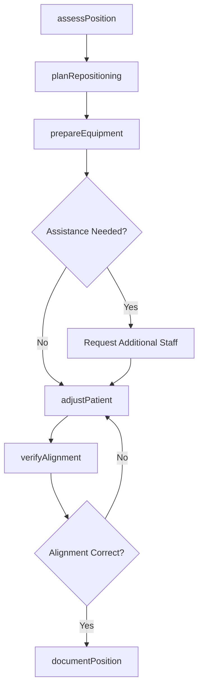
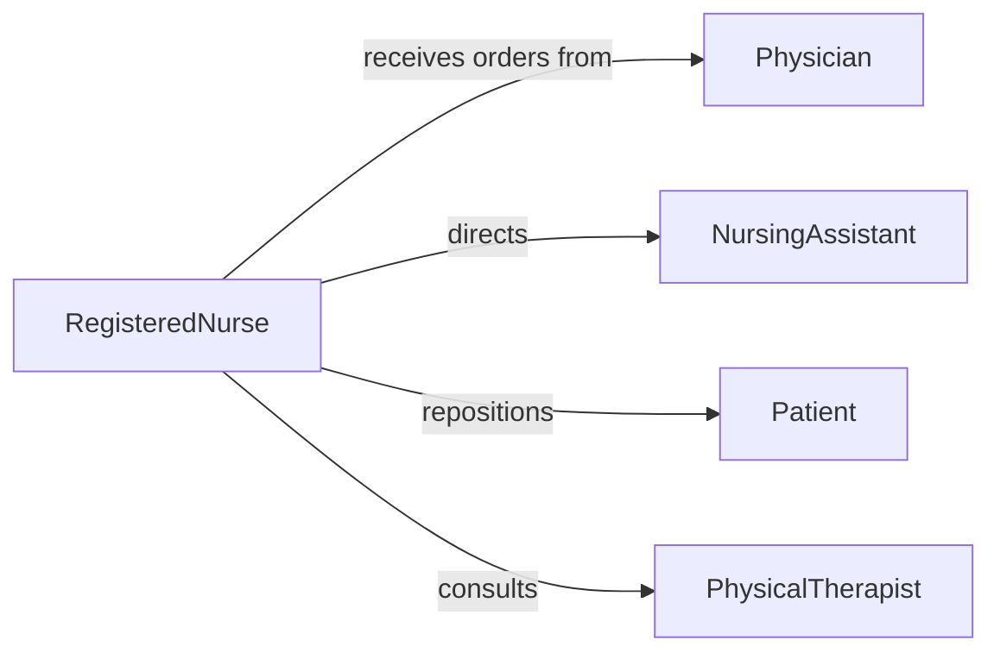

# Adjust Positions Patients Beds Tables

> Business-as-Code definition for repositioning patients on beds, examination tables, and surgical tables to optimize comfort, safety, and procedural access.

## Overview

Patient positioning adjustment involves evaluating patient condition, determining optimal position for procedures or comfort, and safely moving patients while preventing pressure injuries and maintaining body alignment. This definition covers repositioning for examinations, surgeries, imaging, and extended bed rest.

## Actors

| Actor | Description |
|-------|-------------|
| Patient | Requires positioning adjustment for procedures or comfort |
| Physician | Orders specific positioning for procedures or medical reasons |
| SurgicalTeam | Requires optimal patient positioning for surgical access |
| ImagingTechnologist | Needs specific positioning for diagnostic imaging |
| EquipmentVendor | Provides positioning devices and support surfaces |
| SafetyOfficer | Monitors patient handling protocols and injury prevention |

## Roles

| Role | Description |
|------|-------------|
| RegisteredNurse | Assesses positioning needs and directs repositioning |
| NursingAssistant | Performs physical repositioning tasks |
| PhysicalTherapist | Advises on body mechanics and pressure relief |
| PositioningSpecialist | Ensures proper alignment during surgical procedures |

## Entities

| Entity | Description |
|--------|-------------|
| PositioningOrder | Instructions for patient position and frequency |
| BodyAlignment | Assessment of anatomical positioning and support |
| PressurePoint | Area of skin at risk for breakdown during positioning |
| PositioningDevice | Equipment used to support or maintain position |
| RepositioningSchedule | Timeline for turning and adjusting immobile patients |
| SafetyChecklist | Verification of proper positioning and support |

## Actions

| Action | Description |
|--------|-------------|
| assessPosition | Evaluate current position and repositioning needs |
| planRepositioning | Determine target position and required assistance |
| prepareEquipment | Gather positioning devices and support surfaces |
| adjustPatient | Physically move patient to new position |
| verifyAlignment | Confirm proper body alignment and pressure distribution |
| documentPosition | Record position change and patient response |

## Events

| Event | Description |
|-------|-------------|
| positionAssessed | Current positioning status evaluated |
| repositioningPlanned | Target position and approach determined |
| equipmentPrepared | Positioning devices ready for use |
| patientAdjusted | Patient successfully moved to new position |
| alignmentVerified | Body positioning confirmed as appropriate |
| positionDocumented | Repositioning recorded in patient chart |

## Searches

| Search | Description |
|--------|-------------|
| findPositioningOrders | Retrieve positioning instructions by patient |
| getRepositioningSchedules | Query turning schedules for immobile patients |
| getPressurePoints | Find high-risk areas requiring monitoring |
| getPositioningDevices | Search available support equipment by type |

## Workflow



## Actor Relationships



## Usage

### Calling Actions

```typescript
import { adjustPositionsPatientsBedsTables } from '@headlessly/adjust-positions-patients-beds-tables'

const positioning = adjustPositionsPatientsBedsTables()

// Assess current positioning status
const assessment = await positioning.assessPosition({
  patientId: 'PT-334455',
  currentPosition: 'supine',
  timeInPosition: 120,
  skinCondition: 'intact',
  mobilityLevel: 'bedbound'
})

// Plan repositioning for pressure relief
const plan = await positioning.planRepositioning({
  patientId: 'PT-334455',
  targetPosition: 'left-lateral',
  assistanceRequired: 2,
  devicesNeeded: ['positioning-wedge', 'pillow-support']
})

// Prepare equipment and adjust patient
await positioning.prepareEquipment({
  devices: plan.devicesNeeded,
  location: 'room-312'
})

await positioning.adjustPatient({
  patientId: 'PT-334455',
  fromPosition: 'supine',
  toPosition: 'left-lateral',
  staffAssisting: ['RN-Smith', 'CNA-Johnson'],
  technique: 'draw-sheet-lift'
})

// Verify proper alignment
await positioning.verifyAlignment({
  patientId: 'PT-334455',
  headAlignment: 'neutral',
  spineAlignment: 'straight',
  pressurePointsSupported: ['sacrum', 'heels', 'shoulders'],
  patientComfort: 'comfortable'
})
```

### Event-Driven Automation

```typescript
// Schedule next repositioning
positioning.patientAdjusted(async ({ patientId, position, timestamp }) => {
  await positioning.planRepositioning({
    patientId,
    scheduledTime: addMinutes(timestamp, 120),
    targetPosition: getNextPosition(position)
  })
})

// Alert on overdue repositioning
positioning.positionDocumented(async ({ patientId, timestamp }) => {
  const schedule = await getRepositioningSchedule(patientId)
  if (isOverdue(timestamp, schedule.frequency)) {
    await notify({
      to: 'nursing-station',
      message: `Patient ${patientId} overdue for repositioning`
    })
  }
})
```
