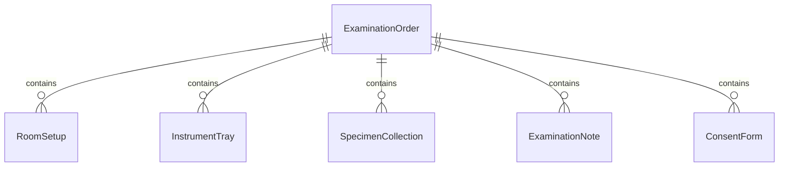
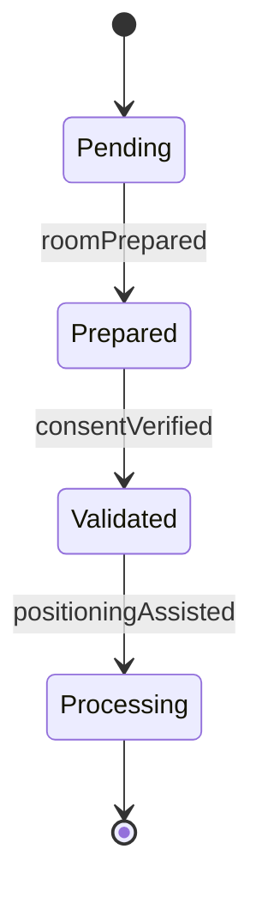
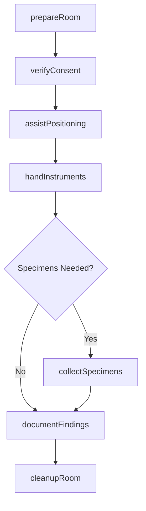
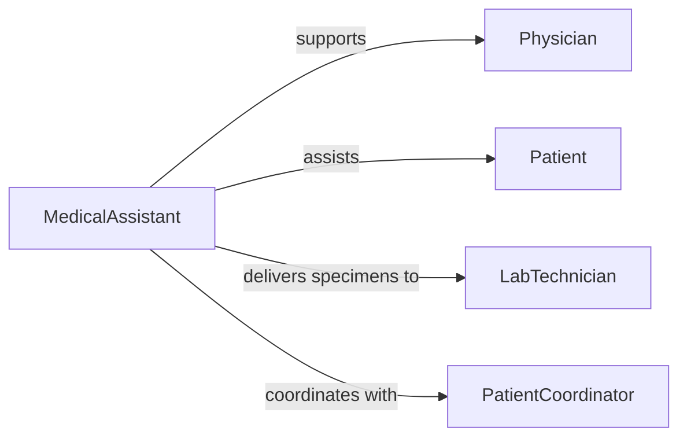

# Assist Healthcare Practitioners During Examinations

> Business-as-Code definition for supporting physicians and advanced practitioners during patient examinations and diagnostic procedures through preparation, equipment handling, and procedural assistance.

## Overview

Healthcare practitioner assistance encompasses preparing examination rooms, positioning patients, handling instruments, documenting findings, and ensuring smooth workflow during medical examinations and treatments. This definition models the complete support process from pre-examination preparation through post-procedure cleanup and documentation.

## Actors

| Actor | Description |
|-------|-------------|
| Physician | Conducts patient examination and medical assessment |
| Patient | Undergoes examination or diagnostic procedure |
| AdvancedPractitioner | Performs examinations as nurse practitioner or physician assistant |
| LabTechnician | Processes specimens collected during examination |
| EquipmentVendor | Supplies medical instruments and diagnostic devices |
| InsuranceProvider | Covers examination and diagnostic services |

## Roles

| Role | Description |
|------|-------------|
| MedicalAssistant | Prepares room and assists during examinations |
| ClinicalSupport | Handles instruments and documentation |
| PatientCoordinator | Manages examination scheduling and patient flow |
| ChaperonStaff | Provides presence during sensitive examinations |

## Entities

| Entity | Description |
|--------|-------------|
| ExaminationOrder | Instructions for type and scope of examination |
| RoomSetup | Configuration of equipment and supplies for procedure |
| InstrumentTray | Organized collection of tools needed for examination |
| SpecimenCollection | Biological samples obtained during examination |
| ExaminationNote | Documentation of findings and patient response |
| ConsentForm | Authorization for examination or procedure |

## Actions

| Action | Description |
|--------|-------------|
| prepareRoom | Set up examination space and required equipment |
| verifyConsent | Confirm patient authorization for procedure |
| assistPositioning | Help patient into appropriate position for examination |
| handInstruments | Provide tools to practitioner as needed |
| collectSpecimens | Gather and label biological samples |
| documentFindings | Record examination observations and results |
| cleanupRoom | Restore examination space after procedure |

## Events

| Event | Description |
|-------|-------------|
| roomPrepared | Examination space ready with necessary supplies |
| consentVerified | Patient authorization confirmed and documented |
| positioningAssisted | Patient properly positioned for examination |
| instrumentsHanded | Tools provided to practitioner during procedure |
| specimensCollected | Biological samples obtained and labeled |
| findingsDocumented | Examination results recorded in patient chart |
| roomCleaned | Examination space restored to ready state |

## Searches

| Search | Description |
|--------|-------------|
| findExaminationOrders | Retrieve scheduled examinations by practitioner or date |
| getInstrumentTrays | Query standard setups by examination type |
| getSpecimens | Find collected samples requiring processing |
| getExaminationNotes | Search documentation by patient or date |


## Entity Relationships



## State Diagram


## Workflow



## Actor Relationships



## Usage

### Calling Actions

```typescript
import { assistHealthcarePractitionersDuringExaminations } from '@headlessly/assist-healthcare-practitioners-during-examinations'

const assistance = assistHealthcarePractitionersDuringExaminations()

// Prepare examination room for routine physical
await assistance.prepareRoom({
  roomNumber: '3B',
  examinationType: 'annual-physical',
  practitionerId: 'MD-Williams',
  supplies: [
    'examination-gown',
    'blood-pressure-cuff',
    'stethoscope',
    'otoscope',
    'reflex-hammer'
  ]
})

// Verify consent before gynecological exam
await assistance.verifyConsent({
  patientId: 'PT-556677',
  procedureType: 'pelvic-examination',
  consentSigned: true,
  chaperoneRequested: true
})

// Assist with positioning for examination
await assistance.assistPositioning({
  patientId: 'PT-556677',
  position: 'lithotomy',
  drapingProvided: true,
  patientComfort: 'confirmed'
})

// Hand instruments during procedure
await assistance.handInstruments({
  practitionerId: 'MD-Williams',
  instrumentSequence: [
    'speculum',
    'cytobrush',
    'spatula'
  ],
  timing: 'as-requested'
})

// Collect specimens for lab
await assistance.collectSpecimens({
  patientId: 'PT-556677',
  specimens: [
    { type: 'cervical-cytology', container: 'liquid-based', labeled: true },
    { type: 'chlamydia-screening', container: 'swab-tube', labeled: true }
  ],
  labDestination: 'pathology'
})
```

### Event-Driven Automation

```typescript
// Auto-notify lab when specimens ready
assistance.specimensCollected(async ({ patientId, specimens, labDestination }) => {
  await notify({
    to: labDestination,
    message: `${specimens.length} specimens ready for pickup`,
    priority: 'routine'
  })
})

// Track room turnover time
assistance.roomCleaned(async ({ roomNumber, timestamp }) => {
  const prepared = await getPreparedTime(roomNumber)
  const turnoverTime = timestamp - prepared
  await logMetric({
    metric: 'room-turnover',
    room: roomNumber,
    duration: turnoverTime
  })
})
```
