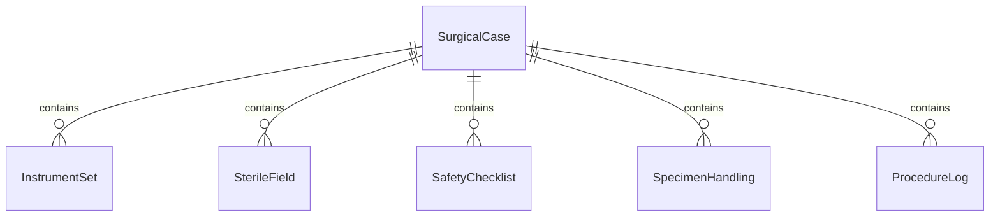
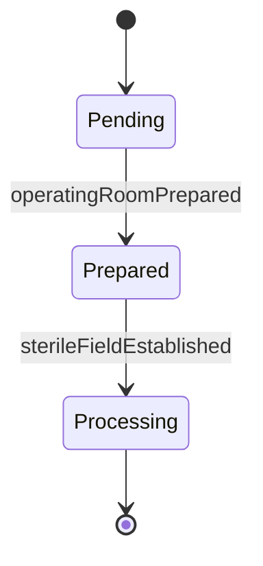
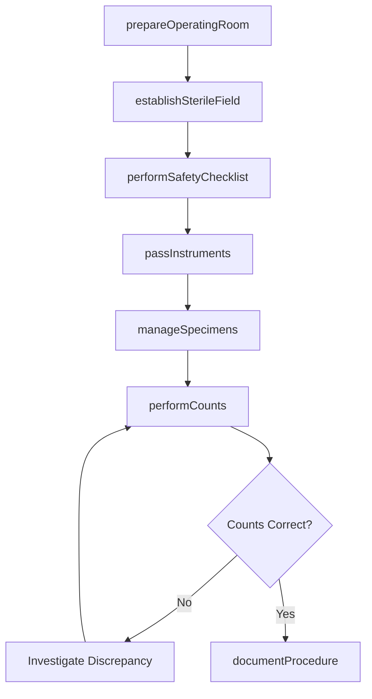
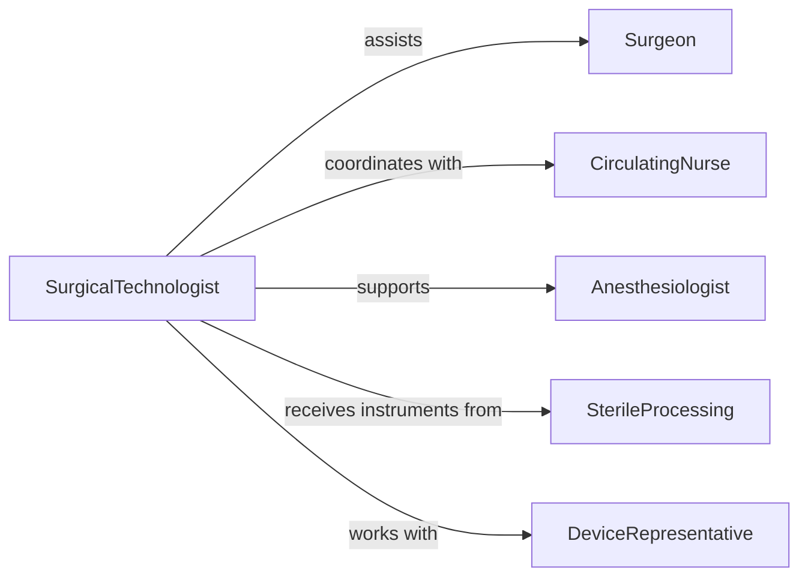

# Assist Healthcare Practitioners During Surgery

> Business-as-Code definition for surgical assistance services. Models the complete perioperative workflow from setup through instrument handling and post-procedure documentation.

## Overview

Surgical assistance involves preparing operating rooms, maintaining sterile fields, passing instruments to surgeons, and supporting patient positioning during procedures. This definition coordinates surgical team activities, equipment management, and regulatory compliance for safe surgical care.

## Actors

| Actor | Description |
|-------|-------------|
| Surgeon | Primary physician performing the surgical procedure |
| Anesthesiologist | Manages patient sedation and vital signs |
| Patient | Individual undergoing surgical treatment |
| DeviceRepresentative | Provides technical support for specialized equipment |
| SterileProcessing | Prepares and sterilizes surgical instruments |
| RegulatorySurveyor | Audits compliance with surgical safety standards |

## Roles

| Role | Description |
|------|-------------|
| SurgicalTechnologist | Maintains sterile field and passes instruments |
| CirculatingNurse | Manages non-sterile activities and documentation |
| ScrubNurse | Assists with sterile technique and instrument handling |
| ORCoordinator | Schedules procedures and coordinates team assignments |

## Entities

| Entity | Description |
|--------|-------------|
| SurgicalCase | Scheduled procedure with patient and surgical team |
| InstrumentSet | Sterile tools required for specific procedure type |
| SterileField | Controlled area where surgery is performed |
| SafetyChecklist | Time-out and verification steps per protocol |
| SpecimenHandling | Tissue or fluid samples collected during surgery |
| ProcedureLog | Documentation of activities and counts during case |

## Actions

| Action | Description |
|--------|-------------|
| prepareOperatingRoom | Set up equipment and verify supplies before case |
| establishSterileField | Create and maintain sterile environment for surgery |
| performSafetyChecklist | Execute time-out and verification procedures |
| passInstruments | Anticipate and provide tools to surgeon during procedure |
| manageSpecimens | Collect, label, and route tissue samples appropriately |
| performCounts | Verify all instruments and supplies accounted for |
| documentProcedure | Record case details, times, and safety compliance |

## Events

| Event | Description |
|-------|-------------|
| operatingRoomPrepared | Setup complete and ready for patient arrival |
| sterileFieldEstablished | Sterile environment created and verified |
| safetyChecklistPerformed | Time-out completed with team acknowledgment |
| instrumentsPassed | Tools provided to surgeon during case |
| specimensManaged | Tissue samples collected and routed to pathology |
| countsPerformed | Final instrument and sponge count verified correct |
| procedureDocumented | Case log completed in medical record |

## Searches

| Search | Description |
|--------|-------------|
| findCases | List surgical procedures by date, surgeon, or status |
| getInstrumentSets | Retrieve sterile tray configurations by procedure type |
| getChecklists | Find safety verification records by case |
| getSpecimens | Track tissue samples from collection to pathology |


## Entity Relationships



## State Diagram


## Workflow



## Actor Relationships



## Usage

### Calling Actions

```typescript
import { assistHealthcarePractitionersDuringSurgery } from '@headlessly/assist-healthcare-practitioners-during-surgery'

const surgery = assistHealthcarePractitionersDuringSurgery()

// Prepare OR for scheduled case
const setup = await surgery.prepareOperatingRoom({
  caseId: 'OR-2026-420',
  procedureType: 'Laparoscopic cholecystectomy',
  surgeonId: 'DR-SMITH-J',
  equipmentNeeded: ['Laparoscopic tower', 'Insufflator', 'Energy device'],
  instrumentSets: ['General lap', 'Gallbladder']
})

// Establish sterile field
await surgery.establishSterileField({
  caseId: 'OR-2026-420',
  tableCovered: true,
  instrumentsOpened: ['General lap', 'Gallbladder'],
  gownsGlovesSterile: true,
  fieldVerified: true
})

// Perform safety checklist
await surgery.performSafetyChecklist({
  caseId: 'OR-2026-420',
  patientVerified: true,
  procedureConfirmed: 'Laparoscopic cholecystectomy',
  siteMarked: 'N/A - intra-abdominal',
  antibioticsGiven: true,
  teamIntroductions: true
})

// Document completed procedure
await surgery.documentProcedure({
  caseId: 'OR-2026-420',
  startTime: '08:15',
  endTime: '09:45',
  instrumentsUsed: ['Laparoscope', 'Graspers', 'Scissors', 'Clip applier'],
  finalCounts: { instruments: 'correct', sponges: 'correct', needles: 'correct' },
  specimensCollected: ['Gallbladder'],
  complications: 'None'
})
```

### Event-Driven Automation

```typescript
// Alert on count discrepancy
surgery.countsPerformed(async ({ caseId, instrumentCount, spongeCount, needleCount }) => {
  const discrepancies = []
  if (!instrumentCount.correct) discrepancies.push('instruments')
  if (!spongeCount.correct) discrepancies.push('sponges')
  if (!needleCount.correct) discrepancies.push('needles')

  if (discrepancies.length > 0) {
    await notify({
      to: 'or-team',
      priority: 'urgent',
      message: `Count discrepancy in case ${caseId}: ${discrepancies.join(', ')}`
    })
  }
})

// Route specimens to pathology
surgery.specimensManaged(async ({ caseId, specimens }) => {
  for (const specimen of specimens) {
    await routeToPathology({
      caseId,
      specimenType: specimen.type,
      container: specimen.container,
      urgency: specimen.frozen ? 'stat' : 'routine'
    })
  }
})
```
