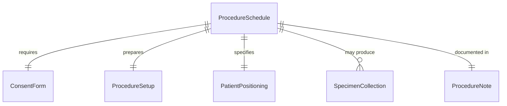
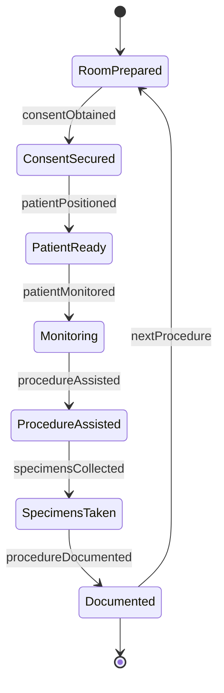
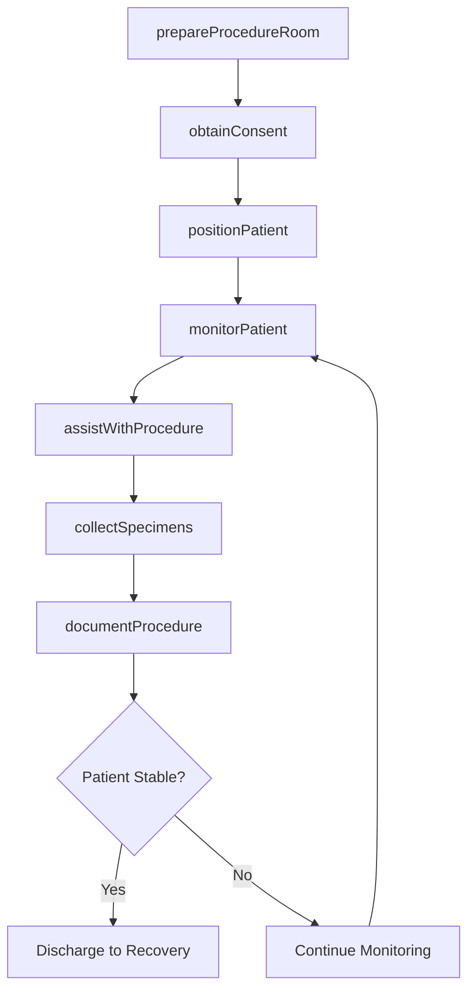
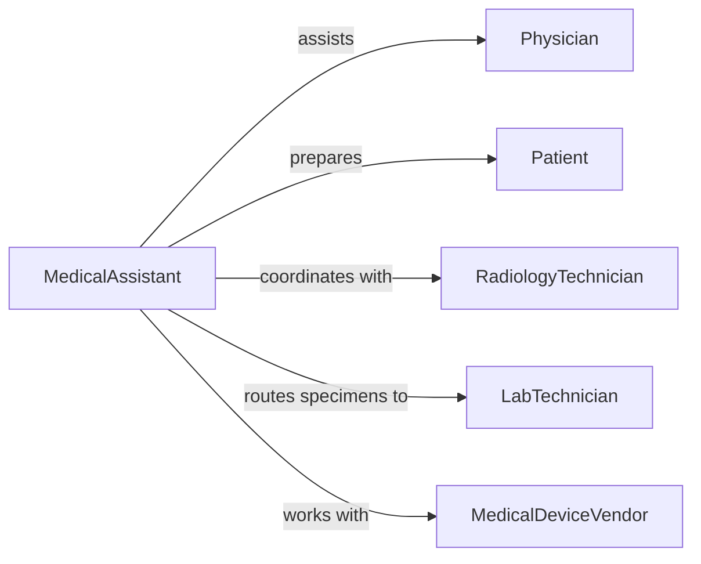

# Assist Practitioners Perform Medical Procedures

> Business-as-Code definition for medical procedure assistance. Models preparation, patient positioning, equipment handling, and documentation for diagnostic and therapeutic procedures.

## Overview

Medical procedure assistance involves preparing exam rooms, positioning patients, managing equipment, and supporting physicians during diagnostic tests and treatments. This definition coordinates clinical workflows, ensures patient safety, and maintains procedure documentation across diverse medical specialties.

## Actors

| Actor | Description |
|-------|-------------|
| Physician | Primary practitioner performing the medical procedure |
| Patient | Individual undergoing diagnostic or therapeutic procedure |
| RadiologyTechnician | Operates imaging equipment during procedures |
| LabTechnician | Processes specimens collected during procedures |
| MedicalDeviceVendor | Provides specialized equipment and technical support |
| InsurancePayer | Authorizes and reimburses procedure services |

## Roles

| Role | Description |
|------|-------------|
| MedicalAssistant | Prepares patients and assists with procedure tasks |
| ProcedureNurse | Monitors patient status and manages medications |
| SchedulingCoordinator | Books procedures and coordinates resources |
| ClinicalDocumentationSpecialist | Ensures complete procedure records |

## Entities

| Entity | Description |
|--------|-------------|
| ProcedureSchedule | Planned medical procedure with date and resources |
| ConsentForm | Patient authorization document with risks disclosed |
| ProcedureSetup | Equipment, supplies, and room configuration |
| PatientPositioning | Body placement for optimal procedure access |
| SpecimenCollection | Tissue or fluid samples obtained during procedure |
| ProcedureNote | Clinical documentation of activities and findings |

## Actions

| Action | Description |
|--------|-------------|
| prepareProcedureRoom | Set up equipment and verify supplies available |
| obtainConsent | Explain procedure and document patient authorization |
| positionPatient | Place patient safely for optimal procedural access |
| assistWithProcedure | Hand instruments, manage equipment, support physician |
| collectSpecimens | Gather and label samples for laboratory analysis |
| monitorPatient | Track vital signs and patient status during procedure |
| documentProcedure | Record activities, findings, and patient response |

## Events

| Event | Description |
|-------|-------------|
| procedureRoomPrepared | Setup complete and ready for patient |
| consentObtained | Patient authorization documented in record |
| patientPositioned | Body placement verified safe and appropriate |
| procedureAssisted | Support provided during clinical intervention |
| specimensCollected | Samples gathered and labeled for lab processing |
| patientMonitored | Vital signs tracked and documented |
| procedureDocumented | Clinical note finalized in medical record |

## Searches

| Search | Description |
|--------|-------------|
| findProcedures | List scheduled procedures by date, physician, or type |
| getSetups | Retrieve equipment configurations by procedure type |
| getSpecimens | Track samples from collection to lab results |
| getProcedureNotes | Find documentation by patient or procedure code |


## Entity Relationships



## State Diagram


## Workflow



## Actor Relationships



## Usage

### Calling Actions

```typescript
import { assistPractitionersPerformMedicalProcedures } from '@headlessly/assist-practitioners-perform-medical-procedures'

const procedures = assistPractitionersPerformMedicalProcedures()

// Prepare room for colonoscopy
const setup = await procedures.prepareProcedureRoom({
  procedureId: 'PROC-2026-789',
  procedureType: 'Colonoscopy',
  equipmentNeeded: ['Colonoscope', 'Monitor', 'Insufflator', 'Suction'],
  suppliesNeeded: ['Biopsy forceps', 'Polypectomy snare', 'Specimen traps'],
  medications: ['Propofol', 'Midazolam', 'Fentanyl']
})

// Obtain informed consent
await procedures.obtainConsent({
  procedureId: 'PROC-2026-789',
  patientId: 'PT-2026-456',
  procedureExplained: true,
  risksDisclosed: ['Bleeding', 'Perforation', 'Sedation complications'],
  alternativesDiscussed: true,
  patientSignature: true,
  witnessSignature: true
})

// Position patient for procedure
await procedures.positionPatient({
  procedureId: 'PROC-2026-789',
  position: 'Left lateral decubitus',
  safetyVerified: true,
  accessOptimized: true,
  comfortMeasures: ['Pillow between knees', 'Blanket for warmth']
})

// Collect biopsy specimens
await procedures.collectSpecimens({
  procedureId: 'PROC-2026-789',
  specimens: [
    { site: 'Ascending colon', type: 'Biopsy', container: 'Formalin jar 1' },
    { site: 'Sigmoid colon', type: 'Polyp', container: 'Formalin jar 2' }
  ],
  labTests: ['Histopathology']
})
```

### Event-Driven Automation

```typescript
// Route specimens to laboratory
procedures.specimensCollected(async ({ procedureId, specimens }) => {
  for (const specimen of specimens) {
    await routeToLab({
      procedureId,
      specimenId: specimen.id,
      labTests: specimen.tests,
      priority: specimen.urgent ? 'stat' : 'routine'
    })
  }
})

// Alert on abnormal vital signs during procedure
procedures.patientMonitored(async ({ procedureId, vitals }) => {
  const alerts = []
  if (vitals.oxygenSaturation < 90) alerts.push('Low O2 saturation')
  if (vitals.heartRate > 120) alerts.push('Elevated heart rate')
  if (vitals.bloodPressureSystolic < 90) alerts.push('Hypotension')

  if (alerts.length > 0) {
    await notify({
      to: 'procedure-team',
      priority: 'urgent',
      message: `Patient alerts in ${procedureId}: ${alerts.join(', ')}`
    })
  }
})
```
