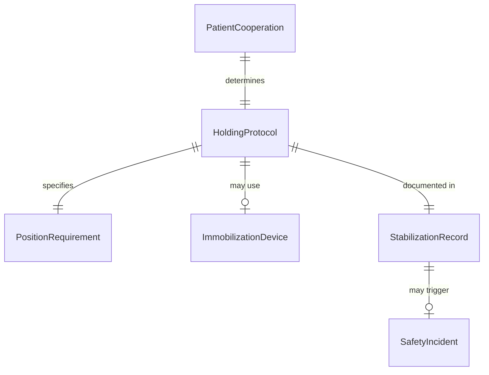
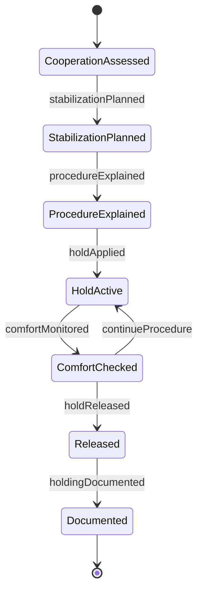
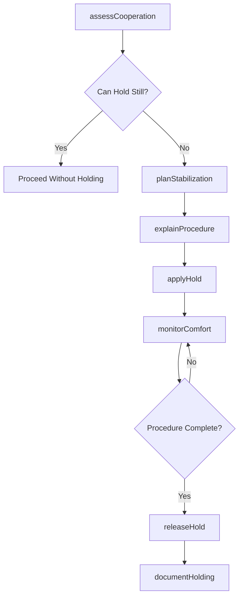
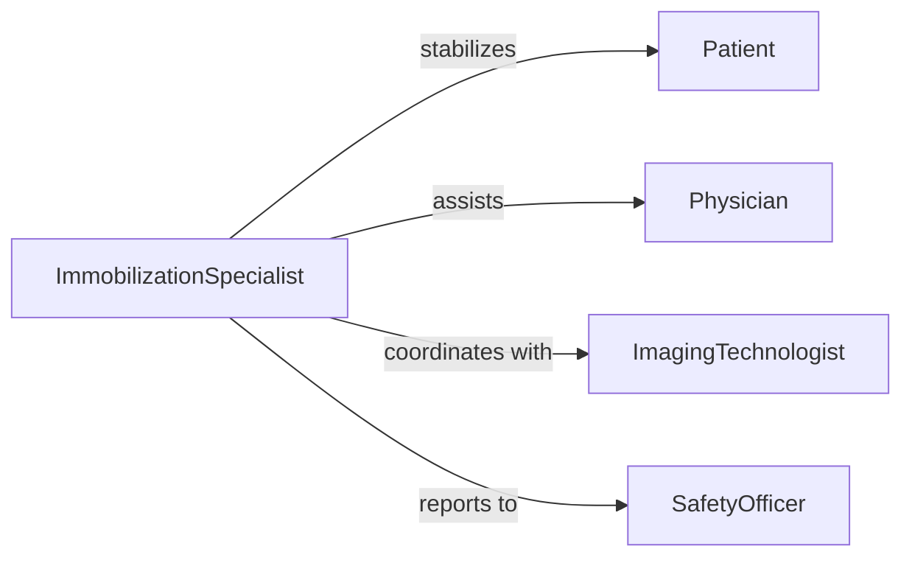

# Hold Patients Ensure Proper Positioning

> Business-as-Code definition for providing physical stabilization and support to maintain patient position during medical procedures, examinations, and imaging studies.

## Overview

Patient holding for positioning involves applying appropriate manual stabilization techniques to ensure patient safety, maintain required anatomical alignment, and prevent movement during sensitive procedures. This definition covers holding techniques for pediatric, geriatric, and mobility-impaired patients during examinations, imaging, and therapeutic interventions.

## Actors

| Actor | Description |
|-------|-------------|
| Patient | Requires stabilization during medical procedure |
| Physician | Performs procedure requiring patient immobilization |
| ImagingTechnologist | Conducts diagnostic imaging requiring still positioning |
| ParentGuardian | May assist with holding pediatric patients |
| AnesthesiaProvider | Manages sedation as alternative to physical holding |
| SafetyOfficer | Monitors patient restraint protocols and techniques |

## Roles

| Role | Description |
|------|-------------|
| ImmobilizationSpecialist | Trained staff member who provides patient stabilization |
| PediatricTechnologist | Specializes in holding techniques for children |
| RadiologyAssistant | Supports positioning during imaging procedures |
| ProcedureNurse | Holds patients during minor surgical interventions |

## Entities

| Entity | Description |
|--------|-------------|
| HoldingProtocol | Guidelines for safe immobilization techniques |
| PositionRequirement | Specific anatomical alignment needed for procedure |
| StabilizationRecord | Documentation of holding technique and duration |
| PatientCooperation | Assessment of patient ability to remain still |
| ImmobilizationDevice | Equipment alternative to manual holding |
| SafetyIncident | Report of injury or discomfort during holding |

## Actions

| Action | Description |
|--------|-------------|
| assessCooperation | Evaluate patient ability to maintain position independently |
| planStabilization | Determine holding technique and personnel needed |
| explainProcedure | Inform patient about need for stabilization |
| applyHold | Physically stabilize patient in required position |
| monitorComfort | Check patient tolerance during immobilization |
| releaseHold | Remove stabilization when procedure complete |
| documentHolding | Record technique used and patient response |

## Events

| Event | Description |
|-------|-------------|
| cooperationAssessed | Patient ability to remain still evaluated |
| stabilizationPlanned | Holding approach and personnel determined |
| procedureExplained | Patient informed about immobilization need |
| holdApplied | Physical stabilization established |
| comfortMonitored | Patient tolerance checked during holding |
| holdReleased | Stabilization discontinued after procedure |
| holdingDocumented | Immobilization details recorded |

## Searches

| Search | Description |
|--------|-------------|
| findHoldingProtocols | Retrieve guidelines by procedure type or patient age |
| getStabilizationRecords | Query holding documentation by patient or date |
| getSafetyIncidents | Find reports of complications during immobilization |
| getDeviceAlternatives | Search equipment options by procedure type |


## Entity Relationships



## State Diagram


## Workflow



## Actor Relationships



## Usage

### Calling Actions

```typescript
import { holdPatientsEnsureProperPositioning } from '@headlessly/hold-patients-ensure-proper-positioning'

const holding = holdPatientsEnsureProperPositioning()

// Assess pediatric patient cooperation for X-ray
const assessment = await holding.assessCooperation({
  patientId: 'PT-889900',
  age: 3,
  procedureType: 'chest-xray',
  developmentalLevel: 'typical',
  anxiety: 'moderate'
})

// Plan stabilization approach
const plan = await holding.planStabilization({
  patientId: 'PT-889900',
  position: 'upright-PA',
  holdingPersonnel: ['parent', 'radiology-assistant'],
  technique: 'gentle-shoulder-stabilization',
  estimatedDuration: 30
})

// Explain procedure to reduce anxiety
await holding.explainProcedure({
  patientId: 'PT-889900',
  explainedTo: ['patient', 'parent'],
  language: 'child-friendly',
  demonstrationProvided: true
})

// Apply hold during imaging
await holding.applyHold({
  patientId: 'PT-889900',
  technique: 'gentle-shoulder-stabilization',
  appliedBy: ['parent', 'RT-Davis'],
  pressureLevel: 'minimal',
  patientResponse: 'tolerating'
})

// Monitor comfort during procedure
await holding.monitorComfort({
  patientId: 'PT-889900',
  checkInterval: 10,
  distressLevel: 'low',
  verbalizationProvided: 'reassuring'
})

// Release and document
await holding.releaseHold({
  patientId: 'PT-889900',
  releasedBy: 'RT-Davis',
  patientStatus: 'comfortable'
})
```

### Event-Driven Automation

```typescript
// Alert on patient distress
holding.comfortMonitored(async ({ patientId, distressLevel }) => {
  if (distressLevel === 'high') {
    await notify({
      to: 'procedure-team',
      urgent: true,
      message: `Patient ${patientId} experiencing high distress during holding`
    })
  }
})

// Auto-document safety incidents
holding.holdReleased(async ({ patientId, patientStatus }) => {
  if (patientStatus.includes('injury') || patientStatus.includes('discomfort')) {
    await createIncidentReport({
      patientId,
      type: 'immobilization-complication',
      severity: 'review-required'
    })
  }
})
```
