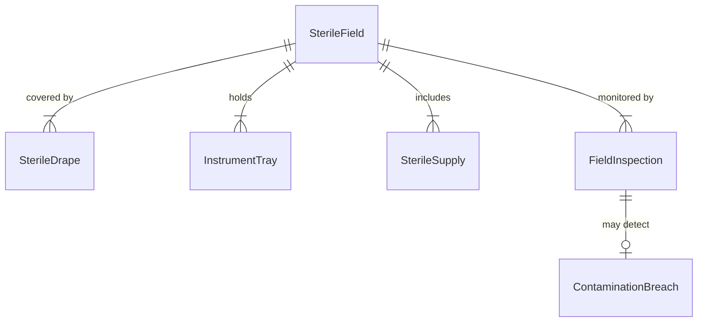
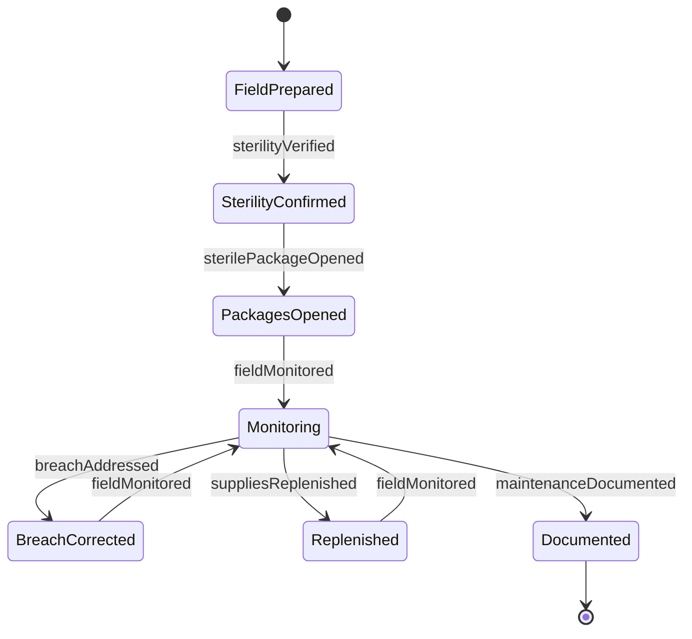
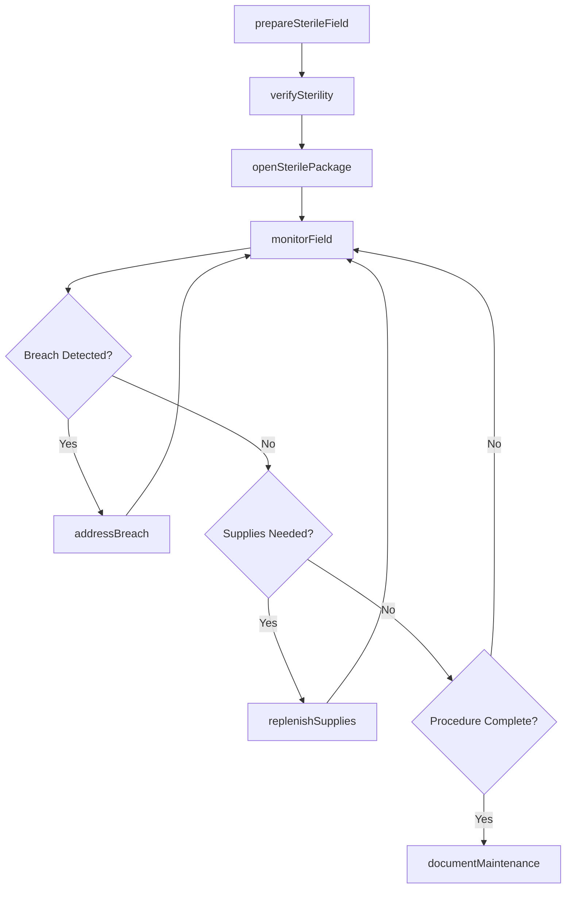
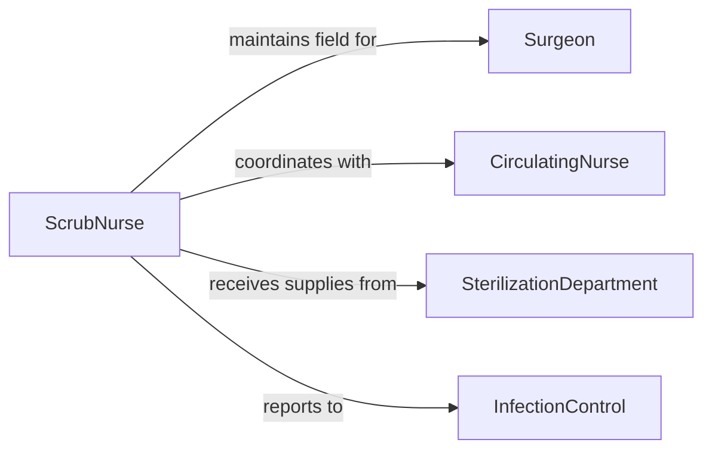

# Maintain Sterile Operative Fields

> Business-as-Code definition for establishing and preserving aseptic surgical environments through proper sterile technique, contamination monitoring, and immediate breach response.

## Overview

Sterile field maintenance involves preparing sterile surfaces, monitoring for contamination, managing sterile supply access, and responding to breaches during surgical procedures. This definition covers the complete sterility lifecycle from initial field preparation through procedure completion, ensuring infection prevention and patient safety.

## Actors

| Actor | Description |
|-------|-------------|
| Surgeon | Operates within sterile field and requires uncontaminated environment |
| Patient | Undergoes surgery requiring sterile conditions |
| SterilizationDepartment | Provides sterilized instruments and supplies |
| InfectionControl | Monitors sterility protocols and breach incidents |
| EquipmentVendor | Supplies sterile drapes, gowns, and instruments |
| AccreditationBody | Audits sterile technique compliance |

## Roles

| Role | Description |
|------|-------------|
| ScrubNurse | Maintains sterile field and handles sterile instruments |
| CirculatingNurse | Provides non-sterile support and monitors for breaches |
| SurgicalTechnologist | Assists with sterile field setup and maintenance |
| SterileProcessingTech | Prepares and delivers sterilized supplies |

## Entities

| Entity | Description |
|--------|-------------|
| SterileField | Designated aseptic area for surgical procedure |
| InstrumentTray | Sterilized collection of surgical tools |
| SterileDrape | Barrier maintaining sterile surface |
| ContaminationBreach | Violation of sterile technique requiring correction |
| SterileSupply | Item verified as aseptic and ready for use |
| FieldInspection | Ongoing assessment of sterility status |

## Actions

| Action | Description |
|--------|-------------|
| prepareSterileField | Establish aseptic surfaces and boundaries |
| verifySterility | Confirm supplies meet sterility standards |
| openSterilePackage | Access supplies while maintaining asepsis |
| monitorField | Continuously assess for contamination breaches |
| addressBreach | Respond immediately to sterile field violations |
| replenishSupplies | Add sterile items during procedure as needed |
| documentMaintenance | Record field status and any breach incidents |

## Events

| Event | Description |
|-------|-------------|
| sterileFieldPrepared | Aseptic surfaces established and verified |
| sterilityVerified | Supply sterility confirmed before use |
| sterilePackageOpened | Supplies accessed using proper technique |
| fieldMonitored | Continuous sterility assessment performed |
| breachAddressed | Contamination corrected and field restored |
| suppliesReplenished | Additional sterile items added to field |
| maintenanceDocumented | Field status recorded in operative record |

## Searches

| Search | Description |
|--------|-------------|
| findSterileFields | Retrieve active surgical fields by OR room |
| getBreachIncidents | Query contamination violations by date or type |
| getSterileSupplies | Find available sterilized items by category |
| getFieldInspections | Search sterility assessments by procedure |


## Entity Relationships



## State Diagram


## Workflow



## Actor Relationships



## Usage

### Calling Actions

```typescript
import { maintainSterileOperativeFields } from '@headlessly/maintain-sterile-operative-fields'

const sterileField = maintainSterileOperativeFields()

// Prepare sterile field for laparoscopic procedure
await sterileField.prepareSterileField({
  orRoom: 'OR-4',
  procedureType: 'laparoscopic-cholecystectomy',
  sterileItems: [
    'back-table',
    'mayo-stand',
    'patient-draping'
  ],
  preparedBy: 'ST-Anderson'
})

// Verify sterility indicators before use
await sterileField.verifySterility({
  items: [
    { name: 'laparoscopic-instrument-set', sterilizationDate: '2026-02-04', indicator: 'passed' },
    { name: 'suture-pack', sterilizationDate: '2026-02-03', indicator: 'passed' }
  ],
  verifiedBy: 'RN-Chen'
})

// Open sterile package using proper technique
await sterileField.openSterilePackage({
  packageId: 'STERILE-78901',
  openedBy: 'RN-Chen',
  technique: 'corner-pull-method',
  presentedTo: 'ST-Anderson'
})

// Monitor field during procedure
await sterileField.monitorField({
  orRoom: 'OR-4',
  checkInterval: 15,
  boundaries: 'verified',
  personnelCompliance: 'maintained'
})

// Address contamination breach
await sterileField.addressBreach({
  orRoom: 'OR-4',
  breachType: 'non-sterile-object-contact',
  contaminatedItem: 'instrument-tray-edge',
  correctionAction: 'replaced-with-sterile-tray',
  correctedBy: 'ST-Anderson'
})
```

### Event-Driven Automation

```typescript
// Alert on sterile field breach
sterileField.breachAddressed(async ({ orRoom, breachType, severity }) => {
  await notify({
    to: 'infection-control',
    message: `Sterile field breach in ${orRoom}: ${breachType}`,
    priority: severity === 'critical' ? 'urgent' : 'routine'
  })

  await logIncident({
    type: 'sterile-technique-violation',
    location: orRoom,
    details: breachType
  })
})

// Track sterile supply usage
sterileField.suppliesReplenished(async ({ orRoom, items }) => {
  for (const item of items) {
    await updateInventory({
      item: item.name,
      action: 'consumed',
      location: orRoom
    })
  }
})
```
